<div align="center">

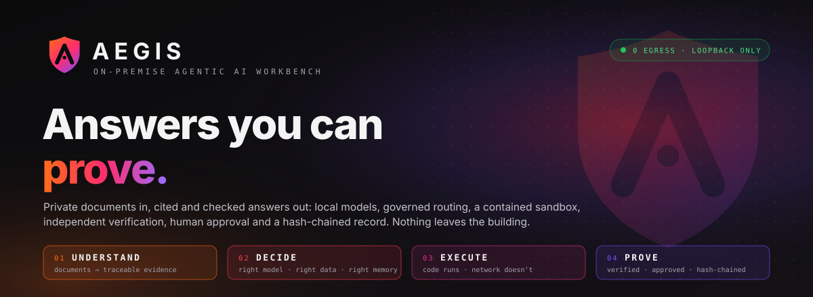

<br>

**[Demo](#aegis-in-5-seconds)** · **[Architecture](#full-system-architecture)** · **[Security](#security-by-architecture)** · **[Quick start](#quick-start)** · **[Docs](docs/)**

<br>

`LOCAL` • `PRIVATE` • `CONTROLLED` • `VERIFIABLE`

</div>

---

## AEGIS in 5 seconds

<div align="center">

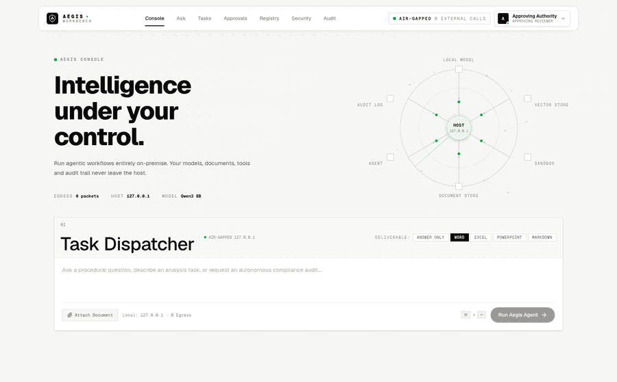

<sub>Real screens from a running instance — console, delivered answer, approval queue, audit chain, sovereignty posture.</sub>

</div>

> One request. Several controlled stages. One outcome you can prove afterwards.

---

## Why AEGIS?

Running a model on your own hardware solves exactly one problem: the prompt does not leave the building. It says nothing about which model answered, what it read, whether the arithmetic is right, who authorised the result, or what you can show a regulator six months later.

<div align="center">
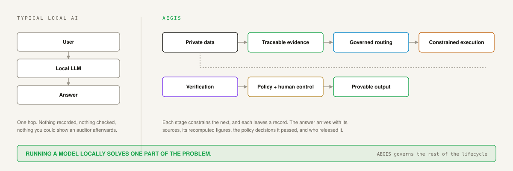
</div>

A sensitive organisation has to control the **data**, the **models**, the **tools**, the **execution**, the **evidence**, the **policies**, the **approvals** and the **audit**. AEGIS is built around that whole lifecycle rather than the inference call in the middle of it.

---

## Understand → Decide → Execute → Prove

| | Stage | What it does | The line that matters |
|---|---|---|---|
| **01** | **UNDERSTAND** | Scans, drawings, spreadsheets and reports become evidence units that keep their source, page and section | Raw document → traceable evidence |
| **02** | **DECIDE** | The task is classified, then routed to a model that policy permits and the host can actually hold in memory | **Installed ≠ authorised** |
| **03** | **EXECUTE** | Generated code runs in a constrained subprocess with resource limits and neutralised network primitives | **Code runs. Network doesn't.** |
| **04** | **PROVE** | Claims are checked against evidence, figures recomputed, policy applied, a human signs, the record is hash-chained | Every answer has a provable history |

---

## Full system architecture

<div align="center">
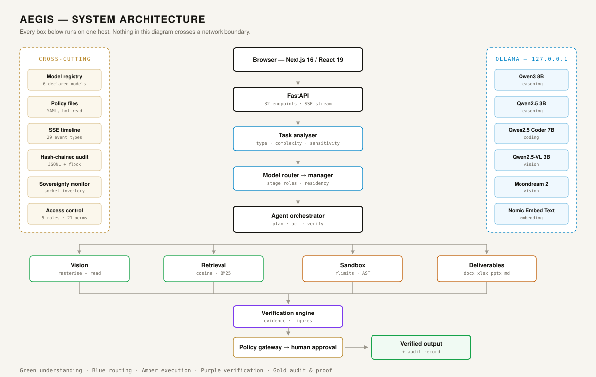
</div>

Everything in that diagram runs on one machine. Inference is reached over loopback; the platform makes no outbound calls at runtime.

---

### 01 / UNDERSTAND

<div align="center">
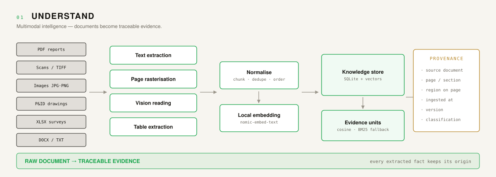
</div>

A PDF with a text layer is parsed directly. One without — a scan, a photographed report — is rasterised page by page and read by the local vision model instead. Either way, what lands in the index is an evidence unit that still knows which document, page and section it came from.

---

### 02 / DECIDE

<div align="center">
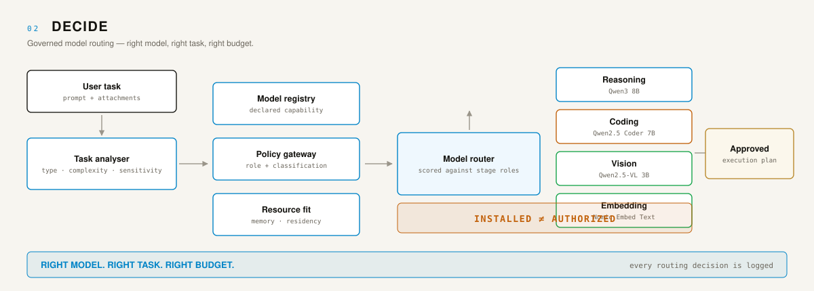
</div>

Each pipeline stage declares the capability it needs; the router scores the registry against that, the caller's role, the data classification and the memory actually free on the host. A model being installed is not the same as a model being permitted for this task.

---

### 03 / EXECUTE

<div align="center">
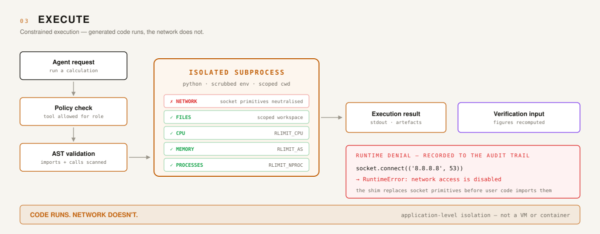
</div>

Arithmetic that ends up in a signed document is never taken from the model's own token prediction — it is written as Python and executed. Before it runs, the source is scanned for disallowed imports and calls; while it runs, POSIX resource limits bound it and a `sitecustomize` shim replaces socket primitives so an outbound call raises rather than connects.

---

### 04 / PROVE

<div align="center">
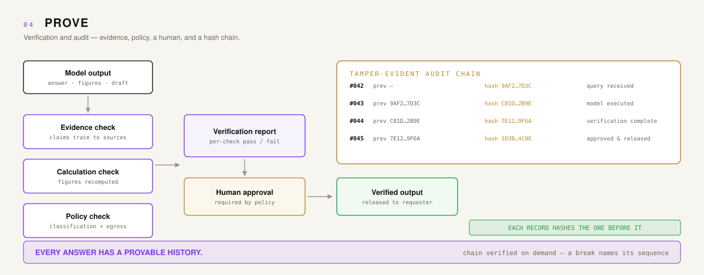
</div>

Every record in `storage/logs/audit.jsonl` carries the hash of the one before it. Editing or deleting a line breaks the chain, and the Audit screen will name the sequence where verification first fails.

---

## See AEGIS in action

<div align="center">

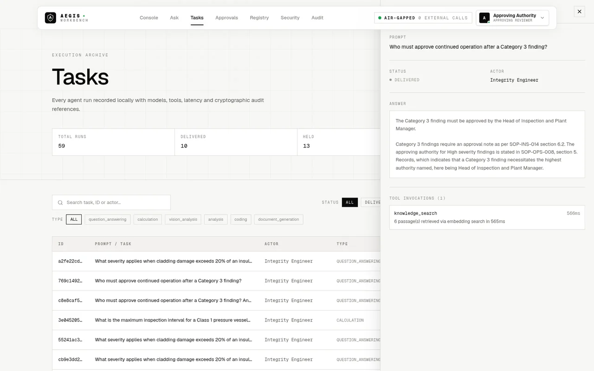

<sub><b>A delivered answer</b> — cited to the organisation's own procedures, with the retrieval call that produced it.</sub>

</div>

<table>
<tr>
<td width="50%">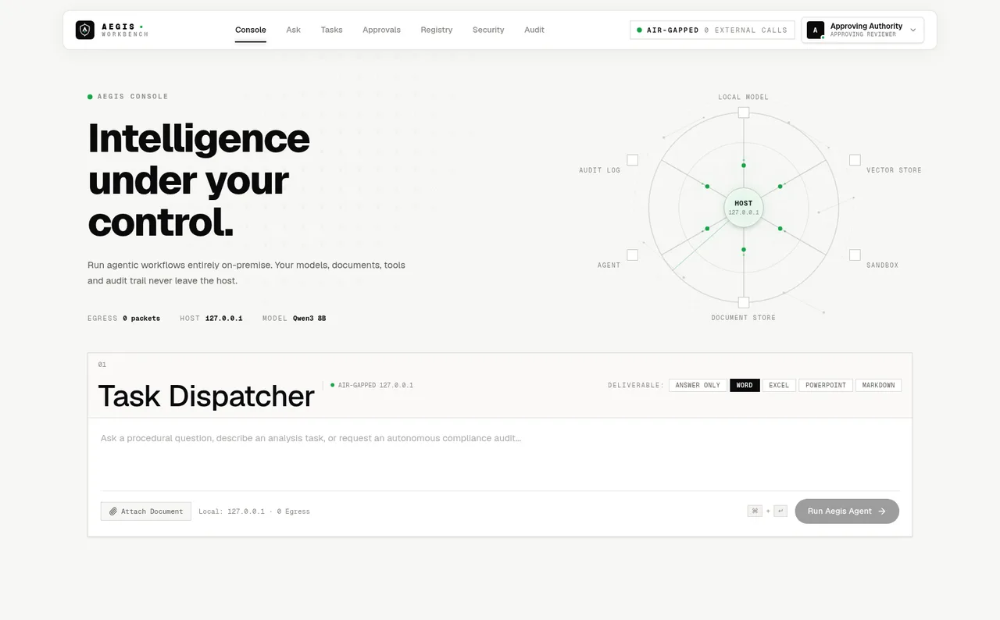<sub><b>Console</b> — dispatch a task, watch the stages.</sub></td>
<td width="50%">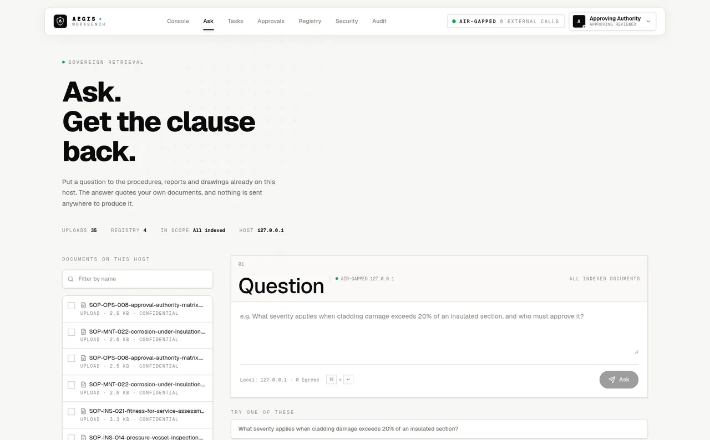<sub><b>Ask</b> — question the documents already on the host.</sub></td>
</tr>
<tr>
<td>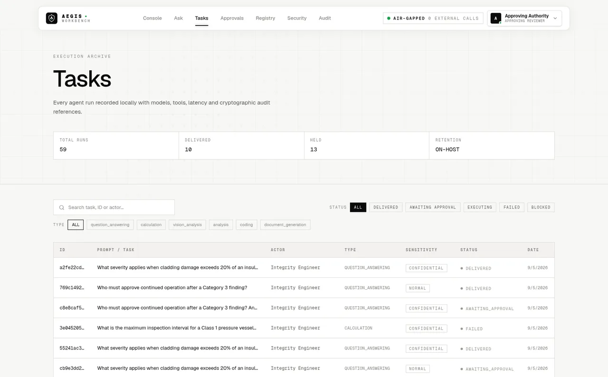<sub><b>Tasks</b> — every run, with models, tools and latency.</sub></td>
<td>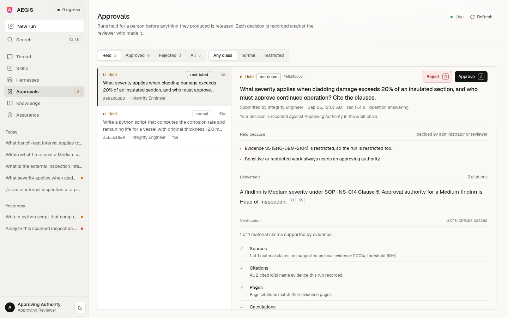<sub><b>Approvals</b> — nothing is released without a signature.</sub></td>
</tr>
<tr>
<td>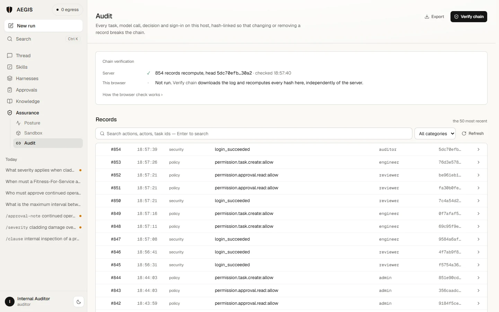<sub><b>Audit</b> — hash-chained, verified on demand.</sub></td>
<td>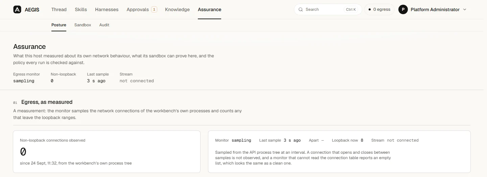<sub><b>Security</b> — live sandbox self-test and policy set.</sub></td>
</tr>
</table>

---

## Core capabilities

| Capability | What is actually implemented |
|---|---|
| **Local inference** | Ollama over loopback; six models declared in `config/models.yaml`, enforced to `127.0.0.1` |
| **Multimodal ingestion** | PDF text extraction, PyMuPDF rasterisation for scans, vision reading, XLSX/DOCX/CSV parsing |
| **Retrieval** | Local embeddings with cosine similarity, BM25 lexical fallback, provenance preserved into citations |
| **Task analysis** | Type, complexity, sensitivity and capability requirements from `config/classification.yaml` |
| **Model routing** | Per-stage roles and capabilities, scored against the registry, policy and free memory |
| **Model residency** | Single-model residency with eviction, so a small host is not asked to hold everything at once |
| **Agent orchestration** | Seven stages — classify, plan, read, retrieve, sandbox, draft, verify — with bounded code retry |
| **Constrained execution** | AST validation, POSIX rlimits (CPU, address space, file size, processes), socket neutralisation |
| **Verification** | Claims traced to evidence, asserted figures recomputed, per-check pass/fail report |
| **Policy gateway** | Default-deny tool and path checks, classification-aware egress rules, approval requirements |
| **Human approval** | Deliverables held unreleased until a role holding `approval.decide` signs; reviewer recorded |
| **Deliverables** | DOCX, XLSX, PPTX and Markdown, generated locally and hashed |
| **Tamper-evident audit** | Append-only JSONL, each record hashing the previous, `flock`-serialised across processes |
| **Sovereignty monitoring** | Socket inventory and egress accounting surfaced on the Security screen |
| **Live execution trace** | Server-Sent Events; 29 event types published during a run |
| **Access control** | Five roles and 21 permissions with inheritance, defined in `policies/access-control.yaml` |

---

## Security by architecture

> **Model output is untrusted until the required checks pass.**

```
MODEL  →  POLICY  →  SANDBOX  →  VERIFICATION  →  HUMAN AUTHORITY  →  RELEASE
```

**What is enforced in code**

- Inference is pinned to loopback and refused otherwise.
- Tool invocation is default-deny, resolved per role from policy files.
- Generated code is statically validated before execution — imports and call targets are scanned.
- Execution runs in a subprocess under `RLIMIT_CPU`, `RLIMIT_AS`, `RLIMIT_FSIZE`, `RLIMIT_NPROC` and `RLIMIT_CORE`, with a scrubbed environment and a scoped working directory.
- Socket primitives are replaced inside the sandbox interpreter, so an outbound call raises rather than connects, and the attempt is recorded.
- File access is confined to the task workspace; path escapes are refused by the policy gateway.
- Approval is separated from execution: the role that runs a task does not hold `approval.decide`.
- The audit log is append-only and hash-chained, with cross-process locking on write.

**What this is not**

Sandboxing here is **application-level isolation inside a subprocess** — static validation, resource limits and a runtime shim. It is **not** a VM, container, namespace or seccomp boundary, and it should not be described as one. A deployment handling genuinely hostile input should place this process inside an OS-level boundary as well. No claim of unbreakable isolation is made anywhere in this repository.

---

## Technology stack

| Layer | Actually used |
|---|---|
| **Frontend** | Next.js 16, React 19, TypeScript, Tailwind 4, Three.js + react-three-fiber |
| **Backend** | FastAPI, Pydantic v2, Uvicorn, Python 3.11 |
| **Inference** | Ollama (loopback) — Qwen3 8B, Qwen2.5 3B, Qwen2.5 Coder 7B, Qwen2.5-VL 3B, Moondream 2, Nomic Embed Text |
| **Storage** | SQLite — tasks, users, sessions, files, knowledge chunks and vectors |
| **Retrieval** | Locally computed embeddings, cosine similarity, BM25 fallback |
| **Documents** | PyMuPDF, pypdf, python-docx, openpyxl, python-pptx, Pillow |
| **Execution** | Python subprocess sandbox with AST validation and POSIX rlimits |
| **Transport** | REST + Server-Sent Events |
| **Monitoring** | psutil-based socket and egress inventory |

There is no PostgreSQL, pgvector, Neo4j or Redis in this project — the store is SQLite, and vector search is computed in process.

---

## An end-to-end request

> *"Analyse the attached scanned inspection report for vessel V-2104, calculate the corrosion rate and remaining life against the minimum allowable thickness, cite the governing SOP clauses, and prepare an approval note."*

| Stage | What happens | What it leaves behind |
|---|---|---|
| **Upload** | File stored locally, hashed, classified | `file` audit record |
| **Classify** | Task type, complexity, sensitivity determined | Profile with signals and reasons |
| **Plan** | Steps decomposed before any of them run | `task.planned` event |
| **Read** | Text-less PDF rasterised, read by the vision model | Extraction with page references |
| **Retrieve** | SOP corpus searched, passages returned with provenance | Evidence units `[S1] [S2] …` |
| **Route** | Each stage matched to a permitted model | Routing decisions on the task |
| **Execute** | Corrosion rate and remaining life computed in the sandbox | Script, stdout, resource usage |
| **Verify** | Figures recomputed, claims traced, checks scored | Verification report |
| **Policy** | Classification and egress rules applied | Policy events |
| **Approve** | Held until a reviewer signs | Reviewer name, id, timestamp |
| **Deliver** | DOCX approval note generated and hashed | Deliverable record |
| **Audit** | Every step above chained | `audit.jsonl` |

---

## Quick start

**Prerequisites** — Python 3.11+, Node 20+, and [Ollama](https://ollama.com) running locally.

```bash
# 1. Clone
git clone https://github.com/kartikeyajay2006/Sovereign-On_Premise-Agentic-AI-Workbench.git
cd Sovereign-On_Premise-Agentic-AI-Workbench

# 2. Backend
python3 -m venv .venv && source .venv/bin/activate
pip install -r requirements.txt

# 3. Frontend
cd frontend && npm install && cd ..

# 4. Models — pull what the registry declares
ollama pull qwen3:8b
ollama pull qwen2.5:3b
ollama pull qwen2.5-coder:7b
ollama pull qwen2.5vl:3b
ollama pull nomic-embed-text

# 5. Optional — seed the demonstration corpus
python scripts/seed_demo_data.py

# 6. Run both services
./scripts/run.sh
```

Then open **http://127.0.0.1:3000**. The API listens on **127.0.0.1:8000**.

Seeded accounts — `operator`, `engineer`, `reviewer`, `auditor`, `admin`. The seed password is set by `security.seed_user_password` in `config/app.yaml`; change it before any real deployment. Stop everything with `./scripts/run.sh --stop`.

Frontend configuration lives in `frontend/.env.local` — copy `frontend/.env.example` to start. No secret is required to run the workbench.

---

## Project structure

```
backend/
  agents/         orchestrator, planner, verifier — the seven-stage pipeline
  api/            FastAPI app, routes, task queue and worker
  core/           config, schemas, database, identity, audit chain, analyzer
  models_layer/   registry, router, residency manager, Ollama client
  policy/         default-deny gateway for tools, paths and approvals
  rag/            parsing, chunking, embedding, retrieval
  security/       sovereignty monitor
  tools/          sandbox, deliverable generation, tool registry
config/           models, routing, classification, prompts, app settings
policies/         access control, approval rules, tool permissions, classification
frontend/         Next.js console — console, ask, tasks, approvals, registry, security, audit
scripts/          run.sh, demo seeding, verification tooling
tests/            118 tests across security, queue, evidence, deliverables, verification
docs/             architecture notes and README assets
```

---

## Limitations

Stated plainly, because they affect whether this is right for your deployment.

- **Latency is hardware-bound.** On a CPU-only host a full question takes roughly 45–75 seconds. A GPU changes this substantially; nothing in the design hides the cost.
- **Vision is the expensive path.** Rasterising and reading a large scanned PDF is far slower than a text query, and scales with page count.
- **Cold starts matter.** The first call after a model is evicted pays load time; single-model residency trades throughput for fitting on a small host.
- **Application-level sandboxing is not VM isolation.** See [Security by architecture](#security-by-architecture).
- **Policy files are deployment-specific.** The shipped roles, classifications and approval rules are a sensible default, not your organisation's.
- **Compliance is not a software property.** The audit chain supports an assurance process; it does not constitute one.
- **Optional Firebase sign-in is a convenience layer, not the security boundary.** It is off by default and cannot work air-gapped; workbench accounts are the supported path.

---

## Roadmap

- [x] Local inference with a declared, policy-checked model registry
- [x] Per-stage model routing with residency management
- [x] Multimodal ingestion including rasterisation for scanned documents
- [x] Retrieval with provenance-preserving citations and lexical fallback
- [x] Sandboxed code execution with static validation and resource limits
- [x] Verification engine — evidence tracing and figure recomputation
- [x] Default-deny policy gateway with classification-aware rules
- [x] Human approval gate with role separation and recorded reviewer
- [x] Hash-chained audit log with cross-process locking and on-demand verification
- [x] Deliverable generation — DOCX, XLSX, PPTX, Markdown
- [x] Live execution trace over SSE
- [x] Sovereignty monitoring and sandbox self-test
- [ ] Token-level answer streaming (the model client supports it; the orchestrator does not yet use it)
- [ ] Model and routing transparency screens (`/models`, `/routing/rules` are served but not surfaced)
- [ ] Per-task policy event panel
- [ ] Permission-derived navigation, so a role sees only what it may reach
- [ ] Merkle-tree audit structure for efficient partial proofs
- [ ] P&ID graph extraction — symbols and their connections

---

## Contributors

| | |
|---|---|
| **[@kartikeyajay2006](https://github.com/kartikeyajay2006)** | Architecture, backend, agent orchestration, sandbox, policy, verification, audit |
| **Raghav Sharma** | Frontend redesign — visual system, layouts, motion, architecture visualisation, AEGIS brand identity |
| **Ankit Pandey** | Contributions to the workbench |

---

<div align="center">

<br>

**AEGIS**
`ON-PREMISE AGENTIC AI WORKBENCH`

**UNDERSTAND → DECIDE → EXECUTE → PROVE**

*Private intelligence. Provable control.*

**YOUR DATA. YOUR MODELS. YOUR INFRASTRUCTURE. YOUR CONTROL.**

<sub>Built for Smart India Hackathon 2025 · Every claim above was checked against the code before it was written.</sub>

</div>
