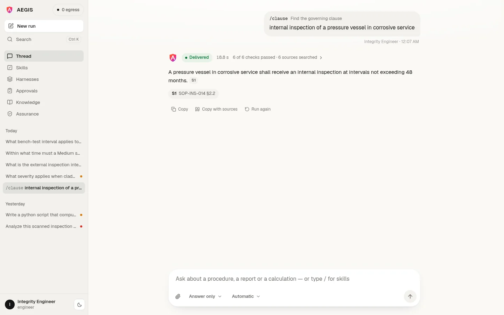
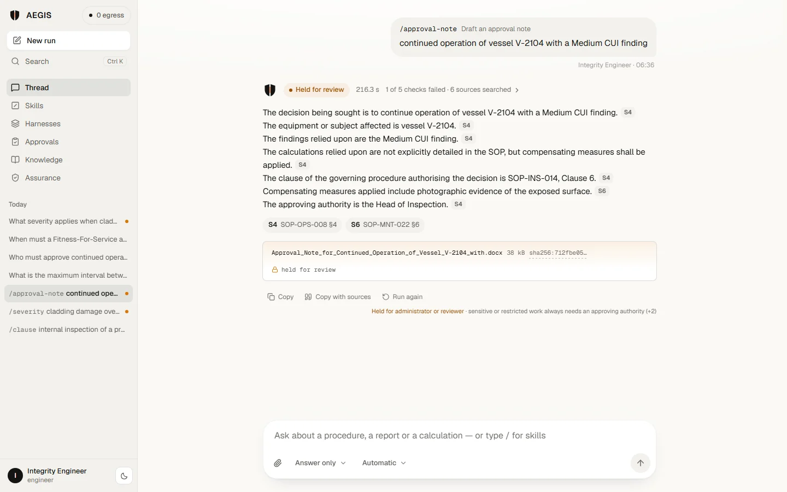
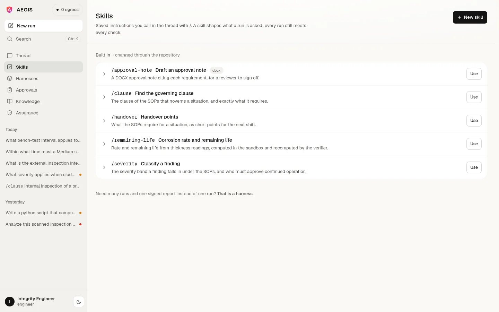
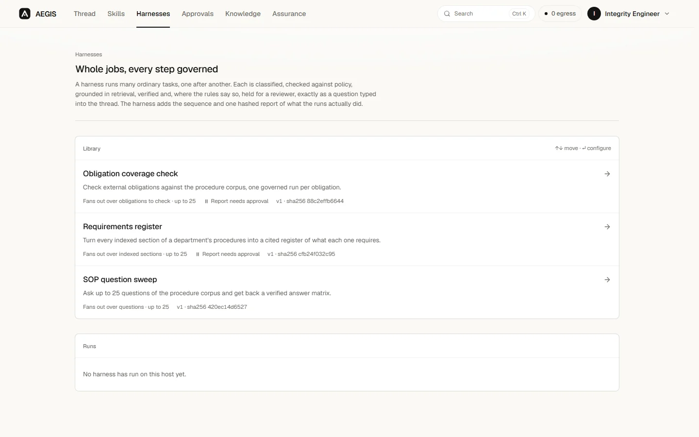
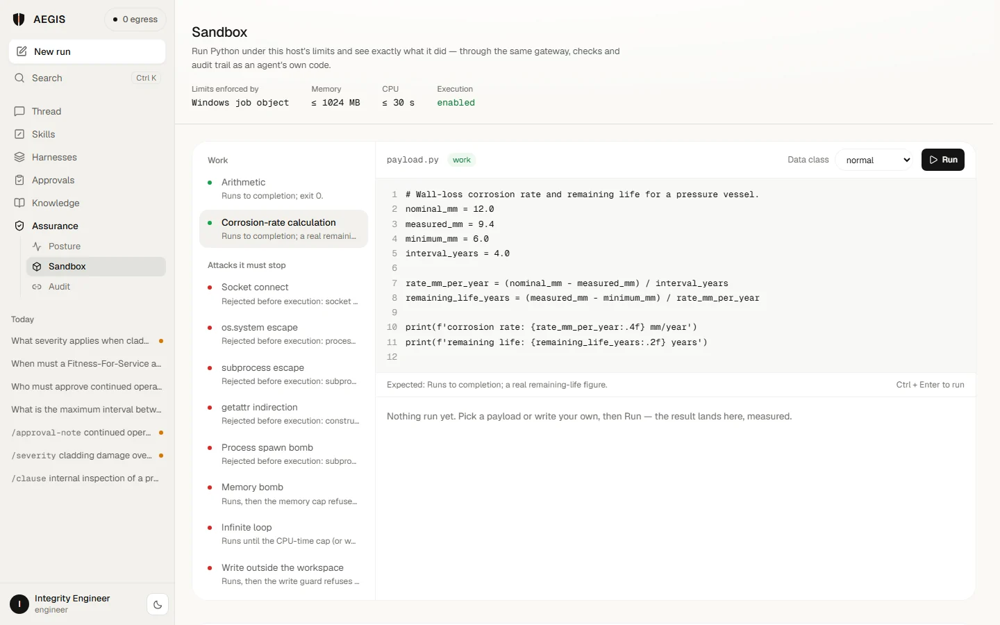

<div align="center">


<br>

**[See it](#see-aegis-in-action)** · **[Architecture](#full-system-architecture)** · **[Security](#security-by-architecture)** · **[Quick start](#quick-start)** · **[Demo script](docs/DEMO.md)**

<br>

`LOCAL` • `PRIVATE` • `CONTROLLED` • `VERIFIABLE`

</div>

---

<div align="center">


<sub>The public page plays one real recorded run as you scroll: every word and figure in it is the run's own.</sub>

</div>

> Ask a question in a thread. AEGIS answers it from your own documents, cites the section every sentence came from, checks the claims and the arithmetic, holds anything that leaves the building for a named reviewer, and writes every step to a hash-chained log.

---

## Why AEGIS?

Running a model on your own hardware solves exactly one problem: the prompt does not leave the building. It says nothing about which model answered, what it read, whether the arithmetic is right, who authorised the result, or what you can show a regulator six months later.

<div align="center">

</div>

A sensitive organisation has to control the **data**, the **models**, the **tools**, the **execution**, the **evidence**, the **policies**, the **approvals** and the **audit**. AEGIS is built around that whole lifecycle rather than the inference call in the middle of it.

---

## Understand → Decide → Execute → Prove

| | Stage | What it does | The line that matters |
|---|---|---|---|
| **01** | **UNDERSTAND** | Reports, scans, drawings and spreadsheets become evidence units that keep their document, page and section | Raw document → traceable evidence |
| **02** | **DECIDE** | The request is classified, then each stage is routed to a model that policy permits and the host can hold in memory | **Installed ≠ authorised** |
| **03** | **EXECUTE** | Generated code runs in a constrained subprocess with OS resource limits and neutralised network primitives | **Code runs. Network doesn't.** |
| **04** | **PROVE** | Claims are checked against evidence, figures recomputed, policy applied, a human signs, the record is hash-chained | Every answer has a provable history |

---

## Full system architecture

<div align="center">

</div>

Everything in that diagram runs on one machine. Inference is reached over loopback, and the platform makes no outbound calls at runtime.

### 01 / UNDERSTAND

<div align="center">

</div>

A PDF is inspected **page by page**. Pages with a text layer are parsed directly. Pages without one (a scan, a photographed report) are rasterised and read by the local vision model in small batches, and a page the vision model returns empty falls back to local Tesseract OCR. Every page becomes its own citable evidence item (`[V1]`, `[V2]` …) that knows its document, page number and source hash. The verifier refuses an answer that attributes a `[V…]` citation to a different page than the one it came from, and holds any answer with a citation that leads to no evidence the run recorded.

### 02 / DECIDE

<div align="center">

</div>

Each stage declares the capability it needs. The router scores the registry against that, the caller's role, the data classification and the memory actually free on the host. You can also pin a model per run from the thread. A conversational message ("thanks", "hello") takes a fast path with no retrieval. A single retrieval question skips planning entirely, because a plan earns its cost only when the work branches.

### 03 / EXECUTE

<div align="center">

</div>

Arithmetic that ends up in a signed document is never taken from the model's own token prediction. It is written as Python and executed. Before it runs, the source is scanned for disallowed imports and calls. While it runs, OS-level limits bound it:

- **Linux:** POSIX `setrlimit` (CPU, address space, file size, processes).
- **macOS:** the same, except that a parent watchdog enforces resident memory, because a useful address-space limit cannot be set there.
- **Windows:** a kernel **Job Object** (committed memory, CPU time, active processes, kill-on-close). It is assigned before the child runs a line of user code and is probed on the host before execution is allowed at all.

A `sitecustomize` shim replaces the socket primitives, so an outbound call raises rather than connects.

### 04 / PROVE

<div align="center">

</div>

Every record in `storage/logs/audit.jsonl` carries the hash of the one before it. Editing or deleting a line breaks the chain. The Audit screen verifies it twice: once on the server, and once again in your browser with Web Crypto, independently of the server.

---

## See AEGIS in action

Real screens from a local instance on a CPU-only Windows laptop, running the synthetic demo corpus.

<div align="center">



<sub><b>Thread</b> — ask in plain language, or call a skill with <code>/</code>. The answer comes back cited to the section it came from, with its checks, timings and model usage one click away.</sub>

</div>

<table>
<tr>
<td width="50%"><sub><b>Held</b> — a drafted approval note that failed a check is held, its DOCX withheld and hashed; nothing is released on the model's word.</sub></td>
<td width="50%"><sub><b>Approvals</b> — why each run was held, what it would release, every check, and a decision recorded against the reviewer.</sub></td>
</tr>
<tr>
<td><sub><b>Skills</b> — saved instructions called with <code>/</code> in the thread; each run records which skill version shaped it.</sub></td>
<td><sub><b>Harnesses</b> — one job over many items; each item is an ordinary checked run, and the job ends in one hashed report.</sub></td>
</tr>
<tr>
<td><sub><b>Sandbox</b> — run code under this host's limits, or fire the attacks it must stop, and see what it measured or which rule refused it.</sub></td>
<td><sub><b>Audit</b> — every task, model call, decision and sign-in, hash-linked; recomputed by the server and, on demand, by your browser.</sub></td>
</tr>
</table>

<div align="center">


<sub><b>Assurance</b> — what the host measured (egress), what it tested (containment) and what it is configured to allow (policy), each labelled as which.</sub>
</div>

---

## Core capabilities

| Capability | What is actually implemented |
|---|---|
| **Local inference** | Ollama over loopback, enforced to `127.0.0.1`; six models declared in `config/models.yaml` |
| **Workbench** | One thread for questions, calculations and deliverables in a sidebar workbench with every run listed; token streaming, per-run model choice, run transcript |
| **Multimodal ingestion** | Per-page PDF inspection, PyMuPDF rasterisation, batched vision reading with Tesseract fallback, XLSX/DOCX/CSV parsing |
| **Retrieval** | Local embeddings with cosine similarity, BM25 lexical fallback, department and classification isolation before ranking |
| **Task analysis** | Type, complexity, sensitivity and capability requirements from `config/classification.yaml`; a run is raised to the class of the evidence it reads |
| **Model routing** | Per-stage roles and capabilities, scored against the registry, policy and free memory, with single-model residency |
| **Skills** | Saved, versioned instructions invoked with `/`; five built in under `config/skills/`, more added from the UI |
| **Harnesses** | Multi-run jobs (obligation coverage, requirements register, SOP question sweep) with one aggregated, hashed report |
| **Constrained execution** | AST validation plus POSIX rlimits, a macOS memory watchdog, or a Windows Job Object; socket neutralisation |
| **Verification** | Claims traced to evidence, every citation checked to lead somewhere, page citations checked against their pages, asserted figures recomputed |
| **Policy gateway** | Default-deny tool and path checks, classification-aware egress rules, approval requirements |
| **Human approval** | Deliverables held until a role holding `approval.decide` signs; reviewer and reason recorded |
| **Deliverables** | DOCX, XLSX, PPTX and Markdown, generated locally and hashed |
| **Tamper-evident audit** | Append-only JSONL, each record hashing the previous, verified server-side and in the browser |
| **Sovereignty monitoring** | Socket inventory and egress accounting of the workbench's own processes |
| **Usage telemetry** | Per-call prompt and output tokens, load, eval and first-token time, context window, done reason |
| **Live execution trace** | Server-Sent Events, 32 event types across tasks, harnesses and the sovereignty monitor |
| **Access control** | Five roles and 22 permissions with inheritance, in `policies/access-control.yaml` |

---

## Security by architecture

> **Model output is untrusted until the required checks pass.**

```
MODEL  →  POLICY  →  SANDBOX  →  VERIFICATION  →  HUMAN AUTHORITY  →  RELEASE
```

**What is enforced in code**

- Inference is pinned to loopback and refused otherwise.
- Tool invocation is default-deny, resolved per role from policy files.
- Generated code is statically validated before execution: imports and call targets are scanned.
- Execution is bounded by the host's own mechanism, and never runs unbounded:
  - **Linux:** `RLIMIT_CPU`, `RLIMIT_AS`, `RLIMIT_FSIZE`, `RLIMIT_NPROC` and `RLIMIT_CORE`.
  - **macOS:** the same without `RLIMIT_AS`, which cannot be set usefully there, so a resident-memory watchdog replaces it.
  - **Windows:** a Job Object. If the host cannot prove its limits hold, execution is refused rather than run unbounded.
- Socket primitives are replaced inside the sandbox interpreter, so an outbound call raises rather than connects, and the attempt is recorded.
- File access is confined to the task workspace; path escapes are refused by the policy gateway.
- Approval is separated from execution: the role that runs a task does not hold `approval.decide`.
- The audit log is append-only and hash-chained, with cross-process locking on write.

**What this is not**

Sandboxing here is **application-level isolation inside a subprocess**: static validation, OS resource limits and a runtime shim. It is **not** a VM, container, namespace or seccomp boundary, and it should not be described as one. A deployment handling genuinely hostile input should place this process inside an OS-level boundary as well. [`docs/RUNTIME-ENVIRONMENT.md`](docs/RUNTIME-ENVIRONMENT.md) sets out exactly what is and is not guaranteed.

---

## Technology stack

| Layer | Actually used |
|---|---|
| **Frontend** | Next.js 16, React 19, TypeScript, Tailwind CSS 4 |
| **Backend** | FastAPI, Pydantic v2, Uvicorn, Python 3.11+ |
| **Inference** | Ollama (loopback): Qwen3 8B, Qwen2.5 3B, Qwen2.5 Coder 7B, Qwen2.5-VL 3B, Moondream 2, Nomic Embed Text |
| **Storage** | SQLite: tasks, users, sessions, files, skills, harness runs, knowledge chunks and vectors |
| **Retrieval** | Locally computed embeddings, cosine similarity, BM25 fallback |
| **Documents** | PyMuPDF, pypdf, Tesseract OCR, python-docx, openpyxl, python-pptx, Pillow |
| **Execution** | Python subprocess sandbox: AST validation, POSIX rlimits / macOS watchdog / Windows Job Object |
| **Transport** | REST + Server-Sent Events |
| **Monitoring** | psutil-based socket and egress inventory |

There is no PostgreSQL, pgvector, Neo4j or Redis in this project: the store is SQLite, and vector search is computed in process.

---

## An end-to-end request

> *"Analyse the attached scanned inspection report for vessel V-2104, calculate the corrosion rate and remaining life against the minimum allowable thickness, cite the governing SOP clauses, and prepare an approval note."*

| Stage | What happens | What it leaves behind |
|---|---|---|
| **Upload** | File stored locally, hashed, classified | `file` audit record |
| **Classify** | Task type, complexity, sensitivity determined | Profile with signals and reasons |
| **Read** | Text-less pages rasterised, read by the vision model (OCR fallback) | One `[V…]` evidence item per page |
| **Plan** | Steps decomposed, because the work branches | `task.planned` event |
| **Retrieve** | SOP corpus searched, passages returned with provenance | Evidence units `[S1] [S2] …` |
| **Route** | Each stage matched to a permitted model | Routing decisions on the task |
| **Execute** | Corrosion rate and remaining life computed in the sandbox | Script, stdout, measured limits |
| **Verify** | Figures recomputed, claims and page citations traced | Verification report |
| **Policy** | Classification and egress rules applied | Policy events |
| **Approve** | Held until a reviewer signs | Reviewer, decision, timestamp |
| **Deliver** | DOCX approval note generated and hashed | Deliverable record |
| **Audit** | Every step above chained | `audit.jsonl` |

[`docs/DEMO.md`](docs/DEMO.md) has twelve scripted scenarios like this one, each with the account to use and the correct answer to check the model against.

---

## Quick start

**Prerequisites:**
- Python 3.11+
- Node 20+
- [Ollama](https://ollama.com), running locally
- Tesseract OCR, for scanned pages the vision model cannot read:
  - macOS: `brew install tesseract`
  - Windows: the UB Mannheim installer
  - Docker: included in the image

```bash
# 1. Clone
git clone https://github.com/kartikeyajay2006/Sovereign-On_Premise-Agentic-AI-Workbench.git
cd Sovereign-On_Premise-Agentic-AI-Workbench

# 2. Backend
python3 -m venv .venv && source .venv/bin/activate      # Windows: .venv\Scripts\activate
pip install -r requirements.txt

# 3. Frontend
cd frontend && npm install && cd ..

# 4. Models: pull what the registry declares
ollama pull qwen3:8b
ollama pull qwen2.5:3b
ollama pull qwen2.5-coder:7b
ollama pull qwen2.5vl:3b
ollama pull nomic-embed-text

# 5. Seed the synthetic demonstration corpus
python scripts/seed_demo_data.py
```

**6. Run both services.**

- **Linux:** `./scripts/run.sh` builds the frontend and starts both services. `./scripts/run.sh --stop` stops them.
- **macOS and Windows:** start them yourself in two terminals:

```bash
python -m uvicorn backend.api.main:app --host 127.0.0.1 --port 8000 --timeout-keep-alive 75
cd frontend && npm run build && npm start
```

Then open **http://127.0.0.1:3000**. The API listens on **127.0.0.1:8000**; `--timeout-keep-alive 75` keeps it from closing connections the web proxy is about to reuse. To run the API on another port, set `WORKBENCH_API_URL` before `npm run build`, because the proxy target is fixed at build time.

**Seeded accounts:** `operator`, `engineer`, `reviewer`, `auditor` and `admin`, all with the password `workbench`. That password is `security.seed_user_password` in `config/app.yaml`; change it before any real deployment. The demo script lists what each role can see and do.

---

## Project structure

```
backend/
  agents/         orchestrator, planner, verifier: the staged pipeline
  api/            FastAPI app, routes (tasks, skills, harnesses, sandbox, system), queue and worker
  core/           config, schemas, database, identity, audit chain, analyzer, events
  harness/        multi-run jobs: definitions, expansion, aggregation, reports
  models_layer/   registry, router, residency manager, Ollama client
  policy/         default-deny gateway for tools, paths and approvals
  rag/            parsing (per-page PDF, OCR), chunking, embedding, retrieval
  security/       sovereignty monitor
  skills/         skill registry
  tools/          sandbox (POSIX / macOS / Windows backends), deliverables, tool registry
config/           models, routing, classification, prompts, skills/, harnesses/, app settings
policies/         access control, approval rules, tool permissions, data classification
frontend/
  app/            routes: landing, sign-in, console (thread), skills, harnesses,
                  approvals, registry (knowledge), security, sandbox, audit
  features/       thread, evidence, skills, harness, sandbox
  components/     approvals, audit, registry, security, landing, navigation
  shared/         design-system controls, data display and motion primitives
scripts/          run.sh, seed_demo_data.py, demo_e2e.py, audit_tool.py, fixture capture
sample_data/      the synthetic SOP corpus, records and scanned reports
tests/            435 tests: security, sandbox, queue, evidence, verification, harnesses, telemetry
docs/             DEMO, USE-CASES, RUNTIME-ENVIRONMENT, design notes, README assets
```

`scripts/audit_tool.py` verifies or archives the audit chain from the command line. `scripts/demo_e2e.py` drives the headline task end to end against a running instance.

---

## Limitations

These are stated plainly, because they affect whether this is right for your deployment.

- **Latency is hardware-bound.** On a CPU-only laptop a cited answer takes about 40 seconds and a drafted deliverable about 4 minutes. A GPU changes this substantially, and nothing in the design hides the cost.
- **Small models draft thin documents.** The verifier says so. With `qwen2.5:3b` and no attached report, an approval note comes back with placeholders and fails its grounding checks, and it is held rather than released.
- **Vision is the expensive path.** Reading a scanned PDF scales with page count.
- **Cold starts matter.** The first call after a model is evicted pays its load time. Single-model residency trades throughput for fitting on a small host.
- **Application-level sandboxing is not VM isolation.** See [Security by architecture](#security-by-architecture).
- **Policy files are deployment-specific.** The shipped roles, classifications and approval rules are a sensible default, not your organisation's.
- **Compliance is not a software property.** The audit chain supports an assurance process; it does not constitute one.

---

## Roadmap

- [x] Local inference with a declared, policy-checked model registry
- [x] Per-stage model routing with residency management and per-run model choice
- [x] Per-page multimodal ingestion: rasterisation, batched vision reading, OCR fallback
- [x] Retrieval with provenance-preserving citations and lexical fallback
- [x] Sandboxed execution with static validation and OS limits on Linux, macOS and Windows
- [x] Verification engine: evidence tracing, citation and page-citation checks, figure recomputation
- [x] Default-deny policy gateway with classification-aware rules
- [x] Human approval gate with role separation and recorded reviewer
- [x] Hash-chained audit log, verified on the server and in the browser
- [x] Deliverable generation: DOCX, XLSX, PPTX, Markdown
- [x] Sidebar workbench: one thread, every run listed, token streaming
- [x] Skills and multi-run harnesses
- [x] Model, retrieval and sandbox transparency screens
- [ ] Permission-derived navigation, so a role sees only what it may reach
- [ ] Per-task policy event panel in the thread
- [ ] Merkle-tree audit structure for efficient partial proofs
- [ ] P&ID graph extraction: symbols and their connections
- [ ] Offline deployment bundle, with a working frontend container

---

## Contributors

| | |
|---|---|
| **[@kartikeyajay2006](https://github.com/kartikeyajay2006)** | Architecture, backend, agent orchestration, sandbox, policy, verification, audit |
| **[@kunalKumar-13](https://github.com/kunalKumar-13)** | Chat-first thread, skills and harnesses, Windows sandbox backend, usage telemetry, landing page, evidence and honesty pass |
| **Raghav Sharma** | Frontend redesign: visual system, layouts, motion, architecture visualisation, AEGIS brand identity; scanned-PDF extraction and macOS sandbox |
| **Ankit Pandey** | Contributions to the workbench |

---

<div align="center">

<br>

**AEGIS**
`ON-PREMISE AGENTIC AI WORKBENCH`

**UNDERSTAND → DECIDE → EXECUTE → PROVE**

*Private intelligence. Provable control.*

<sub>Built for Smart India Hackathon 2025 · Every claim above was checked against the code before it was written.</sub>

</div>
