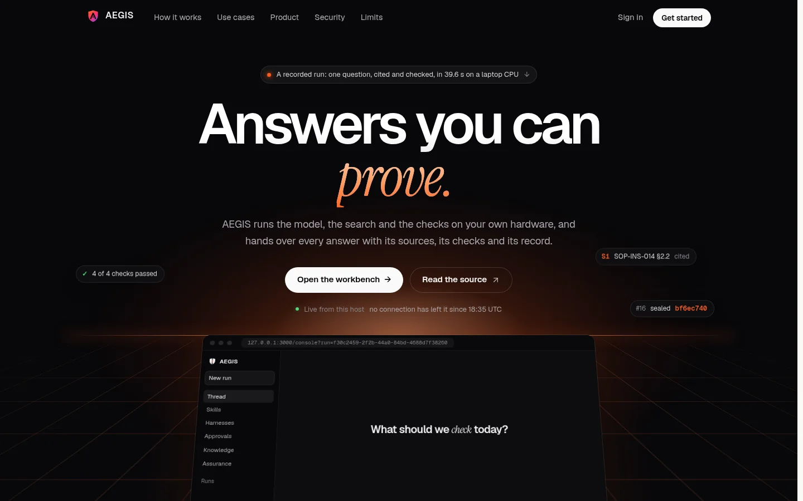
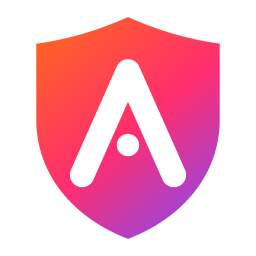

<div align="center">


<br>


**[🎬 See it](#-see-aegis-in-action)** · **[🧭 How it works](#-understand--decide--execute--prove)** · **[🧩 Features](#-what-is-inside)** · **[🔐 Security](#-security-by-architecture)** · **[🚀 Quick start](#-quick-start)** · **[📚 Handbook](#-the-aegis-handbook)** · **[👥 Team](#-the-team)**

For the next build phases and the single flagship workflow to take to SIH, see the
[winning build plan](docs/SIH-WINNING-BUILD-PLAN.md).

</div>

---

> **Ask a question in plain language. AEGIS answers it from your own documents, cites the section every sentence came from, checks the claims and the arithmetic, holds anything that leaves the building for a named reviewer, and writes every step to a hash-chained log, all on one machine, with nothing sent anywhere.**

---

## 💡 Why AEGIS?

Running a model on your own hardware solves exactly one problem: the prompt does not leave the building. It says nothing about **which** model answered, **what** it read, **whether** the arithmetic is right, **who** authorised the result, or **what** you can show a regulator six months later.

<div align="center">

</div>

A sensitive organisation has to control the **data**, the **models**, the **tools**, the **execution**, the **evidence**, the **policies**, the **approvals** and the **audit**. AEGIS is built around that whole lifecycle, not just the inference call in the middle of it.

> *AEGIS does not depend on the AI never making mistakes. It detects, contains, verifies, governs and proves what happened, before an AI-generated result becomes an action.*

---

## 🎬 See AEGIS in action

<div align="center">



<sub>The public page plays one real recorded run as you scroll. Every word and figure in it is the run's own.</sub>

<br><br>


<sub><b>Thread</b> · ask in plain language, or call a skill with <code>/</code>. <b>48 months</b>, cited to <b>SOP-INS-014 §2.2</b>, delivered in 18.8 s on a laptop CPU with 6 of 6 checks passed.</sub>

</div>

<table>
<tr>
<td width="50%">


<sub>🟠 <b>Held by policy</b> · the answer is right and every check passed, but retrieval admitted a <i>Restricted</i> memo, so the run is Restricted and waits for a signature. The model's confidence played no part.</sub>
</td>
<td width="50%">


<sub>✅ <b>Approvals</b> · why each run was held, its answer and citations, every check, and a decision recorded against the reviewer, who can never be the person who ran it.</sub>
</td>
</tr>
<tr>
<td>


<sub>🧪 <b>Harnesses</b> · one job over many items. Each item is an ordinary checked run, and the job ends in one hashed report.</sub>
</td>
<td>


<sub>📦 <b>Sandbox</b> · run code under this host's limits, or fire the attacks it must stop, and see what the OS measured or which rule refused it.</sub>
</td>
</tr>
<tr>
<td>


<sub>🛡️ <b>Assurance</b> · egress <i>measured</i> at zero, containment <i>tested</i> 7/7, policy <i>configured</i>, each labelled with how the host knows it.</sub>
</td>
<td>


<sub>🔗 <b>Audit</b> · every task, model call, decision and sign-in, hash-linked, and recomputed by the server <i>and</i> independently by your browser.</sub>
</td>
</tr>
<tr>
<td>


<sub>📖 <b>Knowledge</b> · what retrieval can cite (filtered by <i>your</i> clearance), the models on this host, and a tester for retrieval itself.</sub>
</td>
<td>


<sub>⚡ <b>Skills</b> · saved instructions called with <code>/</code>. Every run records which skill version shaped it.</sub>
</td>
</tr>
</table>

<div align="center">


<sub>🔑 Local accounts only: no cloud identity provider. Five demo roles, one click each.</sub>
</div>

---

## 🧭 Understand → Decide → Execute → Prove

| | Stage | What it does | The line that matters |
|:--:|---|---|---|
| 🟧 **01** | **UNDERSTAND** | Reports, scans, drawings and spreadsheets become evidence that keeps its document, page and section. Scans are read **page by page** by a local vision model, three pages a call, with OCR as a fallback | *Raw document → traceable evidence* |
| 🟥 **02** | **DECIDE** | The request is classified; each stage is routed to a model that **policy permits for this data** and that **fits in memory** | ***Installed ≠ authorised*** |
| 🟪 **03** | **EXECUTE** | Retrieval applies clearance **before** ranking. Generated code runs under static checks, OS limits and a socket shim | ***Code runs. Network doesn't.*** |
| 🟦 **04** | **PROVE** | Claims traced, citations resolved, figures recomputed; policy decides who must sign; every step hash-chained | *Every answer has a provable history* |

<details>
<summary><b>🔍 Open the four stages in detail</b></summary>
<br>


</details>

---

## 🏗️ Architecture

<div align="center">

</div>

Three processes on one host: the **Next.js console** (`:3000`), the **FastAPI** API (`127.0.0.1:8000`) and **Ollama** (`127.0.0.1:11434`). Storage is SQLite plus files; vectors are computed in process; the live trace is Server-Sent Events. There is no PostgreSQL, Redis, vector database or cloud service, on purpose. → [Architecture in the handbook](docs/handbook/04-architecture/README.md)

---

## 🧩 What is inside

| | Capability | What is actually implemented |
|:--:|---|---|
| 🧠 | **Local inference** | Ollama over loopback, **refused otherwise** (HTTP 503). Six models declared; single-model residency with audited load and evict |
| 💬 | **Workbench** | One thread, every run listed, token streaming, per-run model choice, a transcript of every stage with timings and tokens |
| 👁️ | **Multimodal reading** | Per-page PDF inspection, PyMuPDF rasterising, batched vision reading, Tesseract fallback; DOCX, XLSX, CSV, PPTX parsers |
| 🔎 | **Retrieval** | Local embeddings + cosine; BM25 fallback; **department and clearance applied before ranking** |
| 🧭 | **Routing** | Rules, stage overrides, hard gates (installed · approved · capable), scoring, fallbacks, a reason for every choice |
| ⚡ | **Skills** | Saved, hashed request templates called with `/`; five built in |
| 🧪 | **Harnesses** | Governed multi-run jobs (question sweep, requirements register, obligation coverage) with one hashed report |
| 📦 | **Sandbox** | AST validation + POSIX rlimits / macOS watchdog / **probed** Windows Job Object + socket and write shim |
| 🧮 | **Engineering engine** | Unit-aware, versioned, clause-cited formulas compute corrosion rate, remaining life, severity and the next survey **before the model writes**; every input bound to its table cell, every result hashed; *cannot calculate* when an input is missing |
| ✅ | **Verification** | Claim verdicts (calculated · supported · conflicted · unsupported · human decision), engineering, citation, page, calculation, code, document and isolation-plan checks |
| ⚖️ | **Conflicts** | Disagreeing sources become conflict objects that withhold the decision; a reviewer chooses, the choice is evidence, the formulas recompute |
| 📚 | **Revision control** | One document code, one revision in force; superseded revisions retrieved only on request, and labelled |
| 🗺️ | **P&ID topology** | Isolation plans judged branch by branch against the lockout procedure, flow up and down, paths, affected loops; the sheet marked |
| 🚦 | **Policy gateway** | Default deny for permissions, tools, models and paths; every decision audited **with the rule that made it** |
| 👩‍⚖️ | **Human approval** | Nine rules; separation of duties by account; decisions bound to the version reviewed; request-revision |
| 📄 | **Deliverables** | DOCX, XLSX, PPTX, Markdown, rendered locally, hashed, withheld until released |
| 🔗 | **Tamper-evident audit** | Append-only SHA-256 chain, verified on the server **and in the browser**, sealed with **Ed25519-signed Merkle roots** |
| 🧾 | **Signed proof** | A certificate per run binding its evidence, calculations, approval and deliverable bytes, verifiable **offline** with the public key |
| 🛡️ | **Ingestion guard** | Uploads judged by their bytes: PDF JavaScript, Office macros, remote templates, archive bombs refused; injected instructions withheld from the model |
| 🎯 | **Red team** | 31 attacks run against a live host, each a measurement, with a hashed report |
| 📡 | **Sovereignty monitor** | Samples the workbench's own connections every 2 s; reports "cannot observe" rather than a false zero |
| 📈 | **Usage telemetry** | Tokens, load, prompt and generation time, first-token time, context window, done reason, per model call |
| 🔴 | **Live trace** | 36 Server-Sent Event types across tasks, harnesses and sovereignty |
| 👥 | **Access control** | Five roles, 22 permissions, inheritance, departments, clearance ceilings, hashed sessions, sign-in throttling |

<div align="center">

| 🐍 25,600 lines of Python | ⚛️ 26,300 lines of TypeScript | 🧪 621 tests | 📚 109-page handbook |
|:--:|:--:|:--:|:--:|
| **🔴 36** live event types | **🛡️ 22** permissions · 5 roles | **🎯 31 / 31** attacks held | **📑 15** documents · 207 passages |

</div>

---

## 🔐 Security by architecture

> **Model output is untrusted until the required checks pass.**

```
MODEL  →  POLICY  →  SANDBOX  →  VERIFICATION  →  HUMAN AUTHORITY  →  RELEASE
```

**✅ What is enforced in code**

- Inference is pinned to loopback and refused otherwise.
- Permissions, tools, models and paths are **default deny**, from policy files, and every decision is audited with its rule ID.
- Retrieval applies **department isolation and clearance before ranking**, so nobody learns what they may not read.
- A run's classification **rises to the highest class of the evidence it used**, and never falls.
- Generated code is statically validated (imports, calls, `getattr` tricks, process escapes), then runs under OS limits: `setrlimit` on Linux, a memory watchdog on macOS, a probed **Job Object** on Windows. If the host cannot prove its limits hold, code is **refused**.
- Sockets, including the raw `_socket` primitive, raise inside the sandbox, and writes outside its workspace are refused.
- Sandboxed code cannot read outside its workspace either: `/etc/passwd` and the workbench database are refused at runtime.
- Approval is separated from execution: **nobody approves their own run**, and a decision applies only to the version that was reviewed.
- Uploads are judged by their bytes, not their names; document text addressed to the model is withheld from it and holds the run.
- Sessions are stored by hash; sign-in guessing locks the account.
- The audit log is append-only and hash-chained, and its Merkle root is **signed**, so a rewritten history is caught even when every hash was recomputed.
- Every control above is attacked by `scripts/red_team.py`; the last live run held **31 of 31**, and the report records what was observed, not that it passed.

**⚠️ What this is not, stated plainly**

- The sandbox is **application-level isolation in a subprocess**, not a container or VM, and it runs as the API's user. Its shims block network, process escapes, and reads and writes outside the workspace; a flaw in a shim is not stopped by an operating-system boundary. Container isolation is the next step.
- Engineering figures are deterministic; other claims are traced **lexically**: a passage that carries a claim's terms supports it, which is not the same as entailing it.
- The signing key lives on the host it signs for. Copy the public key and the seals off-host.

Every control, what is measured, and what is still open: **[Threat model](docs/handbook/09-security/06-threat-model.md)** · **[Red team](docs/handbook/09-security/08-red-team.md)** · **[Signed proof](docs/handbook/09-security/09-proof.md)**.

---

## 🛠️ Technology

| Layer | Stack |
|---|---|
| **Frontend** |     |
| **Backend** |     |
| **Models** |  Qwen2.5 3B · Qwen3 8B · Qwen2.5-VL 3B · Qwen2.5 Coder 7B · Moondream 2 · Nomic Embed Text |
| **Storage** |  runs, users, sessions, skills, harness runs, passages and vectors |
| **Documents** | PyMuPDF · pypdf · Tesseract OCR · python-docx · openpyxl · python-pptx · Pillow |
| **Execution** | Python subprocess · AST validation · POSIX rlimits · macOS watchdog · Windows Job Object |
| **Proof** | Ed25519 (`cryptography`) · RFC 6962 Merkle trees · SHA-256 |
| **Transport** | REST · Server-Sent Events |

---

## 🚀 Quick start

**You need:** Python 3.11+, Node 20+, [Ollama](https://ollama.com), and optionally Tesseract. **No GPU.**

```bash
# 1 · Clone
git clone https://github.com/kartikeyajay2006/Sovereign-On_Premise-Agentic-AI-Workbench.git
cd Sovereign-On_Premise-Agentic-AI-Workbench

# 2 · Backend
python3 -m venv .venv && source .venv/bin/activate        # Windows: .venv\Scripts\activate
pip install -r requirements.txt

# 3 · Frontend
(cd frontend && npm ci)

# 4 · Models
ollama pull qwen2.5:3b          # reasoning
ollama pull qwen2.5vl:3b        # vision
ollama pull nomic-embed-text    # retrieval

# 5 · The synthetic corpus: 15 documents, 207 passages
python scripts/seed_demo_data.py

# 6 · Run (Linux). On macOS and Windows, see the handbook
./scripts/run.sh
```

Open **http://127.0.0.1:3000** and pick a demo account.

| Account | Role | Clearance | Try |
|---|---|---|---|
| `engineer` | Integrity engineer | Restricted | `/clause internal inspection of a pressure vessel in corrosive service` |
| `reviewer` | Approving authority | Restricted | **Approvals**, then <kbd>A</kbd> |
| `operator` | Plant operator | Confidential | The same question as the engineer: fewer passages |
| `auditor` | Internal auditor | Restricted | **Audit → Verify chain** |
| `admin` | Platform administrator | Restricted | Everything |

Password for all five: `workbench` (`security.seed_user_password`). **Change it before any real use**, and bind the console to loopback (`npx next start -H 127.0.0.1`) on a shared network.

→ Full setup, Windows, troubleshooting: **[Getting started](docs/handbook/01-getting-started/README.md)** · A guided tour: **[Your first hour](docs/handbook/01-getting-started/07-first-hour.md)**

---

## 📚 The AEGIS Handbook

A **101-page manual**, written from the code, that says where every control stops as well as what it does.

<table>
<tr>
<td width="33%" valign="top">

**🟧 Use it**
- [01 · Getting started](docs/handbook/01-getting-started/README.md)
- [02 · Core concepts](docs/handbook/02-concepts/README.md)
- [03 · Using the workbench](docs/handbook/03-user-guide/README.md)

**🟥 Understand it**
- [04 · Architecture](docs/handbook/04-architecture/README.md)
- [05 · Models and routing](docs/handbook/05-models-and-routing/README.md)

</td>
<td width="33%" valign="top">

- [06 · Knowledge and retrieval](docs/handbook/06-knowledge-and-retrieval/README.md)
- [07 · Agents and orchestration](docs/handbook/07-agents/README.md)
- [08 · Verification](docs/handbook/08-verification/README.md)

**🟪 Run it safely**
- [09 · Security and governance](docs/handbook/09-security/README.md)
- [10 · Configuration reference](docs/handbook/10-configuration/README.md)

</td>
<td width="33%" valign="top">

- [11 · API reference](docs/handbook/11-api/README.md)
- [12 · Operations](docs/handbook/12-operations/README.md)

**🟦 Build on it**
- [13 · Development](docs/handbook/13-development/README.md)
- [14 · Demo guide](docs/handbook/14-demo-guide/README.md)
- [15 · FAQ and glossary](docs/handbook/15-reference/README.md)

</td>
</tr>
</table>

Also: the scripted **[demo with correct answers](docs/DEMO.md)** · **[use cases](docs/USE-CASES.md)** · the **[runtime guarantees](docs/RUNTIME-ENVIRONMENT.md)** · the **[brand kit](docs/assets/brand/README.md)**.

---

## 🗺️ Roadmap

**✅ Built**

- [x] Local inference with a declared, policy-checked model registry; loopback enforced
- [x] Per-stage routing with hard gates, reasons, residency management and per-run model choice
- [x] Per-page multimodal reading: rasterising, batched vision, OCR fallback
- [x] Retrieval with provenance and clearance before ranking; BM25 fallback
- [x] Sandbox with static validation and OS limits on Linux, macOS and Windows
- [x] Verification: claims, citations, page citations, recomputed figures, code, documents
- [x] Default-deny policy gateway with rule IDs; classification raised by evidence
- [x] Human approval with separation of duties
- [x] Hash-chained audit, verified on the server and in the browser
- [x] DOCX, XLSX, PPTX and Markdown deliverables, hashed and held
- [x] Skills, harnesses, live trace, usage telemetry
- [x] Full handbook and brand kit
- [x] Console bound to loopback; self-registration off; hashed session tokens; sign-in throttling; model digests pinned
- [x] Read confinement in the sandbox
- [x] Deterministic, unit-aware engineering formulas with evidence-bound inputs; fail closed when a requested calculation was not computed
- [x] Claim verdicts; conflict objects with human resolution; revision-aware retrieval
- [x] Prompt-injection screening of evidence; upload quarantine by bytes and structure
- [x] Ed25519-signed Merkle roots; per-run certificates; digest-bound approval; deliverables re-hashed on download
- [x] A measured red-team suite; P&ID topology with isolation plans against the lockout procedure

**🔜 Next** ([what is still open, and why](docs/handbook/09-security/06-threat-model.md#what-does-not-hold-yet))

- [ ] A rootless container runtime for generated code (`--network none`, read-only root, non-root)
- [ ] P&ID extraction from drawings (today a drawing is authored as a graph); a benchmark dashboard over the red team and golden answers
- [ ] Off-host anchoring of signed roots; a hardware signing key
- [ ] Offline installation bundle with a frontend container

---

## ⚠️ Limitations

Stated plainly, because they decide whether AEGIS is right for you.

- **Latency is hardware-bound.** On a CPU laptop, a cited answer takes about 20–40 s and a drafted document from a scan several minutes. A GPU changes this substantially.
- **Small models are small.** A 3B model drafts thin documents and leaves things out: asked for an isolation plan it once named one branch of five. The figures and the plan come from deterministic engines, so what it omits is restored and what it gets wrong fails verification, but its prose stays thin. [How the gap was closed](docs/handbook/08-verification/05-limits.md).
- **The sandbox is not a container.** Its limits are enforced by runtime shims in the API user's own process tree. [Details](docs/handbook/09-security/03-sandbox.md).
- **Drawings are authored as graphs.** The P&ID engine answers from a reviewed graph; reading a drawing image into one is not built yet.
- **Egress is measured for the workbench's own processes**, not the whole host. For a provable air gap, add a host firewall.
- **Policy files are a sensible default**, not your organisation's policy. Some declared controls are not implemented yet, and the [configuration reference](docs/handbook/10-configuration/README.md) marks every one.
- **Compliance is not a software property.** The audit chain supports an assurance process; it is not one.

---

## 👥 The team

<table>
<tr>
<td align="center" width="30%" valign="top">
<a href="https://github.com/kartikeyajay2006"></a>
<br><b>Kartikeya Yadav</b>
<br><a href="https://github.com/kartikeyajay2006">@kartikeyajay2006</a>
<br><br>
<br><br>
<sub>Designed and built the platform end to end, from the reference architecture to a working local deployment.</sub>
<br><br>
<sub>🏗️ <b>Foundation</b>: config-driven core, SQLite persistence, local identity and the hash-chained audit log</sub><br>
<sub>🧭 <b>Intelligence</b>: model registry and routing, the knowledge base, tools and the default-deny policy gateway</sub><br>
<sub>🤖 <b>Pipeline</b>: the agent orchestrator, the API and task queue, the sovereignty monitor and secure event streams</sub><br>
<sub>📦 <b>Sandbox & proof</b>: contained code execution, the verifier and the human approval gate</sub><br>
<sub>⚡ <b>Performance</b>: stopped host swapping (a 72 s call had become 25 min), roughly halved run time, fixed concurrent audit writes</sub><br>
<sub>🔧 <b>Reliability</b>: scanned PDFs reaching the vision model, the queue worker, approvals and deliverables</sub><br>
<sub>🎨 <b>Identity & docs</b>: the new AEGIS mark and brand kit, the synthetic industrial dataset, the README and the 101-page handbook</sub>
</td>
<td align="center" width="30%" valign="top">
<a href="https://github.com/kunalKumar-13"></a>
<br><b>Kunal Kumar</b>
<br><a href="https://github.com/kunalKumar-13">@kunalKumar-13</a>
<br><br>
<br><br>
<sub>The most prolific contributor, turning the platform into the workbench people use and making every claim it makes true.</sub>
<br><br>
<sub>💬 <b>Workbench</b>: the chat-first thread, streamed answers, run transcripts and the sidebar of past runs</sub><br>
<sub>⚡ <b>Skills & harnesses</b>: saved instructions called with <code>/</code>, and governed multi-run jobs with hashed reports</sub><br>
<sub>🪟 <b>Windows containment</b>: the Job Object sandbox, probed before any code may run</sub><br>
<sub>📈 <b>Telemetry</b>: what each run cost, which model ran it, and a stop control</sub><br>
<sub>✅ <b>Correctness</b>: clearance before ranking, classification raised by evidence, unresolved citations held, quoted figures never counted as recomputed, the <code>getattr</code> bypass closed, no approving your own run</sub><br>
<sub>🌐 <b>Experience</b>: the landing page that replays a real run, the light and dark design system, keyboard navigation</sub><br>
<sub>🔍 <b>Honesty pass</b>: removed every reading, score and posture claim the backend never measured</sub>
</td>
<td align="center" width="20%" valign="top">
<a href="https://github.com/raghav-shell"></a>
<br><b>Raghav Sharma</b>
<br><a href="https://github.com/raghav-shell">@raghav-shell</a>
<br><br>
<br><sub>Frontend visual system and motion; scanned-PDF extraction and the macOS sandbox</sub>
</td>
<td align="center" width="20%" valign="top">
<a href="https://github.com/ankit25bcs10610"></a>
<br><b>Ankit Pandey</b>
<br><a href="https://github.com/ankit25bcs10610">@ankit25bcs10610</a>
<br><br>
<br><sub>Contributions to the workbench</sub>
</td>
</tr>
</table>

---

<div align="center">



### AEGIS

`ON-PREMISE AGENTIC AI WORKBENCH`

**UNDERSTAND → DECIDE → EXECUTE → PROVE**

*Private intelligence. Provable control.*

<sub>Built for Smart India Hackathon 2025 · Every claim above was checked against the code before it was written.</sub>

</div>
