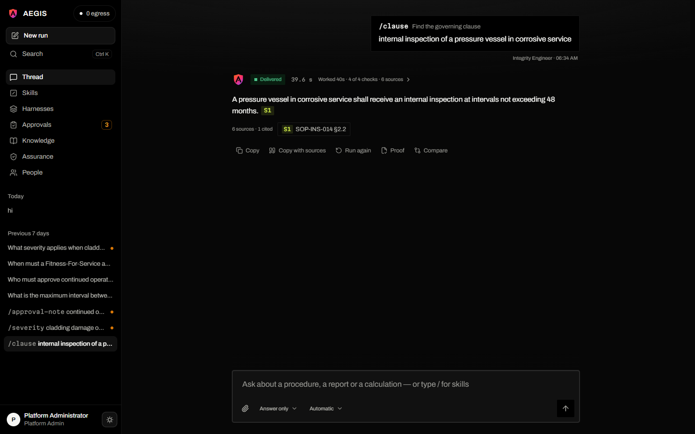
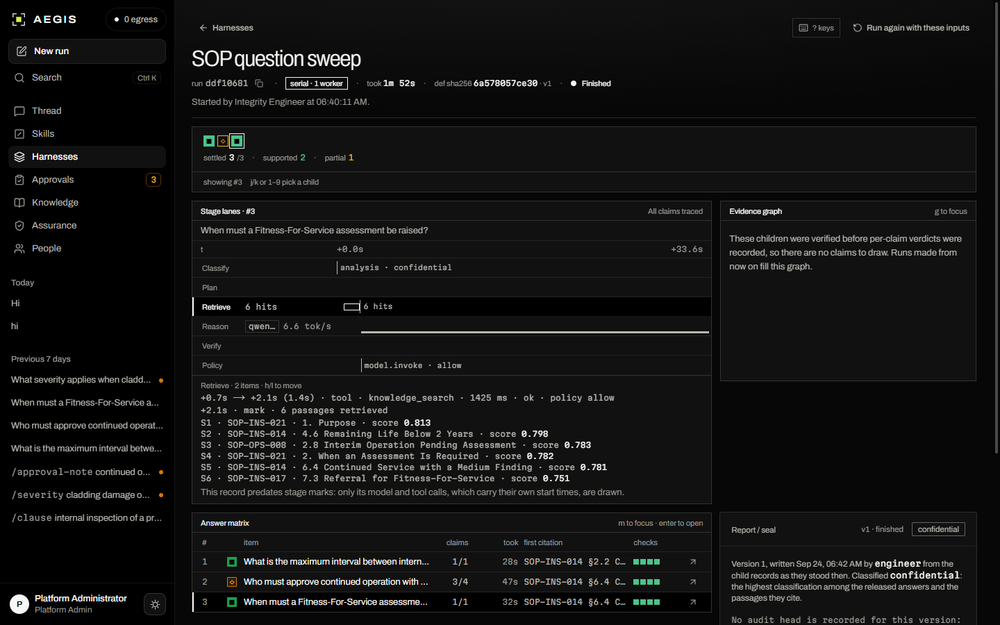
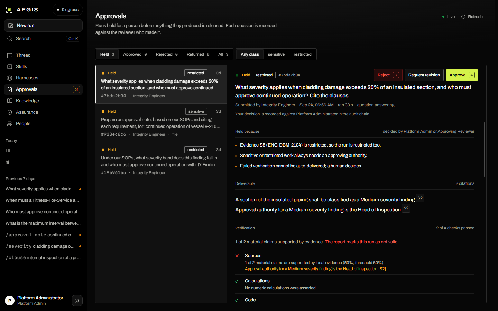
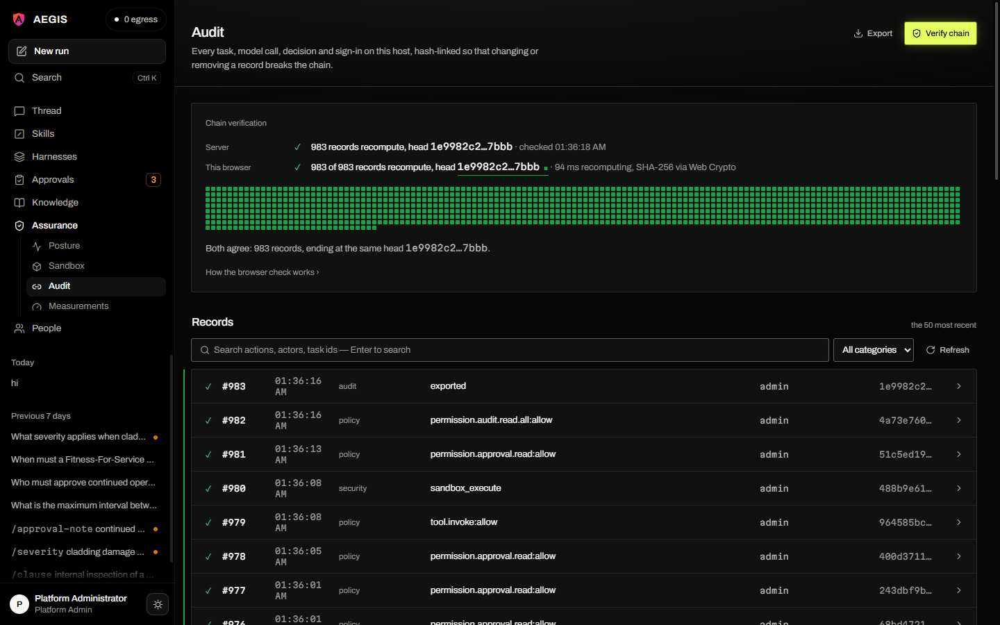
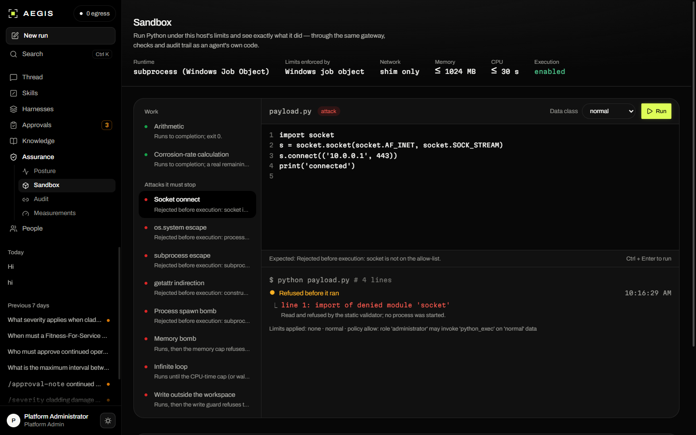
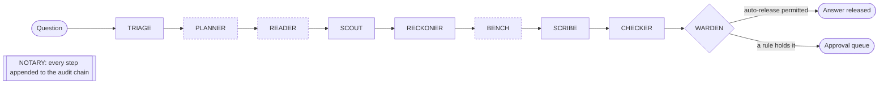
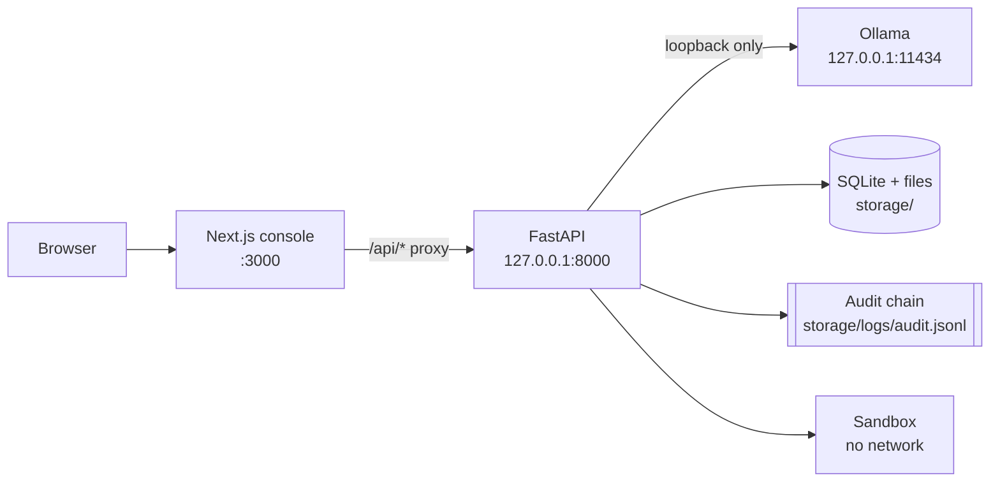

<div align="center">

<picture>
  <source media="(prefers-color-scheme: dark)" srcset="docs/assets/brand/aegis-mark-white.svg">
  
</picture>

# AEGIS

**Answers your plant can prove.**

An air-gapped AI workbench for regulated industrial work. The model, the search and the checks run on one machine, and every answer comes with its sources, its checks and its record.

[](https://github.com/kartikeyajay2006/Sovereign-On_Premise-Agentic-AI-Workbench/actions/workflows/ci.yml)


[What it does](#what-it-does) · [One question, step by step](#one-question-step-by-step) · [A real run](#a-real-run) · [Quickstart](#quickstart) · [Hardware](#hardware-tiers) · [Docs](#docs) · [Limitations](#%EF%B8%8F-limitations)

</div>

<p align="center">
  <picture>
    <source media="(prefers-color-scheme: light)" srcset="frontend/public/landing/shots/thread-light.png">
    
  </picture>
  <br>
  <sub>A delivered answer: each requirement carries the clause it came from. 4 of 4 checks, 3 of 6 retrieved sources cited, Qwen2.5 3B.</sub>
</p>

<details>
<summary><b>More screens</b>: harness, approvals, audit, sandbox</summary>
<br>

| | |
|:--:|:--:|
| <br><sub><b>Harnesses</b>: one governed job over many items, ending in one hashed report</sub> | <br><sub><b>Approvals</b>: why each run was held, and the decision on the record</sub> |
| <br><sub><b>Audit</b>: the hash chain, recomputed by the server and by your browser</sub> | <br><sub><b>Sandbox</b>: an attack preset, refused before it ran</sub> |

</details>

## What it does

- **Cited answers, checked claim by claim.** Every answer is drafted from passages retrieved on this host, and each material claim is traced to the passage it cites. A claim with no support is marked unsupported, and an answer below the support threshold (60% of material claims in the recorded run) fails verification. Department and clearance are applied *before* ranking, so retrieval does not surface what the reader may not see.
- **Figures from a registry, not the model.** Corrosion rate, remaining life, severity, the next survey and relief-valve verdicts come from 18 versioned, clause-cited formulas. The model is told the figures; it is never asked for them. A missing input gives *cannot calculate*, not a guess.
- **Generated code runs in a sandbox.** Static checks refuse imports such as `socket` and `subprocess` before anything runs. OS limits then apply, by default 1024 MB of memory, 30 s of CPU and 45 s of wall clock (`config/app.yaml`): `setrlimit` on Linux, a probed Job Object on Windows, and a rootless container with `--network none` where one is built and its probe passes.
- **A person approves what policy says must be approved.** 11 rules in `policies/approval-rules.yaml` hold a run: restricted data, failed verification, an unresolved conflict, a High finding and more. Nobody approves their own run. A High finding needs two signatures in order.
- **A tamper-evident record.** Every task, model call, policy decision and sign-in is appended to a SHA-256 hash chain whose Merkle roots are signed with Ed25519. The server verifies it, and so can your browser.
- **Zero egress by design, and measured.** The inference client refuses any non-loopback Ollama URL, the sandbox refuses sockets, and the console's CSP allows only its own origin. The sovereignty monitor reads the workbench's own connections every 2 s and counts anything outside `127.0.0.0/8` and `::1`. It measures the workbench's processes, not the whole host.

## One question, step by step

Ten named stages of **one orchestrator** (`backend/agents/orchestrator.py`), run one after another. The names are a way to talk about the stages, not ten independent agents. A stage that is not needed is skipped, and the run says why.

| # | Call-sign | What it does | Runs on |
|:--:|---|---|---|
| 01 | **TRIAGE** | Reads the request: what kind of task, what came in, how sensitive it is | No model · rules |
| 02 | **PLANNER** | Splits multi-step work into steps before anything is drafted | `qwen2.5:3b`, only when a plan is needed |
| 03 | **READER** | Reads scanned reports and drawings, page by page | `qwen2.5vl:3b`, cached per file |
| 04 | **SCOUT** | Finds the passages that could answer it, across every indexed procedure | `nomic-embed-text`, plus keyword search |
| 05 | **RECKONER** | Computes with registered formulas, never free-hand arithmetic | No model · formula registry |
| 06 | **BENCH** | Runs generated code in the sandbox, under hard memory and time caps | No model · sandbox limits |
| 07 | **SCRIBE** | Drafts the answer, one citation per requirement | `qwen2.5:3b`, drafting model |
| 08 | **CHECKER** | Tests every claim against the passage it cites, and fails what it cannot find | No model · rules |
| 09 | **WARDEN** | Applies policy and the data class, and holds anything that needs a person | No model · policy engine |
| 10 | **NOTARY** | Hashes the record onto the audit chain. Edit a byte and the chain breaks | No model · SHA-256 chain |

<sub>Source: <a href="frontend/lib/crew.ts"><code>frontend/lib/crew.ts</code></a>. The models are the defaults registered in <a href="config/models.yaml"><code>config/models.yaml</code></a>; the router can pick another registered model that policy approves for the data.</sub>


```mermaid
flowchart LR
    Q([Question]) --> T[TRIAGE] --> P[PLANNER] --> R[READER] --> S[SCOUT] --> K[RECKONER] --> B[BENCH] --> W[SCRIBE] --> C[CHECKER] --> G{WARDEN}
    G -->|auto-release permitted| OUT([Answer released])
    G -->|a rule holds it| H([Approval queue])
    N[["NOTARY: every step appended to the audit chain"]]
    classDef optional stroke-dasharray: 4 3
    class P,R,B optional
```

<sub>Dashed: runs only when the request needs it. WARDEN also rules on every model and tool call along the way, and NOTARY records each step as it happens.</sub>

## A real run

Run `f30c2459`, captured from a developer host on 24 Sep 2026 with Ollama on loopback. Every figure below is from [`frontend/public/landing/run.json`](frontend/public/landing/run.json), the record the landing page replays.

> **Prompt** · `/clause` Which clause of our SOPs governs the following, and what exactly does it require? *internal inspection of a pressure vessel in corrosive service*
>
> **Answer** · A pressure vessel in corrosive service shall receive an internal inspection at intervals not exceeding 48 months. `[S1]` → **SOP-INS-014 §2.2**

| Stage | Call-sign | Time | What happened |
|---|---|--:|---|
| classify | TRIAGE | 3 ms | question answering, confidential |
| plan | PLANNER | skipped | no plan was made |
| read | READER | skipped | no file was attached |
| retrieve | SCOUT | 602 ms | 6 passages from 2 documents, embedding search |
| sandbox | BENCH | skipped | no code was generated |
| draft | SCRIBE | 38,902 ms | `qwen2.5:3b` Q4_K_M: 1,170 prompt tokens, 29 output tokens at 6.16 tok/s |
| verify | CHECKER | not recorded | 4 of 4 checks passed; 1 of 1 material claims supported |
| release | WARDEN | | no approval required; policy: auto-release permitted |
| record | NOTARY | | 10 records appended, sequence 7–16, head `bf6ec740` |
| **total** | | **39,647 ms** | **delivered** |

Drafting took 98% of the run, and 33.7 s of that was the model reading its prompt on a CPU.

## Quickstart

**You need:** Python 3.11+, Node.js 20+ (CI builds with 22), git, [Ollama](https://ollama.com) and about 15 GB of free disk. No GPU is required. Tesseract is an optional OCR fallback. Details: [1.2 Requirements](docs/handbook/01-getting-started/02-requirements.md).

### Windows (PowerShell)

```powershell
git clone https://github.com/kartikeyajay2006/Sovereign-On_Premise-Agentic-AI-Workbench.git
cd Sovereign-On_Premise-Agentic-AI-Workbench
python -m venv .venv
.\.venv\Scripts\Activate.ps1
pip install -r requirements.txt
cd frontend; npm ci; cd ..

ollama pull qwen2.5:3b; ollama pull qwen2.5vl:3b; ollama pull nomic-embed-text
.\.venv\Scripts\python.exe scripts\seed_demo_data.py      # --check validates without writing

# Terminal 1: Ollama with the tier's variables (quit the tray app first)
.\scripts\start-ollama.ps1 -Tier laptop-8gb

# Terminal 2: the API, with the same tier
$env:SOVEREIGN_PROFILE = 'laptop-8gb'
.\.venv\Scripts\python.exe -m uvicorn backend.api.main:app --host 127.0.0.1 --port 8000 --timeout-keep-alive 75

# Terminal 3: the console
cd frontend; npm run build; npx next start -H 127.0.0.1

# Then: is the host ready?
.\scripts\warmup.ps1            # loads the drafting model, ends READY or NOT READY
.\scripts\warmup.ps1 --check    # the same readings, loads nothing
```

Full walk-through: [1.4 Install on Windows](docs/handbook/01-getting-started/04-install-windows.md).

### Linux and macOS

```bash
git clone https://github.com/kartikeyajay2006/Sovereign-On_Premise-Agentic-AI-Workbench.git
cd Sovereign-On_Premise-Agentic-AI-Workbench
python3 -m venv .venv && source .venv/bin/activate
pip install -r requirements.txt
(cd frontend && npm ci)

ollama pull qwen2.5:3b && ollama pull qwen2.5vl:3b && ollama pull nomic-embed-text
python scripts/seed_demo_data.py

scripts/start-ollama.sh --tier laptop-8gb         # in its own terminal; runs `ollama serve`
SOVEREIGN_PROFILE=laptop-8gb ./scripts/run.sh     # Linux: builds the console, starts API and console
.venv/bin/python scripts/warmup.py                # READY / NOT READY
```

`scripts/run.sh` is written for Linux and also takes `--status`, `--stop` and `--dev`. On macOS, start the API and the console in two terminals with the same commands as on Windows ([1.6 Seed and run](docs/handbook/01-getting-started/06-seed-and-run.md)).

Open **http://127.0.0.1:3000**. `GET http://127.0.0.1:8000/api/ready` answers `"ready": true` when the same checks pass. Before a demo, `scripts/golden_demo.py` drives the three judged moments through the API and ends `READY` or not. It creates real runs, so don't point it at an instance whose history must stay as it is.

**Demo accounts.** With `demo.enabled: true` (the default in `config/app.yaml`), seven accounts from `policies/access-control.yaml` are seeded and listed under the sign-in form, one click each: `engineer`, `reviewer`, `head_of_inspection`, `plant_manager`, `operator`, `auditor` and `admin`. They share one password, `security.seed_user_password` in `config/app.yaml`. Change it, or turn demo mode off, before any real use.

## Hardware tiers

Pick the profile for the host and set it with `SOVEREIGN_PROFILE`. It is overlaid on `config/app.yaml` and `config/routing.yaml`, and `SOVEREIGN_*` variables still win. Start Ollama with the same tier (`start-ollama.ps1 -Tier …` or `start-ollama.sh --tier …`).

| `SOVEREIGN_PROFILE` | Host | Users | Workers | Cited answer | Scan run |
|---|---|:--:|:--:|---|---|
| `laptop-8gb` | 8 GB, CPU only (the demo laptop) | 1 | 1 | 38–56 s, measured | ~100 s with the vision cache warm, ~290 s cold, measured |
| `laptop-16gb` | 16 GB, 8+ cores, no GPU | 1–2 | 1 | ~17 s, estimated | 1.5–2 min, estimated |
| `cpu-server` | 16–32 cores, 64–128 GB | 3–5 | 3 | ~13 s, estimated | not stated |
| `gpu-server` | ≥ 12 GB VRAM, 64 GB RAM | 5–15 | 4 | ~7 s, estimated | under a minute, estimated |

<sub>Figures from the header of each file in <a href="config/profiles/"><code>config/profiles/</code></a>, which says which are measured and which estimated. Tuning: <a href="docs/handbook/12-operations/05-performance.md#hardware-profiles">12.5 Performance</a>. The runbook for the 8 GB laptop: <a href="docs/handbook/14-demo-guide/03-demo-day.md">14.3 Demo day</a>.</sub>

## Accounts and access

There is no self sign-up. Every account is an administrator's decision ([3.1 Sign-in and accounts](docs/handbook/03-user-guide/01-sign-in.md)).

| Path | How it works |
|---|---|
| **Setup token** | With demo mode off, a fresh host has no accounts. At startup it writes a one-time token, valid 24 h, to `storage/setup-token` and prints it in the API console. `/setup` uses it to create the first administrator |
| **Invitation** | An administrator creates a code on **People**, with the role and department fixed. It is single-use, expires (3 days by default), and only its hash is stored |
| **Access request** | `/request-access` creates an account that cannot sign in until an administrator approves it and chooses its role and department |
| **Password reset** | An administrator issues a one-time `RESET-…` code. An air-gapped host has no mail, so there is no *forgot password* |

Five failed sign-ins in five minutes lock an account. Self-registration exists in the API for development only and is off (`security.self_registration_enabled: false`).

## Architecture


```mermaid
flowchart LR
    U[Browser] --> N["Next.js console<br/>:3000"]
    N -->|"/api/* proxy"| A["FastAPI<br/>127.0.0.1:8000"]
    A -->|loopback only| O["Ollama<br/>127.0.0.1:11434"]
    A --> D[("SQLite + files<br/>storage/")]
    A --> L[["Audit chain<br/>storage/logs/audit.jsonl"]]
    A --> X["Sandbox<br/>no network"]
```

Three processes on one host. Storage is SQLite plus files, vectors are computed in process, and the live trace is Server-Sent Events. There is no external database, queue or cloud service. More in [4 · Architecture](docs/handbook/04-architecture/README.md).

| Folder | What is in it |
|---|---|
| [`backend/`](backend) | The FastAPI app: `agents/` (orchestrator, verifier), `rag/`, `knowledge/`, `engineering/` (formula registry, P&ID), `models_layer/` (registry, router, Ollama client), `policy/`, `security/`, `proof/`, `tools/` (sandbox), `api/` |
| [`frontend/`](frontend) | The Next.js 16 console and the public landing page |
| [`config/`](config) | `app.yaml`, `models.yaml`, `routing.yaml`, `classification.yaml`, hardware `profiles/`, prompts, skills, harnesses |
| [`policies/`](policies) | Access control, approval rules, data classification, content scanning, tool permissions |
| [`scripts/`](scripts) | `run.sh`, `start-ollama.*`, `warmup.*`, `seed_demo_data.py`, `golden_demo.py`, `red_team.py`, `backup.py`, `audit_tool.py`, the offline bundle |
| [`sample_data/`](sample_data) | The synthetic plant: SOPs, records, scanned reports, a P&ID, attack files |
| [`infrastructure/`](infrastructure) | `docker-compose.yml`, the sandbox container image, the nftables egress table |
| [`tests/`](tests) | The pytest suite, including the adversarial tests; no test needs a model |
| [`docs/`](docs) | The handbook and the project documents |
| `storage/` | Runtime state: database, uploads, audit log, keys. Not committed |

## Docs

Start with **[What AEGIS implements today](docs/IMPLEMENTED.md)**: every capability, where it lives, and how to see it working. Then the **[handbook](docs/handbook/README.md)**:

| Use it | Understand it | Run it safely | Build on it |
|---|---|---|---|
| [01 Getting started](docs/handbook/01-getting-started/README.md) | [04 Architecture](docs/handbook/04-architecture/README.md) | [09 Security and governance](docs/handbook/09-security/README.md) | [13 Development](docs/handbook/13-development/README.md) |
| [02 Core concepts](docs/handbook/02-concepts/README.md) | [05 Models and routing](docs/handbook/05-models-and-routing/README.md) | [10 Configuration](docs/handbook/10-configuration/README.md) | [14 Demo guide](docs/handbook/14-demo-guide/README.md) |
| [03 Using the workbench](docs/handbook/03-user-guide/README.md) | [06 Knowledge and retrieval](docs/handbook/06-knowledge-and-retrieval/README.md) | [11 API reference](docs/handbook/11-api/README.md) | [15 FAQ and glossary](docs/handbook/15-reference/README.md) |
| [Offline install](docs/handbook/01-getting-started/09-offline-install.md) | [07 Agents](docs/handbook/07-agents/README.md) · [08 Verification](docs/handbook/08-verification/README.md) | [12 Operations](docs/handbook/12-operations/README.md) | [Readiness review](docs/SIH-READINESS-REVIEW.md) |

For security reviewers: [threat model](docs/handbook/09-security/06-threat-model.md) · [sandbox](docs/handbook/09-security/03-sandbox.md) · [audit log](docs/handbook/09-security/05-audit-log.md) · [red team](docs/handbook/09-security/08-red-team.md) · [signed proof](docs/handbook/09-security/09-proof.md).

## ⚠️ Limitations

- **Latency is hardware-bound.** On the 8 GB CPU laptop a cited answer takes 38–56 s and a scanned report takes minutes. Once the host swaps, a 70-second call can take 25 minutes ([12.5](docs/handbook/12-operations/05-performance.md)).
- **Small models are small.** A 3B model drafts thin prose and leaves things out. Figures and isolation plans come from deterministic engines, so what it omits is restored and what it gets wrong fails verification, but the prose stays thin ([8.5](docs/handbook/08-verification/05-limits.md)).
- **Claims are traced lexically.** A passage that carries a claim's terms supports it, which is not the same as entailing it. Engineering figures are the exception: they are recomputed.
- **The sandbox is a container only where its image is built** (`infrastructure/sandbox/build.sh`). Elsewhere it is runtime shims and OS limits in the API user's own process tree; on Linux a private network namespace still refuses its connections ([9.3](docs/handbook/09-security/03-sandbox.md)).
- **Egress is measured for the workbench's own processes, not the whole host.** For a provable air gap, add a host firewall. The nftables table and its counters are read back on Linux only.
- **The signing key lives on the host it signs for.** Copy the public key and the sealed roots off-host.
- **A drawing read from an image is a proposal.** It is compared with the authored graph, and the isolation engine answers from the reviewed graph.
- **The policy files are a starting point, not your organisation's policy.** Some declared permissions are not enforced yet, and [9.1](docs/handbook/09-security/01-access-control.md) marks each one.
- **Compliance is not a software property.** The audit chain supports an assurance process; it is not one.

## 👥 The team

<table>
<tr>
<td align="center" width="30%" valign="top">
<a href="https://github.com/kartikeyajay2006"></a>
<br><b>Kartikeya Yadav</b>
<br><a href="https://github.com/kartikeyajay2006">@kartikeyajay2006</a>
<br><br>
<br><br>
<sub>Designed and built the platform end to end, from the reference architecture to a working local deployment.</sub>
<br><br>
<sub>🏗️ <b>Foundation</b>: config-driven core, SQLite persistence, local identity and the hash-chained audit log</sub><br>
<sub>🧭 <b>Intelligence</b>: model registry and routing, the knowledge base, tools and the default-deny policy gateway</sub><br>
<sub>🤖 <b>Pipeline</b>: the agent orchestrator, the API and task queue, the sovereignty monitor and secure event streams</sub><br>
<sub>📦 <b>Sandbox & proof</b>: contained code execution, the verifier and the human approval gate</sub><br>
<sub>⚡ <b>Performance</b>: stopped host swapping (a 72 s call had become 25 min), roughly halved run time, fixed concurrent audit writes</sub><br>
<sub>🔧 <b>Reliability</b>: scanned PDFs reaching the vision model, the queue worker, approvals and deliverables</sub><br>
<sub>🎨 <b>Identity & docs</b>: the new AEGIS mark and brand kit, the synthetic industrial dataset, the README and the 101-page handbook</sub>
</td>
<td align="center" width="30%" valign="top">
<a href="https://github.com/kunalKumar-13"></a>
<br><b>Kunal Kumar</b>
<br><a href="https://github.com/kunalKumar-13">@kunalKumar-13</a>
<br><br>
<br><br>
<sub>The most prolific contributor, turning the platform into the workbench people use and making every claim it makes true.</sub>
<br><br>
<sub>💬 <b>Workbench</b>: the chat-first thread, streamed answers, run transcripts and the sidebar of past runs</sub><br>
<sub>⚡ <b>Skills & harnesses</b>: saved instructions called with <code>/</code>, and governed multi-run jobs with hashed reports</sub><br>
<sub>🪟 <b>Windows containment</b>: the Job Object sandbox, probed before any code may run</sub><br>
<sub>📈 <b>Telemetry</b>: what each run cost, which model ran it, and a stop control</sub><br>
<sub>✅ <b>Correctness</b>: clearance before ranking, classification raised by evidence, unresolved citations held, quoted figures never counted as recomputed, the <code>getattr</code> bypass closed, no approving your own run</sub><br>
<sub>🌐 <b>Experience</b>: the landing page that replays a real run, the light and dark design system, keyboard navigation</sub><br>
<sub>🔍 <b>Honesty pass</b>: removed every reading, score and posture claim the backend never measured</sub>
</td>
<td align="center" width="20%" valign="top">
<a href="https://github.com/raghav-shell"></a>
<br><b>Raghav Sharma</b>
<br><a href="https://github.com/raghav-shell">@raghav-shell</a>
<br><br>
<br><sub>Frontend visual system and motion; scanned-PDF extraction and the macOS sandbox</sub>
</td>
<td align="center" width="20%" valign="top">
<a href="https://github.com/ankit25bcs10610"></a>
<br><b>Ankit Pandey</b>
<br><a href="https://github.com/ankit25bcs10610">@ankit25bcs10610</a>
<br><br>
<br><sub>Contributions to the workbench</sub>
</td>
</tr>
</table>

<p align="center"><sub>Built for Smart India Hackathon 2025.</sub></p>
