<div align="center">

<picture>
  <source media="(prefers-color-scheme: dark)" srcset="docs/assets/brand/aegis-mark-white.svg">
  
</picture>

# AEGIS

**Answers your plant can prove.**

An air-gapped AI workbench for regulated industrial work. The model, the search, the engineering formulas and every check run on one machine, and each answer arrives with its sources, its checks, the person who approved it and a signed record.

[](https://github.com/kartikeyajay2006/Sovereign-On_Premise-Agentic-AI-Workbench/actions/workflows/ci.yml)


[The judged moments](#the-judged-moments) · [The console](#the-console) · [Proved, not claimed](#proved-not-claimed) · [How a question runs](#how-a-question-runs) · [Quickstart](#quickstart) · [Docs](#docs) · [Limitations](#%EF%B8%8F-limitations)

</div>

<p align="center">
  <picture>
    <source media="(prefers-color-scheme: light)" srcset="docs/assets/readme/landing-light.webp">
    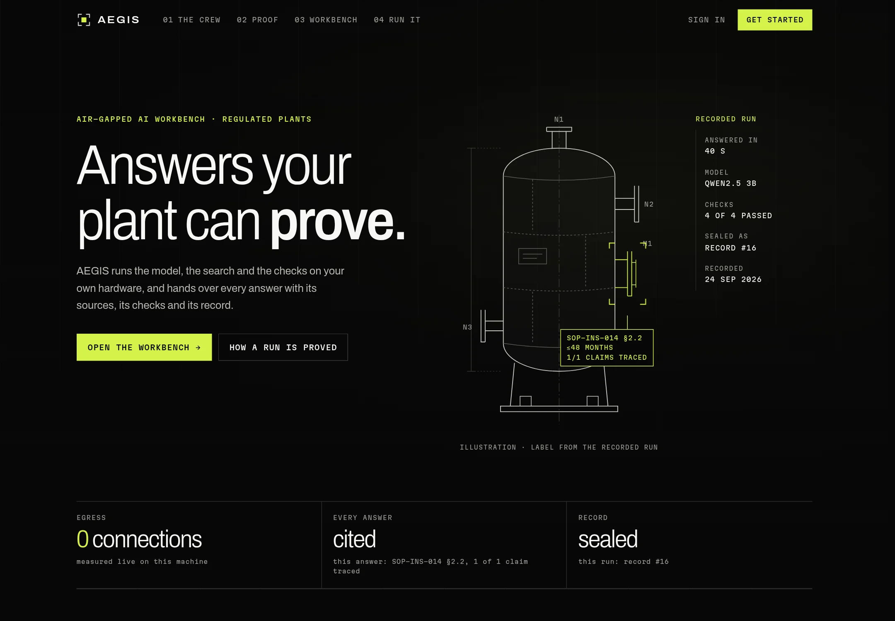
  </picture>
</p>

## In one minute

- **Figures come from a registry, not the model.** Corrosion rate, remaining life, severity, the next survey, relief-valve verdicts, re-rating and interim-operation limits are computed by **21 versioned, clause-cited formulas** before the model writes a word. The model is told the figures and cites them.
- **Every claim is checked.** Each material sentence is traced to the passage or calculation it cites, and a claim nothing supports fails verification. Citations that name evidence the run does not hold are refused.
- **It refuses to guess.** When two records disagree, no figure is stated until a named person chooses, and the choice becomes evidence.
- **A person approves what policy says must be approved.** A High finding needs the Head of Inspection and then the Plant Manager, each on the version they read.
- **Nothing leaves the machine.** Models run through Ollama on loopback, generated code runs in a sandbox the kernel cuts off from the network, and egress is measured, not assumed.
- **Every step is on a signed record.** A SHA-256 hash chain with Ed25519-signed roots, and a certificate per run that anyone can verify offline.

## The judged moments

Each moment is checked end to end against the running workbench by `scripts/golden_demo.py`, which ends `FINAL STATUS: READY` on the demo host. The screens below are those runs.

### 1 · Can V-2104 keep running?

A scanned inspection report goes in. The vision model reads it on this machine, the formula registry computes every figure from the readings it read, and the approval note is drafted from those figures and held for sign-off.

<p align="center">
  <picture>
    <source media="(prefers-color-scheme: light)" srcset="docs/assets/readme/thread-integrity-light.webp">
    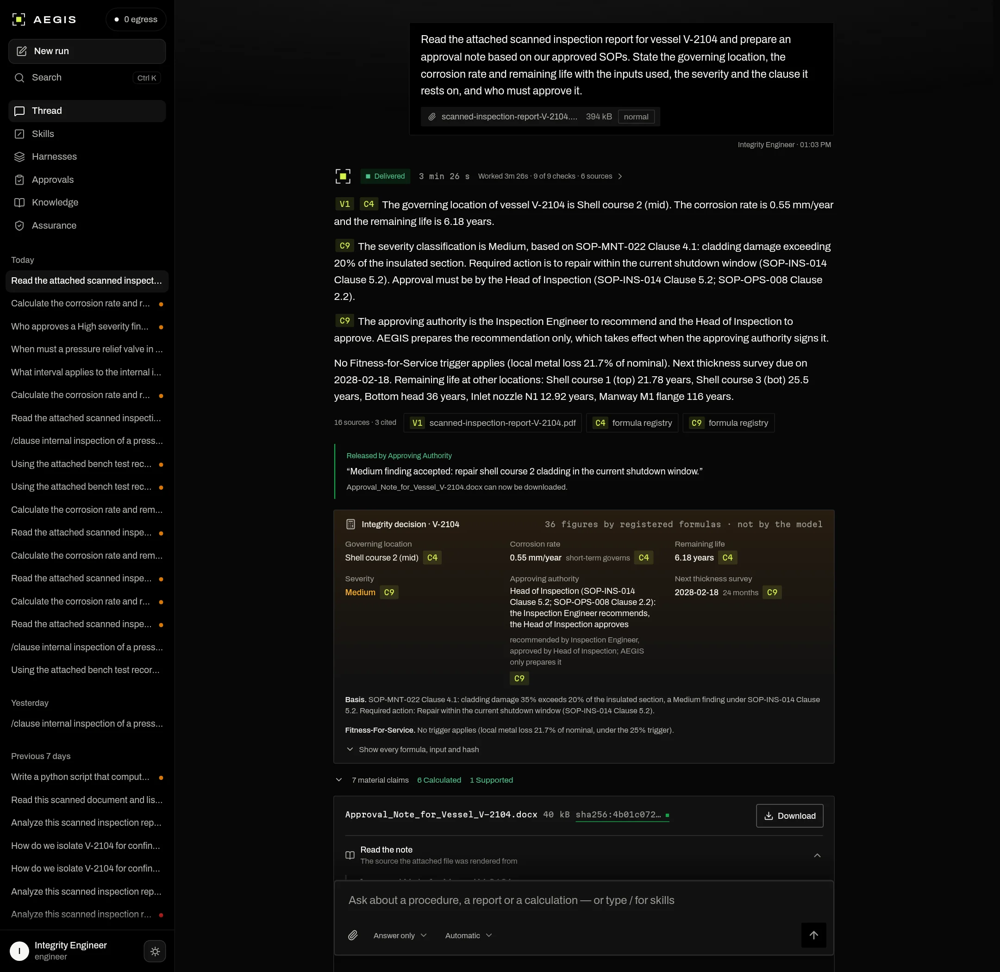
  </picture>
  <br><sub><b>Integrity decision.</b> The governing location is the one with the lowest remaining life, not the thinnest reading. 36 figures, each with its formula version, inputs and hash; <i>cannot calculate</i> when an input is missing.</sub>
</p>

<p align="center">
  <picture>
    <source media="(prefers-color-scheme: light)" srcset="docs/assets/readme/proof-light.webp">
    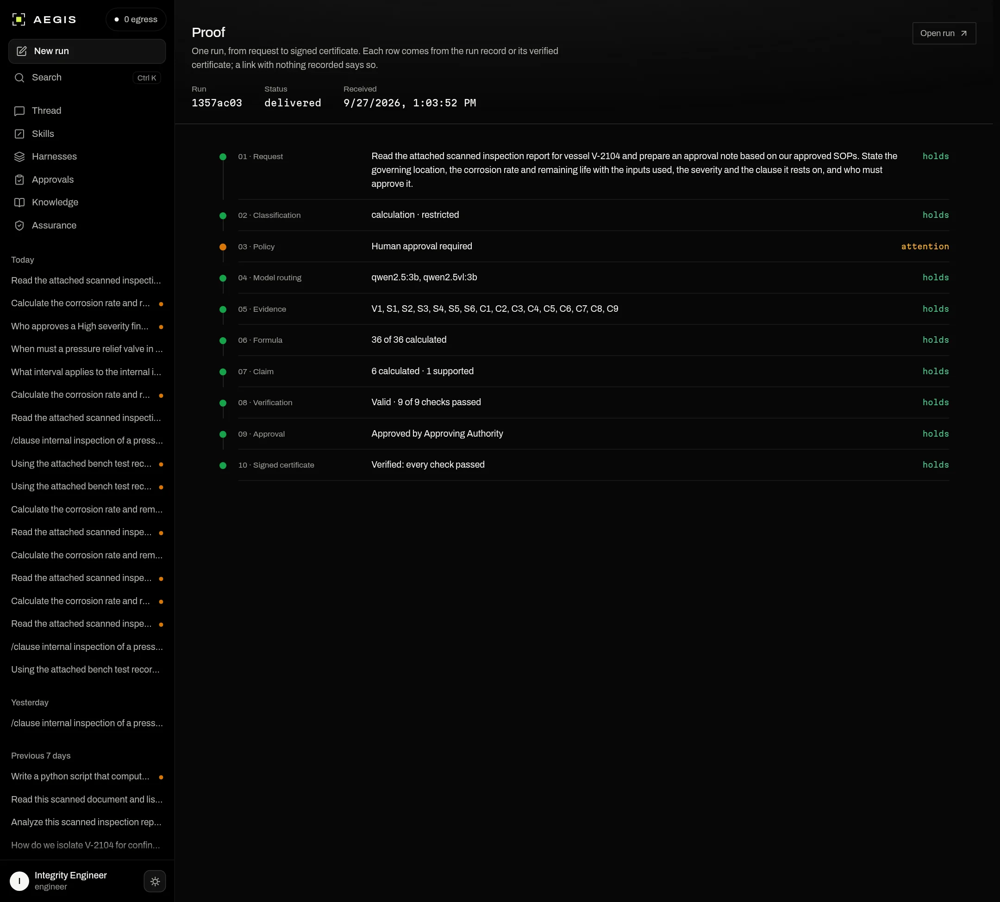
  </picture>
  <br><sub><b>Proof Mode.</b> The same run from request to signed certificate on one screen: 36 of 36 figures calculated, 9 of 9 checks, approved by a reviewer, certificate verified.</sub>
</p>

### 2 · The workbench refuses to guess

The thickness survey and a contractor's field sheet disagree at shell course 2 (9.4 mm against 9.9 mm). No rate, life or severity is stated; the run is held until a reviewer chooses, and the formulas then recompute from that choice.

<p align="center">
  <picture>
    <source media="(prefers-color-scheme: light)" srcset="docs/assets/readme/thread-conflict-light.webp">
    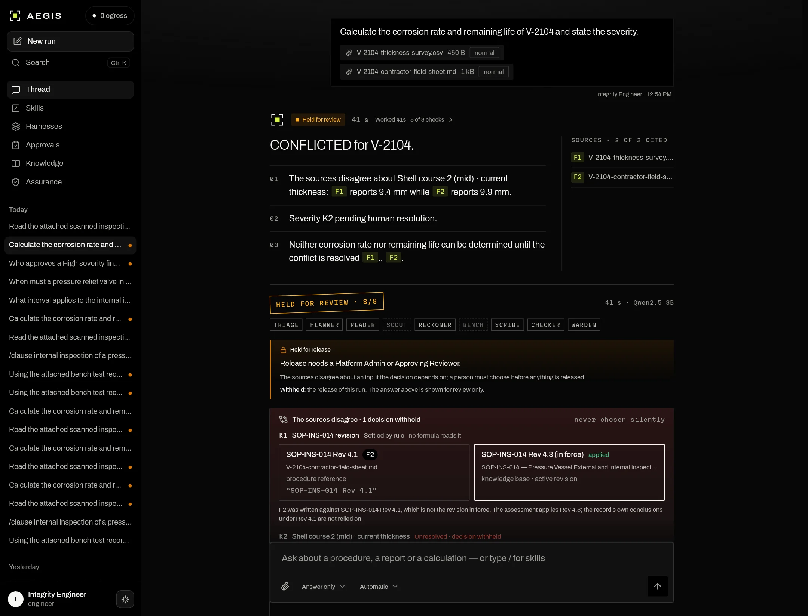
  </picture>
  <br><sub><b>Decision withheld.</b> Conflict K2 is never chosen silently. The field sheet also cites SOP-INS-014 Rev 4.1; the revision in force, 4.3, is applied and shown.</sub>
</p>

### 3 · Attack the controls

31 attacks run against a live host: hostile PDFs and Office files, prompt injection, host-file reads, HTTP, DNS and raw-socket egress from generated code, privilege escalation, forged sessions and audit tampering. **31 of 31 held.**

<table>
<tr>
<td width="50%"><picture><source media="(prefers-color-scheme: light)" srcset="docs/assets/readme/assurance-light.webp">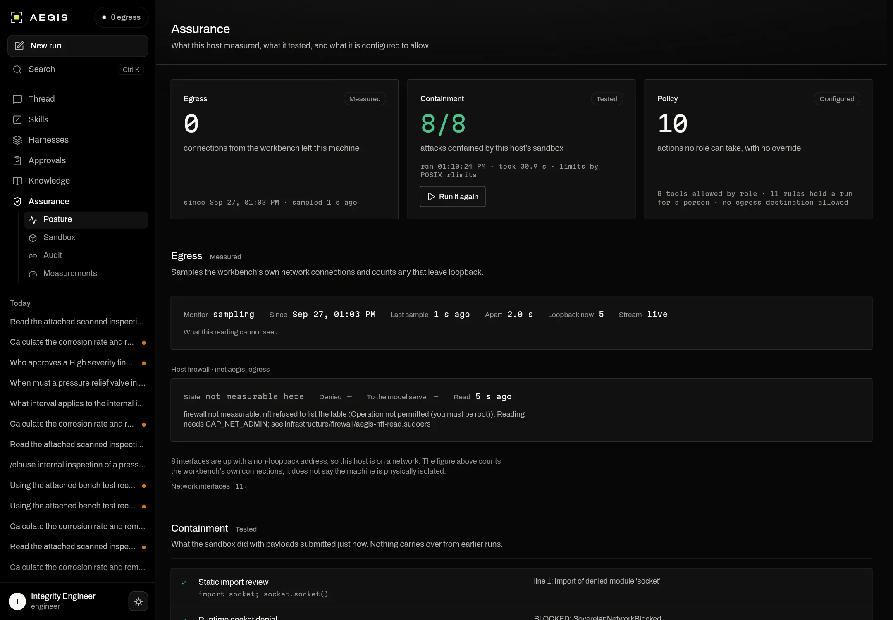</picture><br><sub><b>Assurance.</b> Egress <i>measured</i> at zero, containment <i>tested</i> 8/8, policy <i>configured</i>, each labelled with how the host knows it.</sub></td>
<td width="50%"><picture><source media="(prefers-color-scheme: light)" srcset="docs/assets/readme/sandbox-light.webp">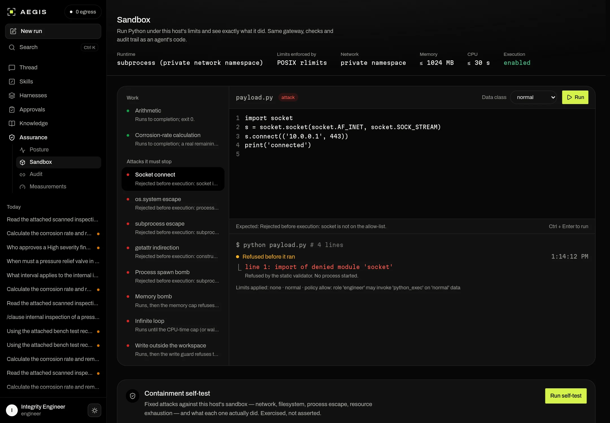</picture><br><sub><b>Sandbox.</b> Static checks, OS limits, and on Linux a private network namespace: the kernel refuses a connection even if the interpreter guard is bypassed.</sub></td>
</tr>
</table>

### And one more: a failed relief valve, two signatures

A PSV bench-test record goes in. Every SOP-INS-025 clause is judged by formula: the valve opened at 11.9 bar(g) against a limit of 11.55, so the finding on V-2104 is High, and release needs the Head of Inspection and then the Plant Manager.

<table>
<tr>
<td width="50%"><picture><source media="(prefers-color-scheme: light)" srcset="docs/assets/readme/thread-relief-light.webp">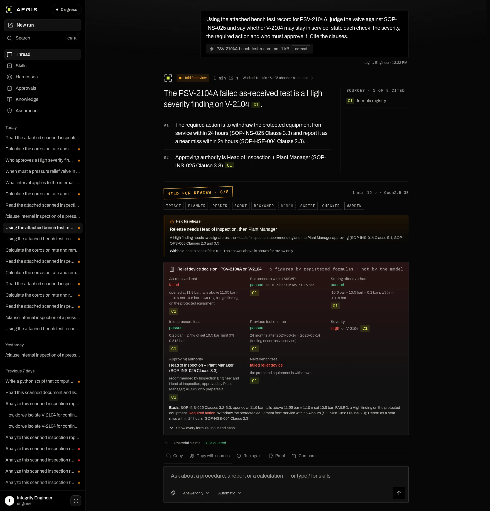</picture><br><sub><b>Relief device decision.</b> Five clauses, five verdicts, all by formula; 8 of 8 checks.</sub></td>
<td width="50%"><picture><source media="(prefers-color-scheme: light)" srcset="docs/assets/readme/approvals-light.webp">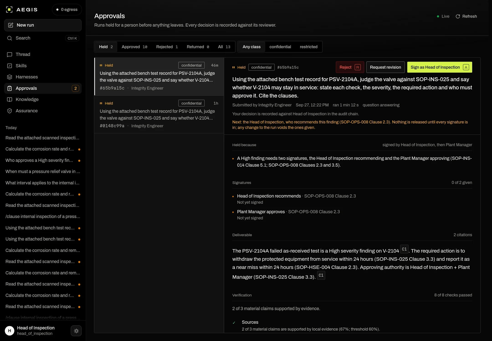</picture><br><sub><b>Approvals.</b> Signatures in order, each bound to the version signed; the person who ran it can never sign.</sub></td>
</tr>
</table>

## The console

<table>
<tr>
<td width="50%"><picture><source media="(prefers-color-scheme: light)" srcset="docs/assets/readme/drawings-light.webp">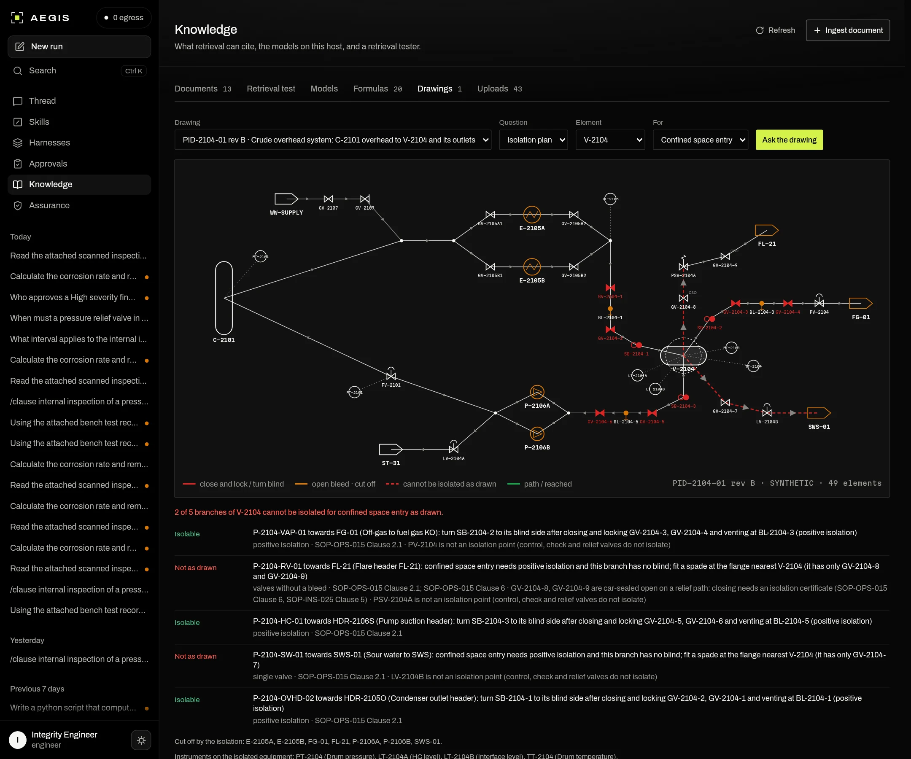</picture><br><sub><b>Drawings.</b> An isolation plan judged branch by branch against the lockout procedure, and drawn on the sheet.</sub></td>
<td width="50%"><picture><source media="(prefers-color-scheme: light)" srcset="docs/assets/readme/harness-control-light.webp">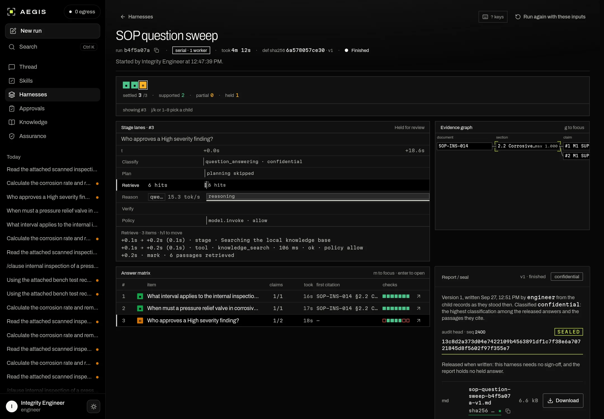</picture><br><sub><b>Harness Control.</b> One governed job over many questions, each an ordinary checked run, ending in one sealed report.</sub></td>
</tr>
<tr>
<td><picture><source media="(prefers-color-scheme: light)" srcset="docs/assets/readme/thread-answer-light.webp">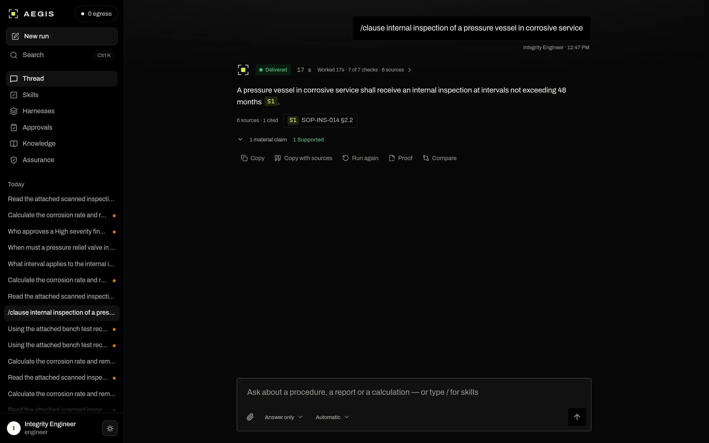</picture><br><sub><b>Thread.</b> Ask in plain language or call a skill with <code>/</code>; the first sentence is the answer, cited.</sub></td>
<td><picture><source media="(prefers-color-scheme: light)" srcset="docs/assets/readme/audit-light.webp">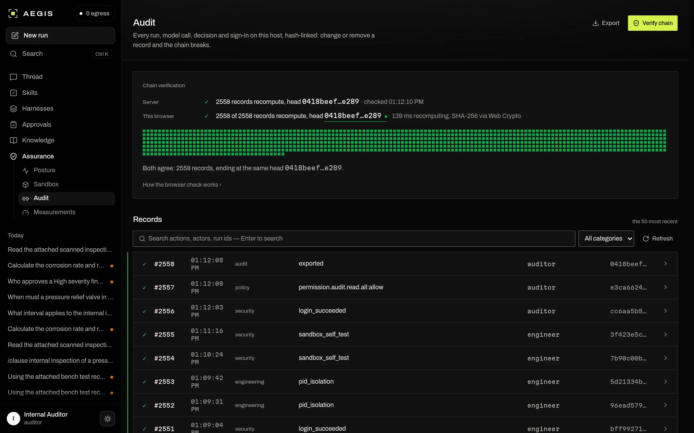</picture><br><sub><b>Audit.</b> Every task, model call, decision and sign-in, hash-chained and verified by the server <i>and</i> by your browser.</sub></td>
</tr>
<tr>
<td><picture><source media="(prefers-color-scheme: light)" srcset="docs/assets/readme/knowledge-light.webp">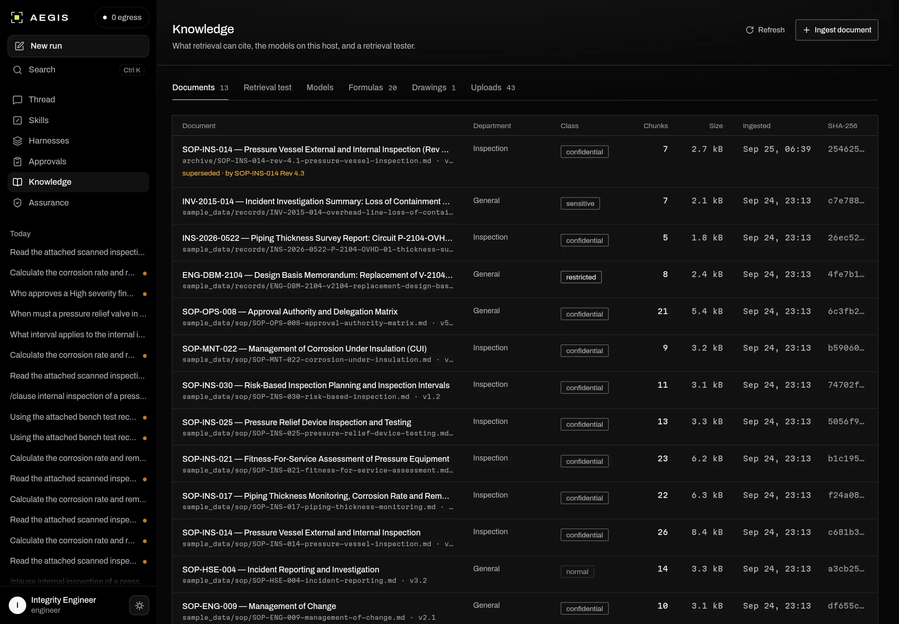</picture><br><sub><b>Knowledge.</b> What retrieval may cite for <i>you</i>: department and clearance are applied before ranking.</sub></td>
<td><picture><source media="(prefers-color-scheme: light)" srcset="docs/assets/readme/measurements-light.webp">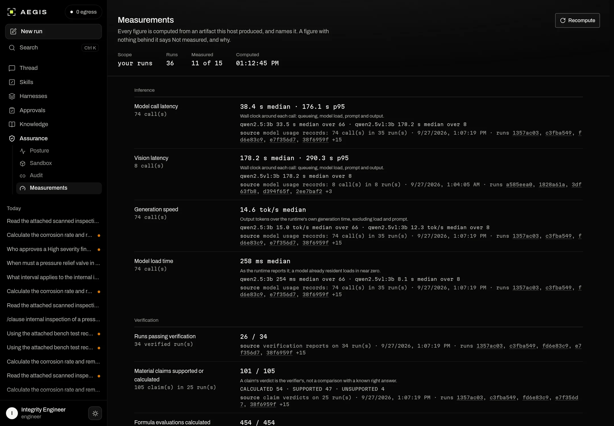</picture><br><sub><b>Measurements.</b> Every figure computed from an artifact on this host; a skipped measurement says skipped.</sub></td>
</tr>
<tr>
<td><picture><source media="(prefers-color-scheme: light)" srcset="docs/assets/readme/skills-light.webp">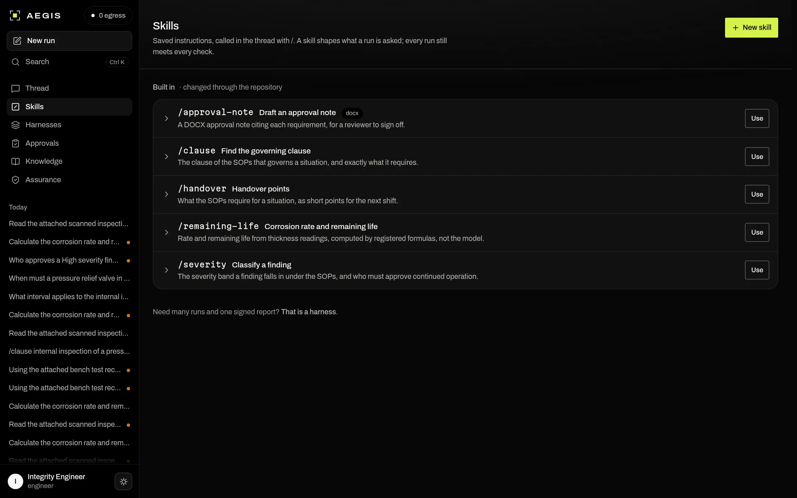</picture><br><sub><b>Skills.</b> Saved instructions called with <code>/</code>; every run records which skill version shaped it.</sub></td>
<td><picture><source media="(prefers-color-scheme: light)" srcset="docs/assets/readme/people-light.webp">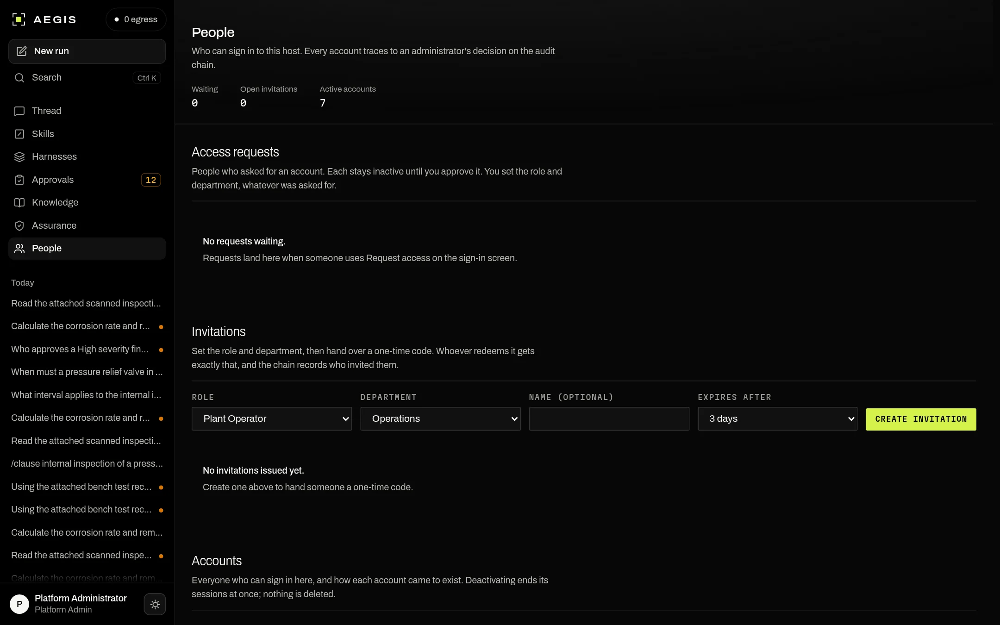</picture><br><sub><b>People.</b> No self sign-up: invitations, access requests and resets, each an administrator's act on the record.</sub></td>
</tr>
</table>

<sub>Every screenshot is taken from the running workbench by <a href="scripts/capture_screens.py"><code>scripts/capture_screens.py</code></a>, in both themes; GitHub shows the one that matches yours.</sub>

## Proved, not claimed

Each figure on this page comes from a command you can run on your own host.

| What | Result on the demo host | Command |
|---|---|---|
| The three judged moments, end to end | `FINAL STATUS: READY` | `python scripts/golden_demo.py` |
| Attacks against the live host | **31 of 31 held**, hashed report | `python scripts/red_team.py` |
| Every console screen, as every account | **132 of 132 clean**: no exception, console error or failed request | `python scripts/ui_check.py` |
| The test suite (no model needed) | **1211 passed**, 13 skipped (Windows-only and container tests) | `pytest` |
| The console against a mocked API | **13 of 13** Playwright smoke tests: sign-in, the Brief, two signatures in order, the screens | `cd frontend && npm run test:e2e` |
| The audit chain | verified by the server and the browser; roots signed | `python scripts/audit_tool.py verify` |
| A run's certificate, offline | every check passed | `python scripts/verify_certificate.py <certificate.json>` |
| The demo corpus | 15 documents, 207 passages, every answer derivable | `python scripts/seed_demo_data.py --check` |

## How a question runs

Ten named stages of **one orchestrator** (`backend/agents/orchestrator.py`), run one after another. A stage that is not needed is skipped, and the run says why.

| # | Call-sign | What it does | Runs on |
|:--:|---|---|---|
| 01 | **TRIAGE** | Reads the request: what kind of task, what came in, how sensitive it is | No model · rules |
| 02 | **PLANNER** | Splits multi-step work into steps before anything is drafted | `qwen2.5:3b`, only when a plan is needed |
| 03 | **READER** | Reads scanned reports and drawings, page by page | `qwen2.5vl:3b`, cached per file |
| 04 | **SCOUT** | Finds the passages that could answer it, across every indexed procedure | `nomic-embed-text`, plus keyword search |
| 05 | **RECKONER** | Computes with registered formulas, never free-hand arithmetic | No model · formula registry |
| 06 | **BENCH** | Runs generated code in the sandbox, under hard memory and time caps | No model · sandbox limits |
| 07 | **SCRIBE** | Drafts the answer, one citation per requirement | `qwen2.5:3b`, drafting model |
| 08 | **CHECKER** | Tests every claim against the evidence it cites, and fails what it cannot find | No model · rules |
| 09 | **WARDEN** | Applies policy and the data class, and holds anything that needs a person | No model · policy engine |
| 10 | **NOTARY** | Hashes the record onto the audit chain. Edit a byte and the chain breaks | No model · SHA-256 chain |

```text
Question → TRIAGE → PLANNER* → READER* → SCOUT → RECKONER* → BENCH* → SCRIBE → CHECKER → WARDEN ─┬─ released
                                                                                                   └─ held for review
           NOTARY appends every step to the audit chain as it happens.          * only when the request needs it
```

<details>
<summary><b>A recorded run, stage by stage</b></summary>
<br>

Run `f30c2459`, captured on 24 Sep 2026 with Ollama on loopback; the figures are from [`frontend/public/landing/run.json`](frontend/public/landing/run.json), the record the public page replays.

> **Prompt** · `/clause` internal inspection of a pressure vessel in corrosive service
>
> **Answer** · A pressure vessel in corrosive service shall receive an internal inspection at intervals not exceeding 48 months. `[S1]` → **SOP-INS-014 §2.2**

| Stage | Call-sign | Time | What happened |
|---|---|--:|---|
| classify | TRIAGE | 3 ms | question answering, confidential |
| retrieve | SCOUT | 602 ms | 6 passages from 2 documents, embedding search |
| draft | SCRIBE | 38,902 ms | `qwen2.5:3b` Q4_K_M: 1,170 prompt tokens, 29 output tokens at 6.16 tok/s |
| verify | CHECKER | | 4 of 4 checks passed; 1 of 1 material claims supported |
| release | WARDEN | | no approval required |
| record | NOTARY | | 10 records appended, head `bf6ec740` |

Drafting took 98% of the run on an 8 GB CPU laptop; on a 16 GB laptop the same question answers in under 20 s.

</details>

## What is inside

| | |
|---|---|
| **Understand** | Per-page PDF reading by a local vision model with a cache keyed by image, model digest and prompt; DOCX, XLSX, CSV, PPTX; revision control; uploads judged by their bytes; injected instructions withheld from the model; secrets and personal data scanned |
| **Decide** | Six declared models with pinned digests; per-stage routing with a reason for every choice; hybrid retrieval with clearance applied before ranking; a default-deny policy gateway |
| **Compute** | 21 formulas (vessel, piping, relief devices, severity, FFS, re-rating, the interim operating envelope, schedules); conflicts that withhold the decision; P&ID graphs read from the drawing; read-only historian and OPC UA adapters |
| **Execute** | AST validation, OS limits, a runtime guard, a private network namespace on Linux, a rootless container where its image is built, an nftables egress table |
| **Verify** | Source, citation, page, calculation, engineering, code, document, claim and isolation-plan checks; claim verdicts: calculated, supported, conflicted, unsupported, needs a person |
| **Govern** | 11 approval rules, two signatures in order for a High finding, separation of duties by account, decisions bound to the version reviewed; accounts only by an administrator's act |
| **Prove** | Hash-chained audit with signed Merkle roots, a signed certificate per run, Proof Mode, measurements, re-run and compare, the red team and the golden demo check |

Everything, with where it lives and how to see it: **[docs/IMPLEMENTED.md](docs/IMPLEMENTED.md)**.

## Quickstart

**You need:** Python 3.11+, Node.js 20+ (CI builds with 22), git, [Ollama](https://ollama.com) and about 15 GB of free disk. No GPU is required. Tesseract is an optional OCR fallback. Details: [1.2 Requirements](docs/handbook/01-getting-started/02-requirements.md).

### Linux and macOS

```bash
git clone https://github.com/kartikeyajay2006/Sovereign-On_Premise-Agentic-AI-Workbench.git
cd Sovereign-On_Premise-Agentic-AI-Workbench
python3 -m venv .venv && source .venv/bin/activate
pip install -r requirements.txt
(cd frontend && npm ci)

ollama pull qwen2.5:3b && ollama pull qwen2.5vl:3b && ollama pull nomic-embed-text
python scripts/seed_demo_data.py

scripts/start-ollama.sh --tier laptop-8gb         # in its own terminal; runs `ollama serve`
SOVEREIGN_PROFILE=laptop-8gb ./scripts/run.sh     # Linux: builds the console, starts API and console
.venv/bin/python scripts/warmup.py                # READY / NOT READY
```

`scripts/run.sh` is written for Linux and also takes `--status`, `--stop` and `--dev`. On macOS, start the API and the console in two terminals with the commands below ([1.6 Seed and run](docs/handbook/01-getting-started/06-seed-and-run.md)).

### Windows (PowerShell)

```powershell
git clone https://github.com/kartikeyajay2006/Sovereign-On_Premise-Agentic-AI-Workbench.git
cd Sovereign-On_Premise-Agentic-AI-Workbench
python -m venv .venv
.\.venv\Scripts\Activate.ps1
pip install -r requirements.txt
cd frontend; npm ci; cd ..

ollama pull qwen2.5:3b; ollama pull qwen2.5vl:3b; ollama pull nomic-embed-text
.\.venv\Scripts\python.exe scripts\seed_demo_data.py

# Terminal 1: Ollama with the tier's variables (quit the tray app first)
.\scripts\start-ollama.ps1 -Tier laptop-8gb

# Terminal 2: the API, with the same tier
$env:SOVEREIGN_PROFILE = 'laptop-8gb'
.\.venv\Scripts\python.exe -m uvicorn backend.api.main:app --host 127.0.0.1 --port 8000 --timeout-keep-alive 75

# Terminal 3: the console
cd frontend; npm run build; npx next start -H 127.0.0.1

# Then: is the host ready?
.\scripts\warmup.ps1
```

Full walk-through: [1.4 Install on Windows](docs/handbook/01-getting-started/04-install-windows.md). Air-gapped host: [1.9 Offline install](docs/handbook/01-getting-started/09-offline-install.md).

Open **http://127.0.0.1:3000**. An empty thread offers the golden demos as cards: pick one, press Run. Before judging, run `scripts/golden_demo.py` and `scripts/ui_check.py`; both create or open real runs, so don't point them at an instance whose history must stay as it is.

**Demo accounts.** With `demo.enabled: true` (the default), seven accounts are seeded and listed under the sign-in form, one click each: `engineer`, `reviewer`, `head_of_inspection`, `plant_manager`, `operator`, `auditor` and `admin`, sharing `security.seed_user_password`. Turn demo mode off for real use: the host then retires every demo account that still takes the shared password and issues a one-time setup token for the first administrator.

## Hardware tiers

Set the profile with `SOVEREIGN_PROFILE`; it is overlaid on `config/app.yaml` and `config/routing.yaml`. Start Ollama with the same tier.

| `SOVEREIGN_PROFILE` | Host | Users | Workers | Cited answer | Scan run |
|---|---|:--:|:--:|---|---|
| `laptop-8gb` | 8 GB, CPU only | 1 | 1 | 38–56 s, measured | ~100 s with the vision cache warm, ~290 s cold, measured |
| `laptop-16gb` | 16 GB, 8+ cores, no GPU | 1–2 | 1 | ~17 s, estimated | 1.5–2 min, estimated |
| `cpu-server` | 16–32 cores, 64–128 GB | 3–5 | 3 | ~13 s, estimated | not stated |
| `gpu-server` | ≥ 12 GB VRAM, 64 GB RAM | 5–15 | 4 | ~7 s, estimated | under a minute, estimated |

<sub>Which figures are measured and which estimated is stated in each file in <a href="config/profiles/"><code>config/profiles/</code></a>. Tuning: <a href="docs/handbook/12-operations/05-performance.md#hardware-profiles">12.5 Performance</a>. The runbook for the demo laptop: <a href="docs/handbook/14-demo-guide/03-demo-day.md">14.3 Demo day</a>.</sub>

## Accounts and access

There is no self sign-up. Every account is an administrator's decision, and each one is on the audit chain ([3.1 Sign-in and accounts](docs/handbook/03-user-guide/01-sign-in.md)).

| Path | How it works |
|---|---|
| **Setup token** | With demo mode off, a fresh host has no accounts. At startup it writes a one-time token, valid 24 h, to `storage/setup-token` and prints it in the API console. `/setup` uses it to create the first administrator |
| **Invitation** | An administrator creates a code on **People**, with the role and department fixed. Single-use, expiring, only its hash stored |
| **Access request** | `/request-access` creates an account that cannot sign in until an administrator approves it and chooses its role and department |
| **Password reset** | An administrator issues a one-time `RESET-…` code. An air-gapped host has no mail, so there is no *forgot password* |

Five failed sign-ins in five minutes lock an account; guessing codes is throttled per address.

## Architecture

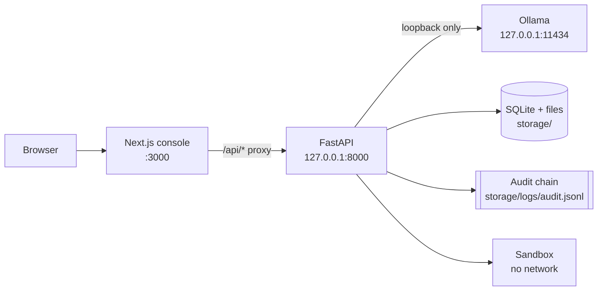
```mermaid
flowchart LR
    U[Browser] --> N["Next.js console<br/>:3000"]
    N -->|"/api/* proxy"| A["FastAPI<br/>127.0.0.1:8000"]
    A -->|loopback only| O["Ollama<br/>127.0.0.1:11434"]
    A --> D[("SQLite + files<br/>storage/")]
    A --> L[["Audit chain<br/>storage/logs/audit.jsonl"]]
    A --> X["Sandbox<br/>no network"]
```

Three processes on one host. Storage is SQLite plus files, vectors are computed in process, and the live trace is Server-Sent Events. There is no external database, queue or cloud service. More in [4 · Architecture](docs/handbook/04-architecture/README.md).

| Folder | What is in it |
|---|---|
| [`backend/`](backend) | The FastAPI app: `agents/` (orchestrator, verifier), `rag/`, `knowledge/`, `engineering/` (formula registry, relief devices, P&ID), `models_layer/`, `policy/`, `security/`, `proof/`, `tools/` (sandbox), `connectors/`, `api/` |
| [`frontend/`](frontend) | The Next.js 16 console and the public page |
| [`config/`](config) | `app.yaml`, `models.yaml`, `routing.yaml`, `classification.yaml`, hardware `profiles/`, prompts, skills, harnesses |
| [`policies/`](policies) | Access control, approval rules, data classification, content scanning, tool permissions |
| [`scripts/`](scripts) | `run.sh`, `start-ollama.*`, `warmup.*`, `seed_demo_data.py`, `golden_demo.py`, `red_team.py`, `ui_check.py`, `capture_screens.py`, `backup.py`, `audit_tool.py`, the offline bundle |
| [`sample_data/`](sample_data) | The synthetic plant: SOPs, records, scanned reports, a P&ID, a PSV test record, attack files |
| [`infrastructure/`](infrastructure) | `docker-compose.yml`, the sandbox container image, the nftables egress table |
| [`tests/`](tests) | The pytest suite, including the adversarial tests; no test needs a model |
| [`docs/`](docs) | The handbook and the project documents |

## Docs

Start with **[What AEGIS implements today](docs/IMPLEMENTED.md)**, then the **[handbook](docs/handbook/README.md)**. For the SIH build: the **[build plan](docs/SIH-WINNING-BUILD-PLAN.md)** and the **[readiness review](docs/SIH-READINESS-REVIEW.md)**.

| Use it | Understand it | Run it safely | Build on it |
|---|---|---|---|
| [01 Getting started](docs/handbook/01-getting-started/README.md) | [04 Architecture](docs/handbook/04-architecture/README.md) | [09 Security and governance](docs/handbook/09-security/README.md) | [13 Development](docs/handbook/13-development/README.md) |
| [02 Core concepts](docs/handbook/02-concepts/README.md) | [05 Models and routing](docs/handbook/05-models-and-routing/README.md) | [10 Configuration](docs/handbook/10-configuration/README.md) | [14 Demo guide](docs/handbook/14-demo-guide/README.md) |
| [03 Using the workbench](docs/handbook/03-user-guide/README.md) | [06 Knowledge and retrieval](docs/handbook/06-knowledge-and-retrieval/README.md) | [11 API reference](docs/handbook/11-api/README.md) | [15 FAQ and glossary](docs/handbook/15-reference/README.md) |
| [Offline install](docs/handbook/01-getting-started/09-offline-install.md) | [07 Agents](docs/handbook/07-agents/README.md) · [08 Verification](docs/handbook/08-verification/README.md) | [12 Operations](docs/handbook/12-operations/README.md) | [Demo script with answers](docs/DEMO.md) |

For security reviewers: [threat model](docs/handbook/09-security/06-threat-model.md) · [sandbox](docs/handbook/09-security/03-sandbox.md) · [audit log](docs/handbook/09-security/05-audit-log.md) · [red team](docs/handbook/09-security/08-red-team.md) · [signed proof](docs/handbook/09-security/09-proof.md).

## ⚠️ Limitations

- **Latency is hardware-bound.** On an 8 GB CPU laptop a cited answer takes 38–56 s and a scanned report minutes. Once the host swaps, a 70-second call can take 25 minutes ([12.5](docs/handbook/12-operations/05-performance.md)).
- **Small models are small.** A 3B model drafts thin prose and sometimes cites what it should not. Figures and isolation plans come from deterministic engines, and what it gets wrong fails verification and holds the run, but the prose stays thin ([8.5](docs/handbook/08-verification/05-limits.md)).
- **Claims are traced lexically.** A passage that carries a claim's terms supports it, which is not the same as entailing it. Engineering figures are the exception: they are computed.
- **The sandbox is a container only where its image is built** (`infrastructure/sandbox/build.sh`). Elsewhere it is runtime guards and OS limits in the API user's process tree; on Linux a private network namespace still refuses its connections ([9.3](docs/handbook/09-security/03-sandbox.md)).
- **Egress is measured for the workbench's own processes, not the whole host.** For a provable air gap, apply the host firewall (`infrastructure/firewall/`); its counters are read back on Linux only.
- **The signing key lives on the host it signs for.** Copy the public key and the sealed roots off-host.
- **The policy files are a starting point, not your organisation's policy.** Some declared permissions are not enforced yet, and [9.1](docs/handbook/09-security/01-access-control.md) marks each one.
- **Compliance is not a software property.** The audit chain supports an assurance process; it is not one.

## 👥 The team

<table>
<tr>
<td align="center" width="30%" valign="top">
<a href="https://github.com/kartikeyajay2006"></a>
<br><b>Kartikeya Yadav</b>
<br><a href="https://github.com/kartikeyajay2006">@kartikeyajay2006</a>
<br><br>
<br><br>
<sub>Designed and built the platform end to end, from the reference architecture to a working local deployment.</sub>
<br><br>
<sub>🏗️ <b>Foundation</b>: config-driven core, SQLite persistence, local identity and the hash-chained audit log</sub><br>
<sub>🧭 <b>Intelligence</b>: model registry and routing, the knowledge base, tools and the default-deny policy gateway</sub><br>
<sub>🤖 <b>Pipeline</b>: the agent orchestrator, the API and task queue, the sovereignty monitor and secure event streams</sub><br>
<sub>📦 <b>Sandbox & proof</b>: contained code execution, the verifier and the human approval gate</sub><br>
<sub>🧮 <b>Engineering</b>: relief-device and FFS formulas, relief records in runs, the network-namespace sandbox</sub><br>
<sub>✅ <b>Correctness sweeps</b>: the uploaded-survey reader, claim verification, demo accounts in production, the console check</sub><br>
<sub>🔧 <b>Reliability</b>: scanned PDFs reaching the vision model, the queue worker, approvals and deliverables</sub><br>
<sub>⚡ <b>Performance</b>: stopped host swapping (a 72 s call had become 25 min), roughly halved run time, fixed concurrent audit writes</sub><br>
<sub>🎨 <b>Identity & docs</b>: the AEGIS mark and brand kit, the synthetic industrial dataset, the README and the handbook</sub>
</td>
<td align="center" width="30%" valign="top">
<a href="https://github.com/kunalKumar-13"></a>
<br><b>Kunal Kumar</b>
<br><a href="https://github.com/kunalKumar-13">@kunalKumar-13</a>
<br><br>
<br><br>
<sub>The most prolific contributor, turning the platform into the workbench people use and making every claim it makes true.</sub>
<br><br>
<sub>💬 <b>Workbench</b>: the chat-first thread, streamed answers, run transcripts and the sidebar of past runs</sub><br>
<sub>⚡ <b>Skills & harnesses</b>: saved instructions called with <code>/</code>, governed multi-run jobs and Harness Control</sub><br>
<sub>🧾 <b>Proof & governance</b>: two signatures in order, Proof Mode, measurements, re-run and compare, account provisioning</sub><br>
<sub>🛡️ <b>Containment</b>: the Windows Job Object sandbox, the container runtime and the nftables egress table</sub><br>
<sub>📈 <b>Telemetry</b>: what each run cost, which model ran it, and a stop control</sub><br>
<sub>✅ <b>Correctness</b>: clearance before ranking, classification raised by evidence, unresolved citations held, no approving your own run</sub><br>
<sub>🌐 <b>Experience</b>: the Hi-Vis design system, the public page that replays a real run, keyboard navigation</sub><br>
<sub>🔍 <b>Honesty pass</b>: removed every reading, score and posture claim the backend never measured</sub>
</td>
<td align="center" width="20%" valign="top">
<a href="https://github.com/raghav-shell"></a>
<br><b>Raghav Sharma</b>
<br><a href="https://github.com/raghav-shell">@raghav-shell</a>
<br><br>
<br><sub>Frontend visual system and motion; scanned-PDF extraction and the macOS sandbox</sub>
</td>
<td align="center" width="20%" valign="top">
<a href="https://github.com/ankit25bcs10610"></a>
<br><b>Ankit Pandey</b>
<br><a href="https://github.com/ankit25bcs10610">@ankit25bcs10610</a>
<br><br>
<br><sub>Contributions to the workbench</sub>
</td>
</tr>
</table>

<p align="center"><sub>Built for Smart India Hackathon 2026. Every figure on this page was measured on the demo host; every screenshot was taken from it.</sub></p>
