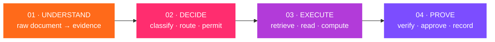

# 1.1 · What AEGIS is

## The problem

Organisations that run plants, grids, refineries and defence programmes sit on decades of procedures, inspection reports, drawings and spreadsheets. A language model could answer questions over that material in seconds. But most of these organisations cannot send a single page of it to a cloud model, and many work on networks with no route to the internet at all.

Running a model on your own hardware solves exactly one part of that. The prompt does not leave the building. It says nothing about:

- **which** model answered, and whether it was allowed to see that data;
- **what** it read, and whether the person asking was cleared to read it;
- **whether** the arithmetic in the answer is right;
- **who** authorised the result before it left the workbench;
- **what** you can show an auditor or a regulator six months later.

AEGIS is built around that whole lifecycle, not just the inference call in the middle of it.

## What AEGIS is

AEGIS is an **on-premise agentic AI workbench**: a web application and an API that run on one machine, next to a local model runtime, and turn a question in plain language into an answer that is:

| Property | What it means in practice |
|---|---|
| **Local** | Models, retrieval, code execution, document generation and the audit log all run on the host. Inference is pinned to loopback and refused otherwise. |
| **Cited** | Every sentence of an answer points at the passage, file or page it came from, as `[S1]`, `[V2]` and so on. |
| **Checked** | The answer is tested before anyone sees it as final: its claims are traced to evidence, its citations must lead somewhere real, and its figures are recomputed. |
| **Governed** | What each person may read, which model may see which class of data, and which tools may run are decided by policy files, not by the model. |
| **Held** | Sensitive work, failed checks and anything that would leave the workbench wait for a named reviewer, who cannot be the person who ran it. |
| **Recorded** | Every step is written to an append-only log in which each record carries the hash of the one before it. |

## The four stages of every run

1. **Understand.** Reports, scans, drawings and spreadsheets become *evidence units* that keep their file, page and section. A scanned PDF is read page by page by a local vision model.
2. **Decide.** The request is classified by type, complexity and sensitivity. Each stage of the run is routed to a model that policy permits for that class of data and that fits in the memory the host has free. *Installed is not the same as authorised.*
3. **Execute.** Retrieval searches only what the person is cleared to read. Generated code runs in a constrained subprocess with operating-system limits and no network.
4. **Prove.** Claims are checked against evidence and figures recomputed, policy decides whether a person must sign, and every step is hash-chained into the audit log.

## What a run looks like

You type a question into the **Thread**:

> *Which clause of our SOPs governs the internal inspection of a pressure vessel in corrosive service, and what exactly does it require?*

About twenty seconds later, on a laptop with no GPU:

> A pressure vessel in corrosive service shall receive an internal inspection at intervals not exceeding 48 months. `S1`
>
> **S1** SOP-INS-014 §2.2 · **Delivered** · 18.8 s · 6 of 6 checks passed · 6 sources searched

Click the summary line and the run opens as a transcript: how the request was classified, which model ran each stage and why, the six passages retrieved with their scores, every check with its result, and the tokens each model call used.

## What AEGIS is not

It is worth being precise, because an overstated claim is worse than a missing feature.

- **It is not a cloud service.** There is no hosted version and no telemetry. The frontend disables Next.js telemetry when it is installed.
- **It is not a virtual machine or container sandbox.** Generated code runs as a subprocess under static checks, OS resource limits and a network shim. That is application-level isolation. See [9.3 The sandbox](../09-security/03-sandbox.md) for exactly what it does and does not stop.
- **It does not make a small model smart.** A 3-billion-parameter model on a CPU drafts thin documents and sometimes gets figures wrong. AEGIS is built to *catch and hold* such output rather than to pretend it cannot happen. [8.5 What verification cannot catch](../08-verification/05-limits.md) is honest about the gaps.
- **It does not make you compliant.** The audit chain supports an assurance process. It is not one.

## Who uses it

| Role | Seeded account | Typical work |
|---|---|---|
| Plant operator | `operator` | Asks procedure questions and submits field calculations |
| Integrity engineer | `engineer` | Analyses inspection data, runs code in the sandbox, adds to the knowledge base |
| Approving reviewer | `reviewer` | Reviews and releases held work |
| Internal auditor | `auditor` | Reads every trace and verifies the audit chain; cannot run tasks |
| Platform administrator | `admin` | Manages models, knowledge and policy |

All five share the demonstration password `workbench`, which is set in `config/app.yaml` under `security.seed_user_password`. Change it before any real use.

## Next

Check your machine against the **[requirements](02-requirements.md)**.

<!-- nav:start -->

---

| | | |
|:--|:--:|--:|
| [← 01 · Getting started](README.md) | [↑ 01 · Getting started](README.md) | [1.2 · Requirements →](02-requirements.md) |

<!-- nav:end -->
