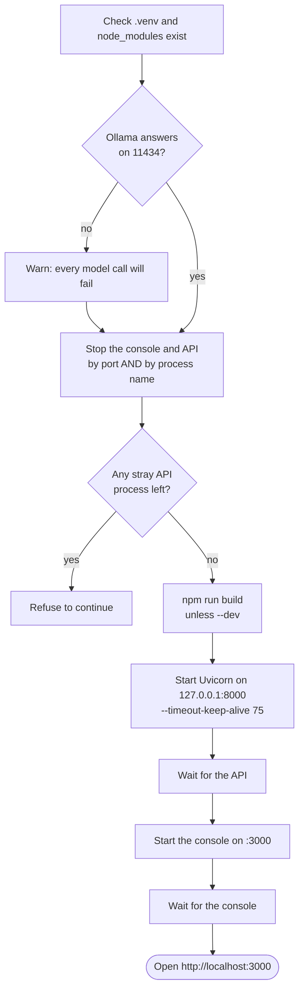

# 1.6 · Seed the corpus and run

## The demonstration corpus

AEGIS ships with a **synthetic** industrial corpus in `sample_data/`: fifteen documents about the inspection and integrity of pressure equipment at an invented refinery. Every procedure, report, equipment tag, reading, person and rupee figure is made up, and each document says so in its own header.

The corpus is built to be *internally consistent*: the readings in the reports satisfy the rules in the procedures, and every clause cross-reference resolves. A correct answer is therefore reachable, and a wrong one is detectable. Without that, a demonstration only shows the machinery running, not whether it reasoned correctly.

| Kind | Where | What is in it |
|---|---|---|
| Procedures (SOPs) | `sample_data/sop/` | 12 procedures: inspection, fitness-for-service, relief devices, risk-based inspection, corrosion under insulation, hot work, confined space, lockout/tagout, approval authority, management of change, incident reporting |
| Records | `sample_data/records/` | A restricted design-basis memo, a sensitive incident investigation, a piping thickness survey |
| Scanned reports | `sample_data/inspection/` | Scanned inspection reports for vessels V-2104 and V-2107, as PDF and PNG, stamped SYNTHETIC. These are **attachments**, not indexed |
| Datasets | `sample_data/datasets/`, `sample_data/coding/` | Thickness surveys and inspection history as CSV |
| Expected answers | `sample_data/expected-answers.json` | The correct figures for the headline tasks |

## Seed it

```bash
source .venv/bin/activate

python scripts/seed_demo_data.py --check     # validate only: writes nothing, opens no database
python scripts/seed_demo_data.py             # build the files, then index the corpus
```

Seeding needs Ollama running with `nomic-embed-text` installed. It takes about thirty seconds and ends with:

```text
15 of 15 document(s) indexed.

What each demo account can retrieve (policy only, before any question):
  operator  operator      dept operations  cleared to confidential  6 of 15 documents
  engineer  engineer      dept inspection  cleared to restricted    12 of 15 documents
  reviewer  reviewer      dept engineering cleared to restricted    15 of 15 documents
  auditor   auditor       dept quality     cleared to restricted    no knowledge search (role lacks it)
  admin     administrator dept general     cleared to restricted    15 of 15 documents

A correct answer for the headline task (V-2104, scanned report):
  governing location   Shell course 2 (mid)
  corrosion rate       0.55 mm/year
  remaining life       6.18 years
  severity             medium
  approver             Head of Inspection
```

Keep those last lines. They are the answers to check the model against during a demonstration.

### Seeding options

| Flag | Effect |
|---|---|
| `--check` | Validate the corpus and print what would be indexed. Writes nothing |
| `--files-only` | Build the generated files (reports, datasets) and skip indexing |
| `--keep-stale` | Keep superseded copies of a document in the index instead of replacing them |
| `--allow-lexical` | Index even when no embedding model is installed |

Re-running is safe. A changed document **replaces** its earlier copy (same document code, new content), including copies uploaded through the interface.

> [!NOTE]
> Seeding regenerates the scanned report images in `sample_data/inspection/`. Git will then show them as modified even though nothing meaningful changed. Restore them with `git checkout -- sample_data/inspection/` if you want a clean tree.

## Run it

### On Linux: the run script

```bash
./scripts/run.sh            # build the console, then start the API and the console
./scripts/run.sh --dev      # start the console in development mode instead (hot reload)
./scripts/run.sh --status   # report what is running, and whether Ollama answers
./scripts/run.sh --stop     # stop both services
```

What `run.sh` does, in order:



Two details are there because they were real failures:

- **It always stops the console before building.** Rebuilding while the server runs leaves it serving a stale chunk manifest, and pages then fail with 400s on their own JavaScript.
- **It stops the API by process name as well as by port.** An old API process that has lost its port keeps its database connection and keeps pulling jobs off the queue, so tasks run on stale code while the new process looks healthy.

Environment variables the script reads:

| Variable | Default | Meaning |
|---|---|---|
| `API_PORT` | `8000` | Port for the API |
| `WEB_PORT` | `3000` | Port for the console |
| `LOG_DIR` | `storage/logs` | Where `api.log`, `web.log` and `build.log` go |

### On macOS and Windows: two terminals

```bash
# Terminal 1
python -m uvicorn backend.api.main:app --host 127.0.0.1 --port 8000 --timeout-keep-alive 75

# Terminal 2
cd frontend && npm run build && npx next start -H 127.0.0.1
```

## What happens when the API starts

The API's boot sequence (`backend/api/main.py`) is fixed:

1. Load and validate every configuration and policy file. A malformed file stops the boot: a workbench with unreadable policy must not start.
2. Create the storage directories and the database schema.
3. Verify the audit chain, and record the boot. A broken chain is recorded as `chain_integrity_failure`.
4. Create the five seed accounts, if the user table is empty.
5. Start the sovereignty monitor and the task worker. Tasks left running by a previous process are closed as interrupted.
6. Load the everyday model in the background, when `inference.prewarm` is on.

You will see:

```text
[workbench] seeded identities: operator, engineer, reviewer, auditor, admin
[workbench] Qwen2.5 3B loaded and ready
```

## Next

Take the **[first-hour tour](07-first-hour.md)**.

<!-- nav:start -->

---

| | | |
|:--|:--:|--:|
| [← 1.5 · Install the models](05-models.md) | [↑ 01 · Getting started](README.md) | [1.7 · Your first hour →](07-first-hour.md) |

<!-- nav:end -->
