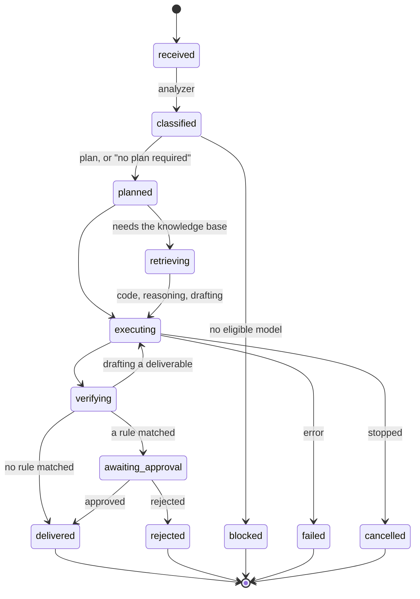

# 2.1 · Runs

A **run** (a *task* in the code and the API) is one request carried through the whole pipeline: from the words you typed and the files you attached, to an answer that is delivered, held, refused or failed. Every run has an ID, and everything it does is recorded against that ID.

## What a run carries

| Field | What it holds |
|---|---|
| `prompt` | What was asked, after any skill template was applied |
| `files` | Attachments, each stored locally and hashed |
| `profile` | The analyzer's classification: input type, task type, complexity, sensitivity, and what the run requires |
| `routing` | Which model ran each stage, and the reason |
| `plan` | The steps, when the work branches enough to be worth planning |
| `evidence` | Every numbered piece of evidence the run gathered |
| `tool_calls` | Every tool invoked, with its arguments and outcome |
| `answer` | The final answer text |
| `verification` | Every check, passed or failed, with its detail |
| `approval` | Whether a person must sign, why, who may, and what they decided |
| `deliverables` | Generated files, each hashed, with whether they are released |
| `usage` | Tokens in and out, load and generation time, per model call |
| `status` | Where the run is now |

## The life of a run

| Status | Shown as | Meaning |
|---|---|---|
| `received` | Queued | Accepted, waiting for the worker |
| `classified` | Running | The analyzer has profiled it |
| `planned` | Running | A plan was made, or the run recorded that none was needed |
| `retrieving` | Running | Searching the knowledge base |
| `executing` | Running | Reading files, running code, reasoning or drafting |
| `verifying` | Running | Checking the answer |
| `awaiting_approval` | **Held** | Waiting for a reviewer |
| `delivered` | **Delivered** | Complete; anything it produced is released |
| `rejected` | **Rejected** | A reviewer refused it |
| `blocked` | **Refused** | Policy allowed no model or tool for it |
| `failed` | **Failed** | Something went wrong; the reason is on the run |
| `cancelled` | **Stopped** | You stopped it |

In the sidebar, held runs carry an amber dot, rejected, failed and refused runs a red one, and stopped runs a grey one. Delivered runs have no dot, so the list does not read as a wall of green.

## One run at a time

Runs are executed by a single background worker (`worker_count=1` in `backend/api/main.py`), in the order they were submitted. On a host that can hold only one model in memory, running two at once would make them fight over it. While a run waits, the Thread shows its place in the queue, updated live by `task.queued` events.

You can stop a run at any time. A stop is checked between stages and while waiting on a model, and the run closes as **Stopped**, recording the stage it was in.

## Three shapes of run

The pipeline adapts to the request. The analyzer decides which shape a run takes.

### A conversation

"Thanks", "hello", "what can you do?": a message of six words or fewer that matches a conversation pattern in `config/classification.yaml`. It is answered in one short model call, with no retrieval, no claim checks and no approval, because it makes no claims.

### A single retrieval question

"What is the inspection interval for…?": one question with no files, no code and no deliverable. There is only one way to answer it, so **no plan is made**, and the transcript says *No plan required: a single retrieval step with no code, files or deliverable*. Planning used to cost 79 seconds of a 200-second run for this kind of question.

### An agentic run

A scanned report, a data file, a request for a document, or a question that clearly branches. The run reads visual inputs first, then plans, then retrieves, computes, reasons, verifies, drafts and passes the approval gate.

## After a restart

If the API stops while a run is in progress, that run cannot be resumed. On the next start it is closed with the explanation *This task was interrupted when the workbench stopped*, and the closure is audited as `recovered_after_restart`. Durable, resumable stages are on the roadmap.

## Related

- The full stage-by-stage walkthrough: [4.2 The life of a request](../04-architecture/02-request-lifecycle.md)
- How the analyzer decides the shape: [7.1 The task analyzer](../07-agents/01-analyzer.md)

<!-- nav:start -->

---

| | | |
|:--|:--:|--:|
| [← 02 · Core concepts](README.md) | [↑ 02 · Core concepts](README.md) | [2.2 · Evidence and citations →](02-evidence.md) |

<!-- nav:end -->
