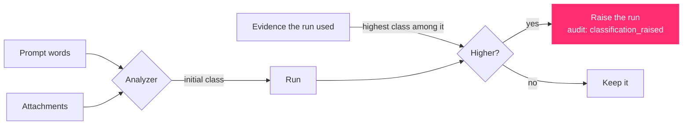

# 2.3 · Classification and clearance

Two questions decide what a run may see and where its result may go: **how sensitive is this data**, and **who is asking**.

## Four levels

Data classification levels are declared in `policies/data-classification.yaml`, ordered by rank:

| Rank | Level | Description | Needs a reviewer? |
|:--:|---|---|:--:|
| 0 | 🟢 **Normal** | Routine internal work with no special handling requirement | No |
| 1 | 🟡 **Confidential** | Internal business information; disclosure would cause harm | No |
| 2 | 🟠 **Sensitive** | Safety, statutory or incident-related work requiring review | **Yes** |
| 3 | 🔴 **Restricted** | Defence-linked, contractual or unreleased design information | **Yes** |

Rank is what every comparison uses: "is this model approved for this data?", "is this person cleared for this passage?", "is this tool allowed on this run?"

## Where a run's class comes from

A run's classification is set in two steps, and **it only ever rises**.

**Step 1: the analyzer.** Keywords in the request score each level (`sensitivity` in `config/classification.yaml`). For example *restricted*, *classified*, *defence* and *tender* point to Restricted; *confidential*, *internal only*, *p&id* and *financial* to Confidential; *safety*, *hazard*, *incident*, *shutdown*, *regulatory* and *statutory* to Sensitive. The highest score wins; with no match the run is Normal.

**Step 2: the evidence.** After the answer is verified, the orchestrator looks at every piece of evidence the run used. An answer is at least as sensitive as the most sensitive thing it was built from, so if a Restricted passage was retrieved, the run becomes Restricted. That is recorded in the audit log as `policy / classification_raised` with the IDs of the evidence responsible, and the held line names it:

> Held for administrator or reviewer · Evidence S5 (ENG-DBM-2104) is restricted, so the run is restricted too.

## Clearance: who may see what

Each role has a **classification ceiling** in `policies/access-control.yaml`:

| Role | Ceiling | Department isolation |
|---|---|---|
| operator | Confidential | Own department only |
| engineer | Restricted | Own department only |
| reviewer | Restricted | All departments (override role) |
| auditor | Restricted | All departments (override role) |
| administrator | Restricted | All departments (override role) |

Nobody is cleared above Restricted, because there is no level above it.

When the knowledge base is searched, two filters are applied **before ranking**, so that a passage the person may not see can never crowd out one they may:

1. **Department isolation.** A passage from another department is excluded, unless its department is `general`, or the person's role is one of the override roles (reviewer, auditor, administrator).
2. **Classification ceiling.** A passage above the person's ceiling is excluded.

That is why the same question gives different answers to different people. On the demonstration corpus, `operator` can retrieve 6 of the 15 documents, `engineer` 12, and `reviewer` and `admin` all 15.

## Models have clearances too

Every model in `config/models.yaml` lists the classifications it is approved for. Moondream, for instance, is approved only for Normal and Confidential. A Restricted run will never be routed to it; if nothing else can do the job, the run is **blocked**, and the reason is recorded.

## Tools have ceilings

Every tool in `policies/tool-permissions.yaml` has a `max_data_classification`. Most are approved up to Restricted. The `vision_extract` tool is approved only up to Sensitive.

## What classification does *not* do yet

`policies/data-classification.yaml` also declares, per level, `evidence_required`, `retention_days` and `redact_in_logs`, a list of `escalation_rules`, and an `egress` block. These describe the intended controls, but **no code reads them today**:

- escalation from evidence is implemented directly in the orchestrator, as described above, rather than through `escalation_rules`;
- nothing deletes runs after `retention_days`;
- audit records are not redacted for Sensitive or Restricted work.

The Configuration reference marks every such setting as *declared only*: [10.6 Policy files](../10-configuration/06-policies.md).

## Related

- How the analyzer scores a request: [7.1 The task analyzer](../07-agents/01-analyzer.md)
- The retrieval filters in code: [6.4 Retrieval and clearance](../06-knowledge-and-retrieval/04-retrieval-and-clearance.md)
- Roles and permissions: [9.1 Access control](../09-security/01-access-control.md)

<!-- nav:start -->

---

| | | |
|:--|:--:|--:|
| [← 2.2 · Evidence and citations](02-evidence.md) | [↑ 02 · Core concepts](README.md) | [2.4 · Verification →](04-verification.md) |

<!-- nav:end -->
