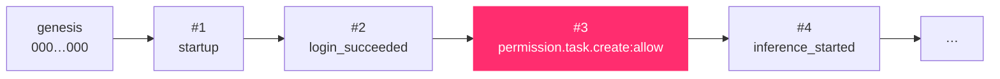

# 2.6 · The audit chain

Every sign-in, permission decision, model call, tool call, classification change, verification, approval, download, sandbox run and self-test is written to one file: `storage/logs/audit.jsonl`. Each line is one record, and each record carries the hash of the record before it.

## What a record looks like

```json
{
  "sequence": 214,
  "id": "0b5c…",
  "at": "2026-09-25T18:43:12.114Z",
  "actor": "engineer",
  "actor_role": "engineer",
  "task_id": "8b7802c5-…",
  "category": "model",
  "action": "inference_started",
  "detail": { "stage": "drafting", "model": "qwen2.5:3b", "routing_reason": "…", "local_only": true },
  "prev_hash": "43b0e7fa…",
  "hash": "4298ec87…"
}
```

The `hash` is computed as:

```text
hash = SHA-256( prev_hash  ||  canonical JSON of the record without "hash" )
```

"Canonical" means keys sorted and no whitespace, so the same record always produces the same bytes. The first record's `prev_hash` is 64 zeros.

## Why a chain



Change one character in record #3 and its hash no longer matches, so record #4's `prev_hash` no longer matches either, and so on to the end. Delete a record, insert one, or reorder two, and the chain breaks at that point. Verification reports **exactly which sequence number** failed.

## Verified twice, independently

| Where | How | When |
|---|---|---|
| **The server** | Recomputes every hash from genesis | At every start (`audit.verify_on_startup`), and whenever anyone opens the Audit screen or calls `GET /api/audit/chain` |
| **Your browser** | Downloads the full log and recomputes the same chain with the Web Crypto API, without trusting the server's answer | When you click **Verify chain**, as a role holding `audit.read.all` |
| **The command line** | `python scripts/audit_tool.py verify` | Whenever you like |

On the Audit screen both computations are shown side by side, and when they agree the panel says so: *Both agree: 234 records, ending at the same head.*

## Writing safely

- **Append-only.** Records are only ever appended; nothing in the application rewrites the file.
- **Cross-process lock.** More than one process can write to the log, so each write takes an exclusive operating-system lock (`fcntl.flock` on Linux and macOS, `msvcrt.locking` on Windows). Neither branch is a no-op.
- **Durable.** Each record is flushed and `fsync`ed before the write returns.

## The categories

| Category | Typical actions |
|---|---|
| `system` | `startup`, `shutdown` |
| `security` | `login_succeeded`, `login_failed`, `logout`, `sandbox_execute`, `sandbox_self_test` |
| `identity` | `seed_users_created`, registrations |
| `policy` | Every gateway decision, e.g. `permission.task.create:allow`, `tool.invoke:allow`, `model.invoke:allow`, `filesystem.access`, `classification_raised` |
| `task` | `received`, `classified`, `finished` |
| `agent` | `plan_created`, `code_retry`, `blocked`, `failed`, `cancelled` |
| `model` | `admitted`, `unloaded`, `inference_started`, `inference_completed` |
| `tool` | `knowledge_search`, `python_exec`, `document_generate`, … |
| `verification` | `completed`, with every check's result |
| `approval` | `requested`, `approved`, `rejected` |
| `deliverable` | `generated`, `downloaded` |
| `file` | `uploaded` |
| `knowledge` | `document_ingested`, deletions |
| `skill` | Skills created and deleted, with their hash |
| `harness` | `run_started`, `child_submitted`, `report_generated`, `run_finished` |
| `sovereignty` | `monitor_started`, `monitor_stopped`, violations |
| `audit` | `exported`, `chain_integrity_failure` |

## Who can read it

| Permission | Holders | May read |
|---|---|---|
| `audit.read.own` | operator, engineer | Records about their own activity |
| `audit.read.all` | reviewer, auditor, administrator | Everything, and export the full log |

## What the chain does not protect against

> [!WARNING]
> A hash chain proves that the log has not been changed **since someone last checked it**. It does not stop a person with write access to the file from rewriting the *whole* chain with fresh hashes. The roadmap adds periodic Merkle roots signed with an Ed25519 key held separately, so that rewriting history would also require that key. Until then, copy the head hash somewhere the host cannot write, for example a printed report, a ticket or a second machine. Then a rewritten chain can be detected by comparing heads.

## Related

- The Audit screen: [3.9 Audit](../03-user-guide/09-audit.md)
- The audit tool, archiving and backups: [12.3 The audit tool](../12-operations/03-audit-tool.md)
- How the log is written: [9.5 The audit log](../09-security/05-audit-log.md)

<!-- nav:start -->

---

| | | |
|:--|:--:|--:|
| [← 2.5 · Approval](05-approval.md) | [↑ 02 · Core concepts](README.md) | [2.7 · Sovereignty →](07-sovereignty.md) |

<!-- nav:end -->
