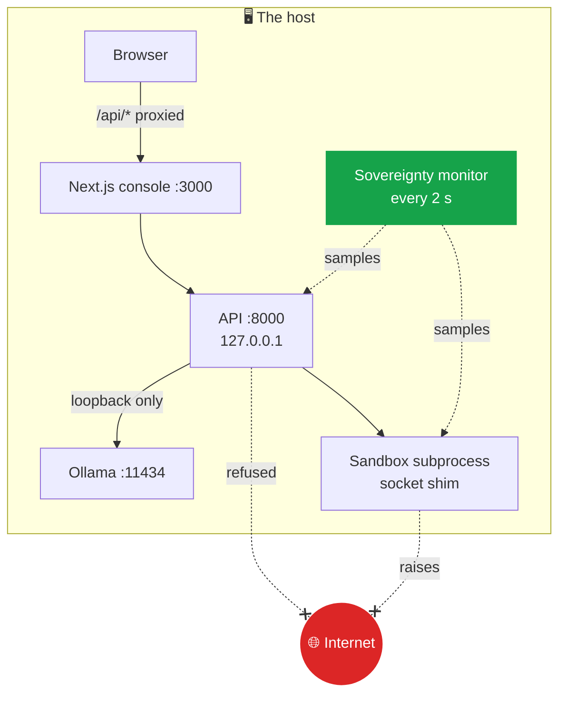

# 2.7 · Sovereignty

*Sovereign* here means one thing: **the data, the models and the results never leave the host.** AEGIS does not ask you to take that on trust. It enforces it in several places and measures it continuously.

## Four layers

| Layer | What it does | Where |
|---|---|---|
| **1. Loopback-only inference** | The inference client refuses any base URL that is not a loopback address. A misconfigured `inference.base_url` pointing at a remote server fails with *inference endpoint must be loopback*, HTTP 503 | `backend/models_layer/client.py` |
| **2. No network in the sandbox** | Generated code that imports `socket`, `requests`, `urllib`, `http` and similar is refused before it runs. Code that reaches a socket anyway hits a `sitecustomize` shim that raises `SovereignNetworkBlocked` | `backend/tools/sandbox.py` |
| **3. No telemetry** | The frontend disables Next.js telemetry on install. The console's Content-Security-Policy allows it to fetch, connect to and render only its own origin | `frontend/package.json`, `frontend/next.config.mjs` |
| **4. Measured egress** | The sovereignty monitor samples the network connections of the API process and its children every two seconds and counts any whose remote address is outside `127.0.0.0/8` and `::1/128` | `backend/security/sovereignty.py` |

## What the monitor measures

Every two seconds (`sovereignty.poll_interval_seconds`) the monitor:

1. lists the API process and all its children, which includes every sandbox run;
2. reads the operating system's connection table;
3. keeps the connections owned by those processes;
4. counts each one as **local** (remote address in an allowed range) or a **violation** (anything else), and counts DNS attempts (remote port 53).

A violation is recorded in the audit log, counted, and published live as a `sovereignty.status` event. The **0 egress** pill in the sidebar and the **Egress** card on the Assurance screen are this count, labelled *Measured*.

If the operating system refuses to show the connection table, the monitor does not report zero. It reports that it is **not monitoring**, and why. A host that cannot be observed is not described as clean.

## What the measurement covers, and what it does not

Being exact about this matters.

- ✅ It covers the **API process** and **everything it starts**: every model call from the API, every sandbox run, document generation and retrieval.
- ❌ It does **not** cover the **Ollama** process or the **Next.js** server, which are separate programs, not children of the API.
- ❌ It is **not** a statement that the machine is physically isolated. The Assurance screen says so beside the figure, and lists the host's network interfaces.

For a deployment that must be provably air-gapped, the right answer is an operating-system control underneath AEGIS: a host firewall that permits only loopback, or a machine with no route out. AEGIS's measurement is then the second witness, not the only one.

## The ten actions no role can take

`policies/tool-permissions.yaml` lists actions denied to every role with no override:

`external_api_call` · `internet_access` · `dns_resolution` · `cloud_model_inference` · `credential_access` · `host_filesystem_access` · `privilege_escalation` · `unregistered_model_use` · `unregistered_tool_use` · `sandbox_network_egress`

They are shown on the Assurance screen as **Policy: 10**, labelled *Configured*. Each is enforced by the mechanism that owns it, not by one central check. [9.2 The policy gateway](../09-security/02-policy-gateway.md) maps each action to what enforces it, and notes where enforcement is partial.

## Related

- The Assurance screen: [3.7 Assurance](../03-user-guide/07-assurance.md)
- The monitor in detail: [9.4 The sovereignty monitor](../09-security/04-sovereignty-monitor.md)

<!-- nav:start -->

---

| | | |
|:--|:--:|--:|
| [← 2.6 · The audit chain](06-audit.md) | [↑ 02 · Core concepts](README.md) | [2.8 · Skills and harnesses →](08-skills-harnesses.md) |

<!-- nav:end -->
