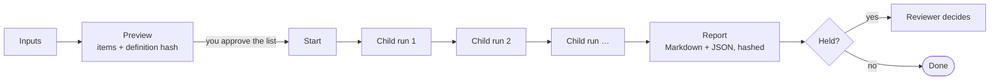

# 2.8 · Skills and harnesses

Skills and harnesses let you reuse work. Neither can relax a single control. They only decide what a run is *asked*.

## Skills: a saved instruction, called with `/`

A **skill** is a named request template with one placeholder, `{input}`. You call it in the Thread by typing `/` and its name, then the text that fills the placeholder.

```yaml
# config/skills/clause.yaml
id: clause
name: Find the governing clause
summary: The clause of the SOPs that governs a situation, and exactly what it requires.
input_hint: The situation, e.g. internal inspection of a vessel in corrosive service
template: >-
  Which clause of our SOPs governs the following, and what exactly does it
  require? {input}
```

Typing `/clause internal inspection of a pressure vessel in corrosive service` runs:

> Which clause of our SOPs governs the following, and what exactly does it require? internal inspection of a pressure vessel in corrosive service

That rendered request is then classified, grounded, verified and held exactly like one typed by hand.

### The five built-in skills

| Command | Name | Produces |
|---|---|---|
| `/approval-note` | Draft an approval note | A DOCX approval note citing each requirement, for a reviewer to sign off |
| `/clause` | Find the governing clause | The clause that governs a situation, and exactly what it requires |
| `/handover` | Handover points | What the SOPs require for a situation, as short points for the next shift |
| `/remaining-life` | Corrosion rate and remaining life | Rate and remaining life from thickness readings, computed in the sandbox and recomputed by the verifier |
| `/severity` | Classify a finding | The severity band a finding falls in, and who must approve continued operation |

### Rules a skill must follow

- A template must contain `{input}` and **nothing else** in braces. The server refuses anything else.
- Built-in skills are written to name "our SOPs", so every run retrieves, and to avoid words that change classification (*safety*, *hazard*, *shutdown*, *incident*, *statutory*, *regulatory*, *confidential*). Such a word must come from the user's input, so that only that run is treated as sensitive. `tests/test_skills.py` holds both properties.
- Every run records which skill shaped it, and that skill's **SHA-256**, in its `received` audit event. If a skill is edited later, you can still tell which version a past run used.

### Who can add skills

| Permission | Holders | May |
|---|---|---|
| `task.create` | everyone except the auditor | Use skills |
| `skill.create` | engineer, reviewer, administrator | Add skills, delete their own |
| `skill.manage` | administrator | Delete anyone's skill |

## Harnesses: one job, many governed runs

A **harness** is a job made of many ordinary runs, followed by one report. Each item becomes its own task, is classified, checked against policy, grounded, verified and held where the rules say so, exactly as if it had been typed into the Thread. The harness definition decides only what each child is **asked**.

### The three built-in harnesses

| Harness | Input | Each child run | The report |
|---|---|---|---|
| **SOP question sweep** | Up to 25 questions, one per line, and an optional standing context | Answers one question from the procedures the person may retrieve | An answer matrix: outcome, claims traced, clauses cited, link to the run |
| **Requirements register** | A department, and an optional document filter | Turns one indexed section into a cited statement of what it requires | A cited register of requirements |
| **Obligation coverage check** | Up to 25 external obligations, and their source reference | Checks one obligation against the procedure corpus | Which obligations the procedures cover, and where |

### How a harness runs



1. **Preview.** You see exactly which items the job will run, and the SHA-256 of the definition you previewed.
2. **Start.** You start precisely the items you approved. If the definition changed since the preview, or no longer produces one of those items, the start is refused rather than silently running something else.
3. **Children.** Items run one after another through the ordinary queue.
4. **Report.** When they finish, a report is written in Markdown and JSON, hashed, and versioned. Held, refused and failed items are counted and shown as such, never folded into the answers.
5. **Decision.** If a reviewer's sign-off is needed, the report waits for it.

Report files are served only if they still match their recorded hash.

## Related

- Using skills: [3.3 Skills](../03-user-guide/03-skills.md)
- Using harnesses: [3.4 Harnesses](../03-user-guide/04-harnesses.md)
- Skills and harnesses in the API: [11.4 Skills and harnesses](../11-api/04-skills-harnesses.md)

<!-- nav:start -->

---

| | | |
|:--|:--:|--:|
| [← 2.7 · Sovereignty](07-sovereignty.md) | [↑ 02 · Core concepts](README.md) | [2.9 · Conflicts and human resolution →](09-conflicts.md) |

<!-- nav:end -->
