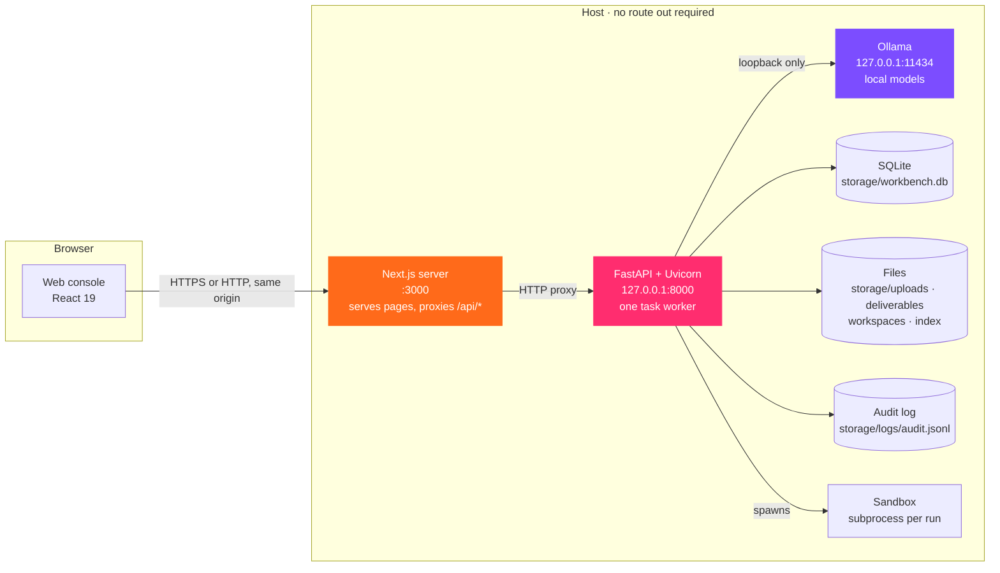
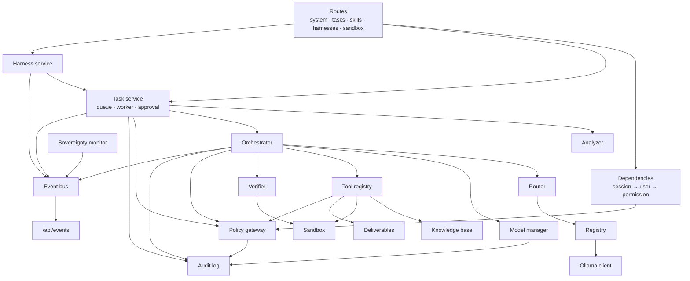

# 4.1 · System overview

## Three processes on one host

| Process | Technology | Listens on | Responsibility |
|---|---|---|---|
| **Web console** | Next.js 16, React 19, TypeScript, Tailwind CSS 4 | `:3000` | Serves the pages; proxies every `/api/*` request to the API so the API can stay on loopback; sets the Content-Security-Policy |
| **API** | FastAPI 0.115, Uvicorn 0.34, Pydantic 2, Python 3.11+ | `127.0.0.1:8000` | Authentication, policy, the task queue and worker, the agent pipeline, retrieval, the sandbox, deliverables, audit, the sovereignty monitor, the event stream |
| **Model runtime** | Ollama | `127.0.0.1:11434` | Holds and runs the local models: generation, vision, embedding |

The browser only ever talks to the web console's origin. The console's CSP (`default-src 'self'`, `connect-src 'self'`) means the browser itself will refuse to fetch from, connect to, or render anything from another origin.

## Inside the API

Every arrow into the **policy gateway** is a question: *may this user do this, on this data, with this tool or model?* Every arrow into the **audit log** is a record of the answer. Both are singletons shared by the whole process.

## Startup

When the API starts it: loads and validates every YAML file (a malformed policy stops the boot); creates storage and the schema; verifies the audit chain; seeds the five accounts if the user table is empty; starts the sovereignty monitor; closes any run a previous process left in progress; starts one task worker; and, if `inference.prewarm` is on, loads the everyday model in the background with the drafting system prompt already read.

## What is deliberately not here

| Not used | Instead | Why |
|---|---|---|
| PostgreSQL, pgvector | SQLite in WAL mode; vectors as BLOBs, cosine similarity in Python | One file to back up; no server; the corpus is thousands of passages, not millions |
| Neo4j or another graph store | None yet | P&ID graph extraction is on the roadmap, not built |
| Redis, Kafka | An in-process `asyncio` fan-out bus | One process produces and serves every event |
| Celery, a worker fleet | One in-process worker | One model fits in memory at a time; parallel runs would fight over it |
| Kubernetes | A shell script, or Docker for the API | A single host |
| A cloud identity provider | Local accounts, PBKDF2, sessions in SQLite | No route off the host is needed to sign in |

## Related

- [4.2 The life of a request](02-request-lifecycle.md)
- [4.3 Backend modules](03-backend-modules.md)

<!-- nav:start -->

---

| | | |
|:--|:--:|--:|
| [← 04 · Architecture](README.md) | [↑ 04 · Architecture](README.md) | [4.2 · The life of a request →](02-request-lifecycle.md) |

<!-- nav:end -->
