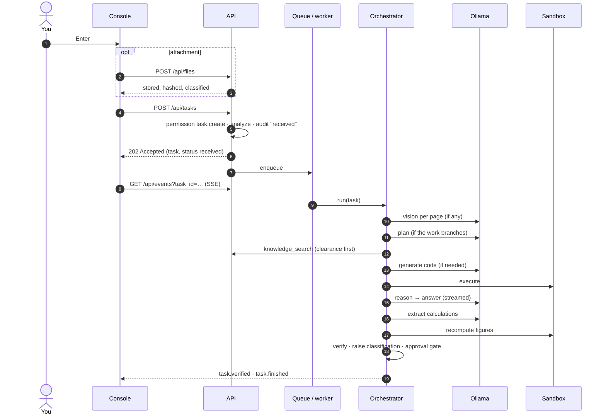

# 4.2 · The life of a request

This page follows one request from the moment you press **Enter** to the moment its answer is delivered or held, naming the code that does each step. The orchestrator's main method is `AgentOrchestrator.run` in `backend/agents/orchestrator.py`.

## 1 · Upload (optional)

`POST /api/files` (`file.upload`). The file's name is sanitised, its size checked against `storage.max_upload_bytes` (50 MB) and its extension against `storage.allowed_upload_extensions`. It is stored under `storage/uploads/`, confined to the storage root by the policy gateway, hashed with SHA-256, and given an input type (from its extension) and a classification. Audited as `file / uploaded`.

## 2 · Create the task

`POST /api/tasks` (`task.create`) with the prompt, the file IDs, an optional output format, an optional preferred model and an optional skill.

- If a **skill** is named, its template renders the request, and the skill's ID and SHA-256 are recorded.
- The **analyzer** (`backend/core/analyzer.py`) produces the profile: input type, task type, complexity, sensitivity, confidence, step budget, and whether the run needs retrieval, vision, code execution or a deliverable.
- The task is saved with status `received`, audited as `task / received`, published as `task.created`, and put on the queue. The API answers **202 Accepted** at once. The work happens in the background.

## 3 · Queue

One worker takes tasks in order. While a task waits, `task.queued` events report its position and which task is running. The worker persists the task at every stage boundary, so the database always shows where a run is, even during a long CPU inference.

## 4 · Conversation fast path

If the analyzer classed the message as **conversation**, the orchestrator answers it in one short model call and ends. No retrieval, no checks, no approval. It makes no claims.

## 5 · Read visual inputs first

If the task has images or PDF pages without a text layer, they are read **before planning**, for two reasons. Only one generation model fits in memory on a modest host, so planning first would load the reasoning model, evict it for the vision model, and load it again. And a plan written after the document has been read is a better plan.

- Each PDF is inspected page by page (`inspect_pdf_pages`). Pages with fewer than 120 characters of text need vision.
- Those pages are rendered with PyMuPDF at a long edge of 1100 px (`rasterize_pdf`).
- Pages are read in **batches of three** per vision call; standalone images one at a time.
- An empty vision result falls back to **Tesseract OCR**. If both find nothing, the page is recorded as *No legible content extracted from this page*, and a limitation is noted.
- Each page becomes its own `V` evidence item with its file, page number and source hash. A `task.extraction` event reports the batch.

## 6 · Plan, only when the work branches

`_needs_plan` returns true when the run needs code, needs vision, produces a deliverable, or has files. Otherwise the transcript records *No plan required: a single retrieval step with no code, files or deliverable*, and the run skips a stage that once cost 79 seconds of a 200-second run.

A plan is a short JSON list of steps (budget: 350 output tokens). If the model's plan cannot be parsed, a deterministic fallback plan for the profile is used. Audited as `agent / plan_created`.

## 7 · Read text files

Attachments with text (text files, documents, spreadsheets, PDFs with a text layer) are read with the `file_read` tool. Each segment becomes `F` evidence.

## 8 · Retrieve

If the run requires retrieval, `knowledge_search` runs with the prompt, plus the first three visual findings when there are any, cut to 800 characters. The person's department and clearance are applied **before** ranking. Results become `S` evidence; `task.evidence` carries them. If nothing is found, the limitation *No supporting passages were found* is recorded.

## 9 · Generate and run code (when needed)

If the profile requires code, or the plan includes `python_exec`, the coding stage asks the model for a script (700 output tokens), validates it, and runs it in the sandbox. If it fails, the model is shown the error and tries again, up to `verification.max_replans` (2) attempts, each audited as `agent / code_retry`. The output becomes `C` evidence. `task.code_generated` and `task.sandbox_result` report each attempt.

## 10 · Reason

The reasoning model is given the request; every page-level evidence item, each cut to 400 characters; the first six other items (retrieved passages and file text), each cut to 500 characters; any extraction; and the first 2,000 characters of any sandbox output. It is asked for a cited answer (900 output tokens). Because a passage is cut at 500 characters, the demonstration corpus keeps every clause shorter than that. See [6.5 Writing a corpus](../06-knowledge-and-retrieval/05-corpus-authoring.md). Its text streams to the browser as `task.token` events. The complete answer arrives once, as `task.answer`.

## 11 · Verify

The checks run in a fixed order: sources, citations, page citations, calculations (the model restates its figures as expressions and the sandbox recomputes them), code. A check that raises is recorded as failed, never as a crashed run. Recomputed figures become `C` evidence.

## 12 · Draft the deliverable (if any)

If the run produces a document, it is drafted as structured content and checked by *document_verification*. The final report adds the hallucination check over every material claim, and `valid` is true only if every check passed. `task.verified` publishes the report; `verification / completed` audits each check's result.

## 13 · Raise the classification

The highest classification among the evidence the run used is compared with the run's own. If higher, the run is raised, audited as `policy / classification_raised`, and a second `task.classified` event announces it. **It only ever rises.**

## 14 · The approval gate

The gateway evaluates the approval rules against the final profile, the prompt and whether verification passed.

- **Held:** any document is rendered and hashed but not released; the status becomes `awaiting_approval`; audited as `approval / requested` with the reasons.
- **Not held:** any document is rendered and released; the status becomes `delivered`.

## 15 · Finish

`task.finished` carries the final status and duration. Whatever happened (delivered, held, blocked, failed or stopped) the run's record, evidence and audit trail are complete.

## How each failure ends

| What happened | Status | Recorded as |
|---|---|---|
| No eligible model for a stage | `blocked` | `agent / blocked` with the router's reason |
| The model runtime failed | `failed` | *Local inference failed: …* |
| Anything unexpected | `failed` | The exception type and message. The pipeline never continues silently |
| You pressed Stop | `cancelled` | The stage it was in |

<!-- nav:start -->

---

| | | |
|:--|:--:|--:|
| [← 4.1 · System overview](01-system-overview.md) | [↑ 04 · Architecture](README.md) | [4.3 · Backend modules →](03-backend-modules.md) |

<!-- nav:end -->
