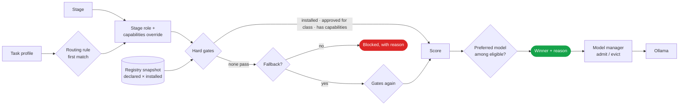

# 05 · Models and routing

> Installed is not the same as authorised.

A run is not answered by "the model". Each **stage** (reading a scan, planning, writing code, drafting, verifying) is routed separately, to a model that is installed, approved for the run's classification, has the capabilities the stage needs, and fits in the memory the host has free.

| Page | Covers |
|---|---|
| [5.1 The model registry](01-registry.md) | Declaring models, and reconciling the declaration with what is installed |
| [5.2 How a model is chosen](02-router.md) | Rules, stage overrides, hard gates, scoring, fallbacks, a preferred model, and the reason |
| [5.3 Memory and residency](03-residency.md) | Admission, single residency, eviction, keep-alive and prewarming |
| [5.4 The Ollama client](04-ollama-client.md) | Loopback enforcement, generation options, streaming, images, usage |
| [5.5 Adding a model](05-adding-a-model.md) | A worked example, and what to check afterwards |

## The flow

Every decision (the winner, the top six candidates with their scores and notes, whether a fallback was used, whether a preferred model was honoured and why not) is stored on the run, shown in its transcript, and audited.

<!-- nav:start -->

---

| | | |
|:--|:--:|--:|
| [← 4.6 · The live event stream](../04-architecture/06-events.md) | [↑ The AEGIS Handbook](../README.md) | [5.1 · The model registry →](01-registry.md) |

<!-- nav:end -->
