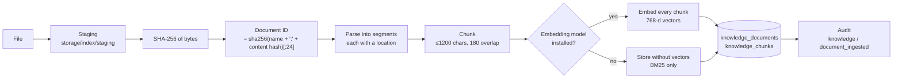

# 6.1 · Ingestion

A document enters the knowledge base in one of two ways:

| Route | Who | How |
|---|---|---|
| **The seed script** | An operator at the shell | `python scripts/seed_demo_data.py`: the demonstration corpus, with metadata read from each document's header |
| **The Knowledge screen** | `knowledge.ingest` (engineer, reviewer, administrator) | **+ Ingest document**, or `POST /api/knowledge/documents` |

## What happens

1. **Stage.** The upload is written to `storage/index/staging/` under its base name only, so a path in the file name cannot escape the directory.
2. **Identify.** The document ID is derived from the file name and a hash of its content. The same file ingested twice gets the same ID and is re-indexed in place: its old chunks are deleted first. A changed file gets a new ID.
3. **Parse.** The file is split into **segments**, each with a **location**: a Markdown or DOCX section, a PDF page, a spreadsheet sheet, a slide. See [6.2](02-parsing-and-vision.md).
4. **Chunk.** Segments longer than 1,200 characters are cut into overlapping passages. See [6.3](03-chunking-embedding.md).
5. **Embed.** If an embedding model is installed, every passage is embedded locally. If not, passages are stored without vectors and found only by the lexical retriever.
6. **Store.** The document row carries its title, source path, department, classification, version, hash, media type, size and passage count. Each chunk carries its ordinal, location, text, a token estimate, and its vector and the model that made it.
7. **Audit.** `knowledge / document_ingested` records who, what and how many passages.

## Metadata

| Field | From the Knowledge screen | From the seed script |
|---|---|---|
| Title | The first heading, or the file name | The document's title line |
| Department | The form (default *general*) | `**Department:**` in the header |
| Classification | The form (default *confidential*) | `**Classification:**` in the header |
| Version | The form (default *1.0*) | `**Revision:**` in the header |

The seed script maps the header's department and classification names onto the IDs declared in `policies/access-control.yaml` and `policies/data-classification.yaml`, and **refuses** any document that is not marked `SYNTHETIC` in both its banner and its `**Status:**` field, or that has no `**Revision:**`. A demonstration corpus that could be mistaken for real data is a liability.

## Supported formats

`.txt`, `.md`, `.pdf`, `.docx`, `.csv` and `.xlsx`. A PDF whose pages have no text layer can be ingested, but its scanned pages contribute no passages: the knowledge base parses text only. Scans are for attachments, which the vision model reads.

## Removing a document

`DELETE /api/knowledge/documents/{id}` (`knowledge.manage`, administrator) removes the document and, by cascade, all its passages. It is audited.

## Superseded versions

Because a changed file is a new document, two versions of a procedure can both be in the index after an interface upload, and both can be retrieved. The seed script avoids this for the demonstration corpus by removing any other copy with the same **document code** (such as `SOP-INS-014`) unless `--keep-stale` is given. General revision control (tracking effective dates and superseded status, and preferring the active revision at retrieval) is on the roadmap.

<!-- nav:start -->

---

| | | |
|:--|:--:|--:|
| [← 06 · Knowledge and retrieval](README.md) | [↑ 06 · Knowledge and retrieval](README.md) | [6.2 · Parsing, pages and vision →](02-parsing-and-vision.md) |

<!-- nav:end -->
