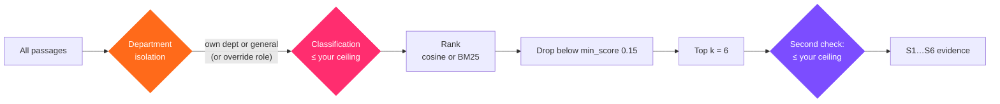

# 6.4 · Retrieval and clearance

Retrieval is the `knowledge_search` tool, backed by `KnowledgeBase.search`. It runs when the analyzer says a run needs grounding, and from the Knowledge screen's Retrieval test.

## When a run retrieves

From `retrieval` in `config/classification.yaml`:

- **always** for `document_generation`, `question_answering` and `analysis` tasks;
- otherwise when the request contains a **trigger**: *sop*, *standard operating procedure*, *manual*, *procedure*, *policy*, *guideline*, *as per our*, *according to our*, *past report*, *previous inspection*.

This is why built-in skills and harness templates say "our SOPs": it guarantees retrieval whatever the task type.

## The query

The run's prompt, plus the descriptions of the first three visual findings when a scan was read, cut to 800 characters. With a skill, the prompt is the rendered template.

## Clearance first, then ranking



1. **Department isolation.** Unless your role is an override role (reviewer, auditor, administrator), only passages from **your department** and **general** documents are considered.
2. **Classification ceiling.** Passages above your role's maximum classification are removed.
3. **Rank** what is left.
4. **Floor.** Scores below `knowledge_base.min_score` (0.15) are dropped.
5. **Top k.** The best `default_top_k` (6) are kept.
6. **Second check.** The tool filters the results against your ceiling once more, as an independent guard.

### Why before, not after

Filtering *after* ranking used to give an operator three passages where an engineer got six: Restricted passages took the other slots and were then removed. That meant less context for the answer, and a count that told the operator something above their clearance had matched. Filtering first means everyone gets their best six passages from what they may see, and learns nothing about what they may not.

The Documents list on the Knowledge screen applies the same two rules, so a person does not even see the *title* of a document they could never retrieve.

## Ranking

### Embedding mode

The query is embedded, and every candidate passage with a vector is scored by **cosine similarity**. Passages with a score of zero or less are ignored. Scores run from 0 to 1; on the demonstration corpus, good matches score about 0.65–0.80.

### Lexical mode (BM25)

Used when there is no embedding model, when no candidate has a vector, or when embedding the query fails.

```text
score(passage) = Σ over query terms t:
    idf(t) × tf(t) × (k1 + 1) / (tf(t) + k1 × (1 − b + b × len / avg_len))

idf(t) = ln(1 + (N − df + 0.5) / (df + 0.5))
k1 = 1.5,  b = 0.75
```

Tokens are lowercase runs of letters, digits and `-_/.`, so `sop-ins-014`, `p-2104` and `6.0` survive as single terms. BM25 scores are not bounded to 0–1; the same 0.15 floor applies.

## What a result carries

Each result becomes an `S` evidence item with the passage text, document title, section location, department, classification, version, ingestion time, source hash, and score. `task.evidence` streams them, and the run's transcript lists them with their scores.

## Known limits

- Retrieval is **one mode at a time**: dense *or* lexical, not both merged, and there is no re-ranker. A hybrid retriever (BM25 and embeddings in parallel, merged and re-ranked) is on the roadmap.
- **Revisions are not tracked.** Two versions of a procedure can both be retrieved if both were uploaded. See [6.1](01-ingestion.md#superseded-versions).
- **Scale.** Similarity is computed in Python over every candidate passage. That is fast for thousands of passages and slow for millions. The single-host design assumes the former.

<!-- nav:start -->

---

| | | |
|:--|:--:|--:|
| [← 6.3 · Chunking and embedding](03-chunking-embedding.md) | [↑ 06 · Knowledge and retrieval](README.md) | [6.5 · Writing a corpus →](05-corpus-authoring.md) |

<!-- nav:end -->
