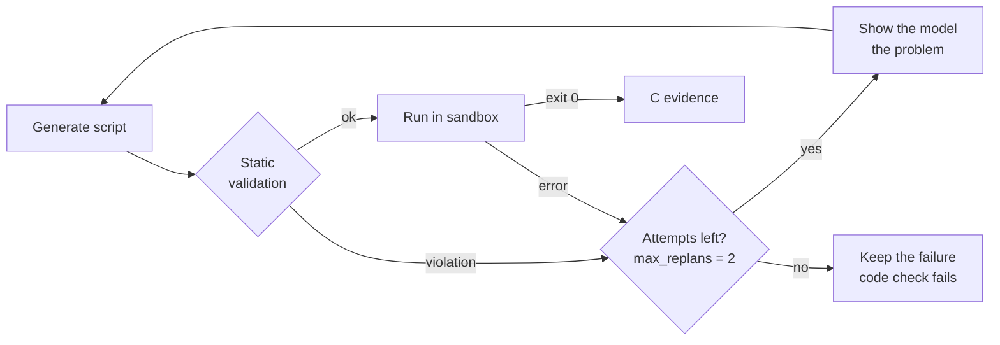

# 7.2 · The orchestrator

`AgentOrchestrator` in `backend/agents/orchestrator.py` runs one task through its stages. [4.2 The life of a request](../04-architecture/02-request-lifecycle.md) walks through them in order; this page covers the machinery around them.

## Stages at a glance

| # | Stage | Runs when | Model role | Output |
|---|---|---|---|---|
| 1 | Conversation | Task type is `conversation` | reasoning | A short reply; nothing else runs |
| 2 | Vision extraction | Images or scanned pages | vision | `V` evidence, per page |
| 3 | Planning | Code, vision, a deliverable, or files | reasoning | A plan, or a recorded skip |
| 4 | File reading | Text-bearing attachments | none | `F` evidence |
| 5 | Retrieval | `requires_retrieval` | embedding | `S` evidence |
| 6 | Code execution | `requires_code_execution` or a planned `python_exec` | coding | `C` evidence |
| 7 | Reasoning | Always | reasoning | The answer, streamed |
| 8 | Verification | Always | reasoning (extraction) + sandbox | Checks; recomputed `C` evidence |
| 9 | Deliverable drafting | `produces_deliverable` | reasoning | Structured content; document check |
| 10 | Classification raise | Always | none | Raised profile, if evidence warrants |
| 11 | Approval gate | Always | none | Held, or delivered |

## The evidence ledger

One `EvidenceLedger` per run hands out every evidence ID: `S` for retrieved passages, `F` for file text, `V` for visual reading, `C` for computation, and `E` for anything else. IDs are unique across the whole run. The ledger is bound to the task's evidence list from the start, so evidence gathered before a failure survives it.

## Persistence at every boundary

`_stage(...)` is called at each stage boundary. It sets the task's status, emits `task.stage`, and calls the task service's persist callback, which writes the task to SQLite. Without it, a long CPU inference would leave the stored task frozen at *classified* while the agent was plainly working. Evidence is also persisted as it arrives.

## Cancellation

`_check_cancelled` is consulted between stages, and `_until_stopped` wraps every wait on the model runtime, so pressing **Stop** interrupts a long call rather than waiting for it to finish. A stop raises `TaskCancelled`, which is **not** caught by the verification stage's error handling: a stop is not a failed check, and must not be filed as *figures could not be recomputed*.

## Streaming

The answer streams through `_generate_streaming`, which flushes visible text about twenty times a second as `task.token` events. Text inside an unclosed `<think>` block is withheld until the block closes, then stripped. The complete text is sent once, as `task.answer`.

## Code, with bounded retries

Each retry is audited as `agent / code_retry` with the problem, and emitted as `task.code_retry`. The last result, success or failure, is what the code check judges.

## Failure handling

| Exception | Status | Why this status |
|---|---|---|
| `TaskCancelled` | `cancelled` | You asked |
| `NoEligibleModelError` | `blocked` | Policy or installation allows no model. That is a refusal, not a malfunction |
| `InferenceError` | `failed` | The runtime failed: *Local inference failed: …* |
| Anything else | `failed` | `Type: message`. The pipeline never continues after an unexpected error |

Every path emits `task.finished` with the final status and duration, and writes an audit record.

## Usage records

Every model call appends a `ModelUsage` record: stage, model, tokens in and out, latency, speed, context window, output limit, done reason, time to first token, load, prompt and generation times, whether it streamed, and whether it was cancelled. A figure the runtime did not report stays `null`, never zero. See [5.4](../05-models-and-routing/04-ollama-client.md#usage-telemetry).

## Known structure debt

The orchestrator is one ~2,100-line module. It works, and it is heavily commented with the reasons behind each decision, but its stages are methods on one class that share state. The roadmap splits it into typed stages with a shared `WorkflowContext` and explicit inputs, outputs and failure states. That enables testing each stage alone, resuming after a restart, and a proof view that shows each stage's inputs and outputs.

<!-- nav:start -->

---

| | | |
|:--|:--:|--:|
| [← 7.1 · The task analyzer](01-analyzer.md) | [↑ 07 · Agents and orchestration](README.md) | [7.3 · Planning and prompts →](03-planning-prompts.md) |

<!-- nav:end -->
