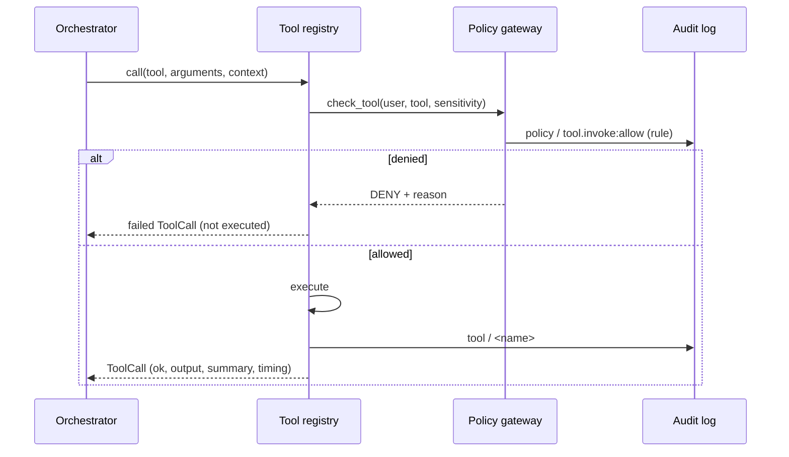

# 7.4 · Tools

The tool registry (`backend/tools/registry.py`) holds the operations the pipeline can invoke. **Every invocation goes through the policy gateway first**: an unregistered tool, a role the tool is not granted to, or data above the tool's ceiling is refused, and the decision is audited as `policy / tool.invoke:<allow|deny>` with the rule that decided it.

## The six registered tools

| Tool | What it does | Side effects | Ceiling |
|---|---|---|---|
| `knowledge_search` | Searches the knowledge base with the caller's department and clearance applied before ranking; returns `S` evidence | Read only | Restricted |
| `file_read` | Reads an attached file the caller may access, preserving page and section; returns `F` evidence | Read only | Restricted |
| `python_exec` | Runs Python in the sandbox; returns stdout, stderr, exit code, limits applied and network attempts blocked | Execute | Restricted |
| `spreadsheet_analyze` | Loads an attached CSV or XLSX in the sandbox and summarises its structure, columns and statistics | Read only | Restricted |
| `historian_read` | Reads recorded values for an instrument tag, or every instrument on an equipment tag, from the historian or OPC UA; returns `M` evidence | Read only | Restricted |
| `document_generate` | Renders a DOCX, XLSX, PPTX or Markdown deliverable with its citations, and hashes it | Write | Restricted |

Every tool is granted to operator, engineer, reviewer and administrator in `policies/tool-permissions.yaml`, and to no other role. The auditor cannot invoke any tool: oversight without the power to act.

## How an invocation is recorded

Each call is kept on the run as a `ToolCall`: tool, arguments (summarised), status, output summary, error, and timing. `task.tool_started` and `task.tool_completed` stream it.

## `file_read` in detail

1. The file must be one of the task's attachments.
2. The gateway checks **file access**: the uploader always may; otherwise the reader's role must be an override role, or the file's department must match theirs.
3. The gateway checks **path confinement**: the resolved path must lie inside the storage root. A path that escapes (through `..`, a symlink or an absolute path) is refused as `host_filesystem_access`.
4. The file is parsed (see [6.2](../06-knowledge-and-retrieval/02-parsing-and-vision.md)), and each segment becomes `F` evidence with its location.

> [!WARNING]
> If the model asks for a file ID that does not match any attachment, `file_read` currently falls back to the **first** attachment rather than refusing. With several attachments, that can attribute one file's content to another's request. Removing this fallback is roadmap item 2 ("evidence provenance").

## `historian_read` in detail

Plant data is reached through read-only connectors (`backend/connectors/`). The interface (`base.py`) has `describe`, `tags`, `tags_for` and `read`, and nothing else: no write, acknowledge, method call or subscription exists to be asked for.

| Source | Adapter | What it reads |
|---|---|---|
| `historian` (default) | `SQLiteHistorian` | The SQLite historian at `connectors.historian.path`, opened with SQLite's `mode=ro`, so the driver itself refuses writes |
| `opcua`, `mode: simulator` | `OPCUAConnector` | The same tags as OPC UA variables `ns=2;s=<tag>`, served from the historian, with the historian's own timestamps (never restamped as "now") |
| `opcua`, `mode: live` | `OPCUAConnector` | A real server at `connectors.opcua.endpoint`, current values only, through the optional `asyncua` library. It is not in `requirements.txt`: without it the adapter reports "not installed" and reads nothing |

Arguments: `tag` (an instrument such as `PT-2104`, or equipment such as `V-2104` for all its instruments), `source`, an optional ISO 8601 `start` and `end`, and `limit` (newest samples per tag, default 24, at most 500).

Each tag read becomes one `historian` evidence item (`M`): the source and tag in `source_document`, the window in `location`, one line per sample in the excerpt, and in `extraction_data` every reading with its **timestamp, value, unit, quality** (`good`, `uncertain`, `bad`) and the source's reason for anything not good. A bad sample has **no value**: never a zero or the last good reading. `good_min`, `good_max` and `latest` are computed from good samples only. A connector that cannot be asked (no database, library not installed, unknown tag) fails the call with the reason; it never returns an empty result that would read as "nothing recorded".

The historian's classification is `connectors.historian.classification` (confidential by default); a user cleared below it is refused.

### The simulated historian

`python scripts/seed_historian.py` (also run by `scripts/seed_demo_data.py`) writes `storage/historian.db`: two weeks of hourly samples, 2026-05-11 to 2026-05-24, for PT-2104, TT-2104 and LT-2104A on V-2104 and PT-2107 and TT-2107 on V-2107, generated from a fixed seed so every build is identical. V-2107's instruments report `bad (out_of_service)` from its withdrawal on 2026-05-18, and PT-2104 has a six-hour `comm_failure` on 2026-05-20. The data is **simulated**: the database says so in its `meta` table, and every item served from it is marked `simulated` and titled "Simulated …".

The orchestrator does not call `historian_read` on its own: it is in the catalogue the planner is shown, for plans that need recorded process values.

## Tools in the policy file that are not registered

`policies/tool-permissions.yaml` also declares `file_write` and `vision_extract`.

- **`vision_extract`**: reading images is done by the orchestrator directly, through the router and the model manager, not as a registry tool. So the policy entry's ceiling (*sensitive*) is not what gates vision; the vision **model's** approved classifications are.
- **`file_write`**: generated files are written by the sandbox inside its workspace and by `document_generate`. There is no separate write tool.

A tool the model names that is not registered is refused by default (`allow_unregistered_tools: false`).

<!-- nav:start -->

---

| | | |
|:--|:--:|--:|
| [← 7.3 · Planning and prompts](03-planning-prompts.md) | [↑ 07 · Agents and orchestration](README.md) | [7.5 · Deliverables →](05-deliverables.md) |

<!-- nav:end -->
