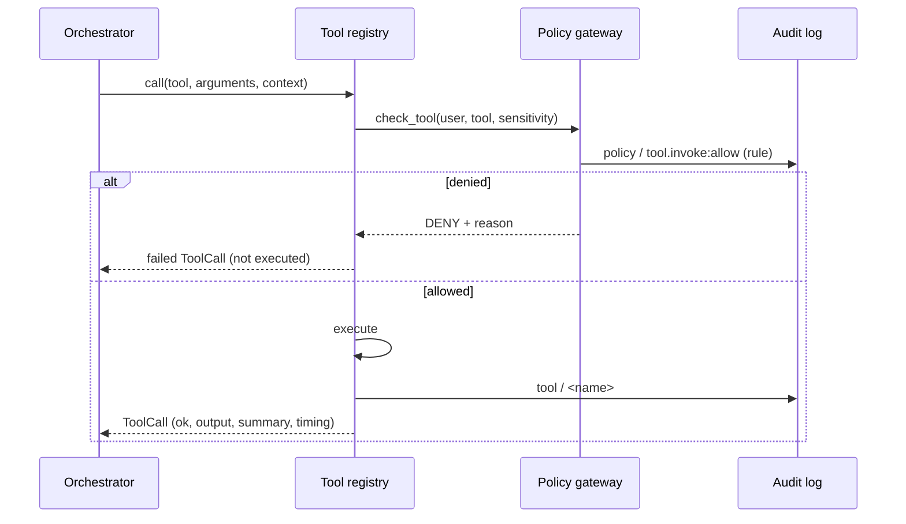

# 7.4 · Tools

The tool registry (`backend/tools/registry.py`) holds the operations the pipeline can invoke. **Every invocation goes through the policy gateway first**: an unregistered tool, a role the tool is not granted to, or data above the tool's ceiling is refused, and the decision is audited as `policy / tool.invoke:<allow|deny>` with the rule that decided it.

## The seven registered tools

| Tool | What it does | Side effects | Ceiling |
|---|---|---|---|
| `knowledge_search` | Searches the knowledge base with the caller's department and clearance applied before ranking; returns `S` evidence | Read only | Restricted |
| `file_read` | Reads an attached file the caller may access, preserving page and section; returns `F` evidence | Read only | Restricted |
| `python_exec` | Runs Python in the sandbox; returns stdout, stderr, exit code, limits applied and network attempts blocked | Execute | Restricted |
| `spreadsheet_analyze` | Loads an attached CSV or XLSX in the sandbox and summarises its structure, columns and statistics | Read only | Restricted |
| `historian_read` | Reads recorded values for an instrument tag, or every instrument on an equipment tag, from the historian or OPC UA; returns `M` evidence | Read only | Restricted |
| `cmms_read` | Lists the open work orders and notifications raised against an equipment tag in the CMMS; returns one `W` evidence item. Called by the run itself when it assesses a tag | Read only | Restricted |
| `document_generate` | Renders a DOCX, XLSX, PPTX or Markdown deliverable with its citations, and hashes it | Write | Restricted |

Every tool is granted to operator, engineer, reviewer and administrator in `policies/tool-permissions.yaml`, and to no other role. The auditor cannot invoke any tool: oversight without the power to act.

## How an invocation is recorded

```mermaid
sequenceDiagram
    participant O as Orchestrator
    participant T as Tool registry
    participant G as Policy gateway
    participant A as Audit log
    O->>T: call(tool, arguments, context)
    T->>G: check_tool(user, tool, sensitivity)
    G->>A: policy / tool.invoke:allow (rule)
    alt denied
      G-->>T: DENY + reason
      T-->>O: failed ToolCall (not executed)
    else allowed
      T->>T: execute
      T->>A: tool / <name>
      T-->>O: ToolCall (ok, output, summary, timing)
    end
```

Each call is kept on the run as a `ToolCall`: tool, arguments (summarised), status, output summary, error, and timing. `task.tool_started` and `task.tool_completed` stream it.

## `file_read` in detail

1. The file must be one of the task's attachments.
2. The gateway checks **file access**: the uploader always may; otherwise the reader's role must be an override role, or the file's department must match theirs.
3. The gateway checks **path confinement**: the resolved path must lie inside the storage root. A path that escapes (through `..`, a symlink or an absolute path) is refused as `host_filesystem_access`.
4. The file is parsed (see [6.2](../06-knowledge-and-retrieval/02-parsing-and-vision.md)), and each segment becomes `F` evidence with its location.

> [!WARNING]
> If the model asks for a file ID that does not match any attachment, `file_read` currently falls back to the **first** attachment rather than refusing. With several attachments, that can attribute one file's content to another's request. Removing this fallback is roadmap item 2 ("evidence provenance").

## `historian_read` in detail

Plant data is reached through read-only connectors (`backend/connectors/`). The interface (`base.py`) has `describe`, `tags`, `tags_for` and `read`, and nothing else: no write, acknowledge, method call or subscription exists to be asked for.

| Source | Adapter | What it reads |
|---|---|---|
| `historian` (default) | `SQLiteHistorian` | The SQLite historian at `connectors.historian.path`, opened with SQLite's `mode=ro`, so the driver itself refuses writes |
| `opcua`, `mode: simulator` | `OPCUAConnector` | The same tags as OPC UA variables `ns=2;s=<tag>`, served from the historian, with the historian's own timestamps (never restamped as "now") |
| `opcua`, `mode: live` | `OPCUAConnector` | A real server at `connectors.opcua.endpoint`, current values only, through the optional `asyncua` library. It is not in `requirements.txt`: without it the adapter reports "not installed" and reads nothing |

Arguments: `tag` (an instrument such as `PT-2104`, or equipment such as `V-2104` for all its instruments), `source`, an optional ISO 8601 `start` and `end`, and `limit` (newest samples per tag, default 24, at most 500).

Each tag read becomes one `historian` evidence item (`M`): the source and tag in `source_document`, the window in `location`, one line per sample in the excerpt, and in `extraction_data` every reading with its **timestamp, value, unit, quality** (`good`, `uncertain`, `bad`) and the source's reason for anything not good. A bad sample has **no value**: never a zero or the last good reading. `good_min`, `good_max` and `latest` are computed from good samples only. A connector that cannot be asked (no database, library not installed, unknown tag) fails the call with the reason; it never returns an empty result that would read as "nothing recorded".

The historian's classification is `connectors.historian.classification` (confidential by default); a user cleared below it is refused.

### The simulated historian

`python scripts/seed_historian.py` (also run by `scripts/seed_demo_data.py`) writes `storage/historian.db`: two weeks of hourly samples, 2026-05-11 to 2026-05-24, for PT-2104, TT-2104 and LT-2104A on V-2104 and PT-2107 and TT-2107 on V-2107, generated from a fixed seed so every build is identical. V-2107's instruments report `bad (out_of_service)` from its withdrawal on 2026-05-18, and PT-2104 has a six-hour `comm_failure` on 2026-05-20. The data is **simulated**: the database says so in its `meta` table, and every item served from it is marked `simulated` and titled "Simulated …".

The orchestrator does not call `historian_read` on its own: it is in the catalogue the planner is shown, for plans that need recorded process values.

## `cmms_read` in detail

A maintenance-management system (CMMS) answers one question here: which work orders and notifications are raised against this tag and not yet closed? It has its own read-only interface in `base.py`, `ReadOnlyMaintenanceSource`, with `describe` and `open_items` and nothing else: no create, release, confirm or close exists to be asked for. Items come back as `MaintenanceItem` records (number, work order or notification, tag, title, work type, status, priority, raised date, planned start, closed date, raised by, the record that prompted it). An item is open in the statuses `open`, `released`, `in_progress` and `awaiting_shutdown`.

| `connectors.cmms.mode` | What it reads |
|---|---|
| `simulator` (default) | The SQLite database at `connectors.cmms.path`, opened with `mode=ro`, so the driver itself refuses writes |
| `live` | Nothing. It is declared so a configuration can name it, and refused with "not implemented": there is **no SAP PM or Maximo client in this build**. One would implement the same two methods, mapping its own statuses onto the open set. Its endpoint must in any case be a literal address inside `sovereignty.allowed_cidrs`; a hostname is refused rather than resolved, since a DNS lookup is denied outright |

Argument: `tag` (an equipment or functional-location tag such as `V-2104` or `PSV-2104A`).

The lookup becomes one `cmms` evidence item (`W`): the source and tag in `source_document`, the extract date in `location`, one line per open item in the excerpt, or "No open work order or notification for …" when there are none. `extraction_data` holds every open item, the counts and `work_order_raised`. A CMMS that cannot be asked (no database, live mode, a tag it does not know) fails the call with the reason: it never returns an empty list that would read as "no work raised". The classification is `connectors.cmms.classification` (normal by default: work-order lists are operational records).

### Called by the run, stated in the note

Unlike `historian_read`, the orchestrator calls `cmms_read` itself. When a run has assessed a tag (a vessel, a relief valve, a piping circuit), right after the formula registry, it looks up that tag through the registry, so the call is policy-checked, audited as `tool / cmms_read:ok` and kept on the run like any other. The `W` item joins the ledger, and the run, not the model, writes the approval note's **Maintenance status (CMMS)** sentence from it:

- an open work order: "A work order is already raised for V-2104 in CMMS (simulator): WO-4000321 (repair, awaiting shutdown, planned start 2026-11-09): Repair cladding and insulation on shell course 2 (SOP-MNT-022). Open notification: NOTIF-10402117 … [W1]."
- none: "No open work order found in CMMS (simulator) for PSV-2104A [W1]."
- the CMMS could not be asked: "CMMS (simulator) could not be read for V-2104 (…), so whether a repair is already raised is not known." It is also listed under the run's limitations.

The sentence is set on the deliverable next to the approving-authority line, rendered in the DOCX, Markdown and PPTX, and shown in the thread's reading view as "Repair raised?".

### The simulated CMMS

`python scripts/seed_cmms.py` (also run by `scripts/seed_demo_data.py`) writes `storage/cmms.db`: fictional work orders and notifications consistent with the demonstration scenario, as of 2026-09-20. V-2104 has an open notification for the corrosion under insulation INS-2026-0417 found and an open repair order for the cladding and insulation, awaiting the shutdown window. PSV-2104A's bench test and overhaul (PRV-2026-0311) is a closed order, so nothing is open against the valve. V-2107, withdrawn on 2026-05-18, has an open assessment order. The data is **simulated**: the database says so in its `meta` table, and every item served from it is titled "Simulated cmms:simulator" and named "CMMS (simulator)" in the note.

## Tools in the policy file that are not registered

`policies/tool-permissions.yaml` also declares `file_write` and `vision_extract`.

- **`vision_extract`**: reading images is done by the orchestrator directly, through the router and the model manager, not as a registry tool. So the policy entry's ceiling (*sensitive*) is not what gates vision; the vision **model's** approved classifications are.
- **`file_write`**: generated files are written by the sandbox inside its workspace and by `document_generate`. There is no separate write tool.

A tool the model names that is not registered is refused by default (`allow_unregistered_tools: false`).

<!-- nav:start -->

---

| | | |
|:--|:--:|--:|
| [← 7.3 · Planning and prompts](03-planning-prompts.md) | [↑ 07 · Agents and orchestration](README.md) | [7.5 · Deliverables →](05-deliverables.md) |

<!-- nav:end -->
