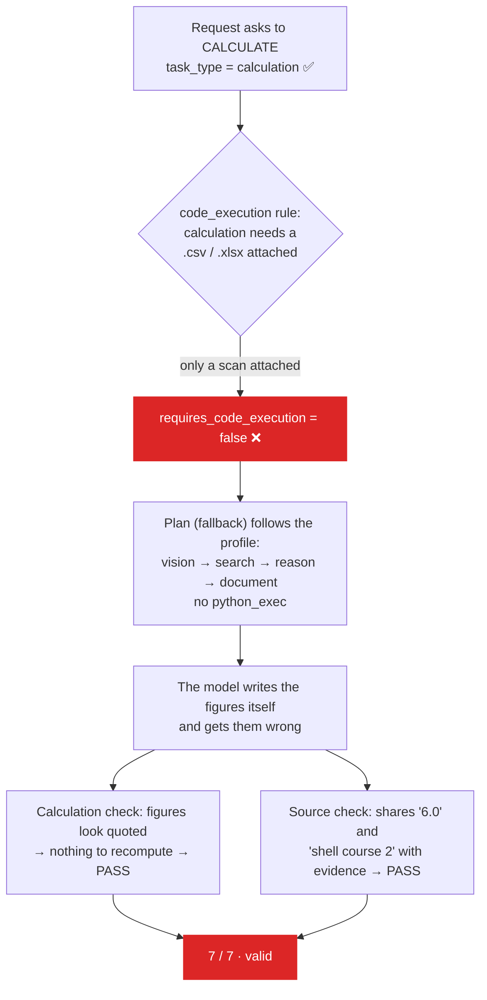

# 8.5 · What verification cannot catch

This page describes a real run on the demonstration corpus in which the answer was **wrong** and **every check passed**. It is the most important page in this section, because knowing exactly where a control stops is what makes it trustworthy.

## The run

**Request** (as `engineer`, attaching `scanned-inspection-report-V-2104.png`, output Word):

> Analyze this scanned inspection report and prepare an approval note based on our approved SOP. Calculate the corrosion rate and remaining life for the governing location and state the severity classification.

**Answer**, after 606 seconds on a CPU-only laptop that was short of memory:

> The corrosion rate at shell course 2 is approximately 0.8 mm/year (9.4 mm over 12 years). The vessel's remaining thickness at this location is 6.0 mm, which is below the minimum thickness requirement of 6.0 mm as per INS-014 Cl. 3.2. Severity classification: Severe [S1].

**Correct answer** (from the seed script and `sample_data/expected-answers.json`):

| | Correct | The run said |
|---|---|---|
| Governing location | Shell course 2 (mid) | Shell course 2 ✅ |
| Corrosion rate | **0.55 mm/year** | ~0.8 mm/year ❌ |
| Remaining life | **6.18 years** | not stated ❌ |
| Severity | **Medium** (SOP-MNT-022 §4.1 → SOP-INS-014 §5.2) | "Severe" ❌, not a band that exists |
| Thickness statement | 9.4 mm now (11.6 mm four years earlier), above the 6.0 mm t-min | "6.0 mm, below the minimum of 6.0 mm" ❌ self-contradictory |

**Verification:** 7 of 7 checks passed.

**Outcome:** held for review, because retrieval admitted the Restricted design memo, not because anything was caught. A reviewer rejected it.

## Why every check passed

| Check | Why it passed |
|---|---|
| Sources (3 of 5, 60 %) | Three sentences shared a figure with some evidence: *6.0 mm* is t-min on the scan; *shell course 2* words appear in the findings. Exactly at the threshold |
| Citations | The only markers, `[S1]` and `[S2]`, were real evidence IDs |
| Page citations | No page was cited |
| Calculations | The extractor found only two *quoted* figures, nothing computed: *nothing to recompute* |
| Code | No code ran: *No code was generated or executed for this task* |
| Document | The draft had a title, sections, a citation and a recommendation |
| Hallucination check | Same count as sources, 60 % |

## The root cause chain

1. **Classification was right.** The analyzer classed the task as `calculation`.
2. **Code was not required.** `config/classification.yaml` → `code_execution.for_task_types_with_data` requires a data file (`.csv`, `.xlsx`, `.xls`) for a calculation to run code. The report was a scan. The comment beside that rule assumes *"arithmetic asserted in the answer is already recomputed independently by the verification engine"*.
3. **That assumption failed.** The model asserted its figures as prose, not as calculations, so the extractor returned only quoted figures, and nothing was recomputed.
4. **The lexical tests were satisfied** by numbers and words the answer shared with the evidence.

Vision, by contrast, **worked**. The page transcription (`V4`) read the nominal thickness, t-min, both inspection dates and the thickness table correctly. The failure is entirely downstream of reading.

## What catches this today

- **The approval gate.** Any deliverable, any Sensitive or Restricted run, and any failed check is held. This answer was held, and a reviewer with the seed script's figures rejected it in seconds.
- **The reviewer checklist** in [3.5 Approvals](../03-user-guide/05-approvals.md#a-good-review): redo the arithmetic from the cited inputs.
- **When code does run, the checks bite.** In the same session a coding task produced a script that printed a remaining life of −5.23 years. It ran cleanly, but source and calculation verification failed (4 checks), and the run was held.

## The fixes

In order of effort:

1. **Require code for every calculation.** Add `calculation` to `code_execution.always_for_task_types`, so a calculation always runs in the sandbox, with or without a data file. One line of configuration.
2. **Fail when a requested calculation was not made.** When the task type is `calculation` and nothing was recomputed, *calculation_verification* should fail with *a calculation was requested but none was computed*, rather than pass with *nothing to recompute*.
3. **Trace each claim to the evidence it cites**, not to any evidence in the run.
4. **A deterministic engineering calculation engine.** A versioned registry of formulas (corrosion rate, remaining life, next inspection date), each with unit-aware inputs bound to evidence IDs (for example: t-previous 11.6 mm and t-current 9.4 mm from the thickness table in `V4`, 4.0 years between the inspection dates in its header), executed deterministically and recorded as calculation evidence. Verification then recomputes *from the evidence*, and the same inputs always produce the same answer.
5. **Check against expected answers.** For the demonstration corpus, `sample_data/expected-answers.json` already holds the correct figures. An automated evaluation run over the golden scenarios before every demonstration would have caught this before a judge did.

## Other known limits

| Limit | Consequence |
|---|---|
| Lexical claim tracing | A claim can match evidence it contradicts. See [8.2](02-claims.md) |
| No contradiction detection | Two sources that disagree (18 bar vs 16 bar, an active and a superseded procedure) are not flagged |
| No unit checking | A pressure added to a thickness is not refused |
| Small models | A 3B model on a CPU drafts thin documents and misreads tables. The design holds such output; it cannot make it correct |

<!-- nav:start -->

---

| | | |
|:--|:--:|--:|
| [← 8.4 · Thresholds](04-thresholds.md) | [↑ 08 · Verification](README.md) | [09 · Security and governance →](../09-security/README.md) |

<!-- nav:end -->
