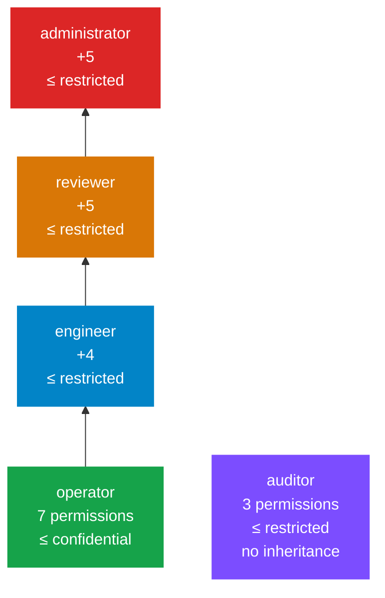

# 9.1 · Access control

Roles, permissions and departments are declared in `policies/access-control.yaml`. Anything not granted there is refused.

## Roles and inheritance

The auditor stands apart on purpose. It inherits nothing, so it cannot create tasks or search knowledge. It is **oversight without the power to act**.

## The 22 permissions

| Permission | op | eng | rev | aud | adm | Checked by |
|---|:--:|:--:|:--:|:--:|:--:|---|
| `task.create` | ✅ | ✅ | ✅ | | ✅ | Creating tasks, harness runs; listing skills |
| `task.read.own` | ✅ | ✅ | ✅ | | ✅ | Implicit: an owner may always read their task |
| `task.read.department` | | ✅ | ✅ | | ✅ | ⚠️ **Not enforced**: no code checks it |
| `task.read.all` | | | ✅ | ✅ | ✅ | Task list, task detail, the event stream, harness runs |
| `file.upload` | ✅ | ✅ | ✅ | | ✅ | `POST /api/files` |
| `file.read.own` | ✅ | ✅ | ✅ | | ✅ | Implicit, via `owner_always_allowed` |
| `knowledge.search` | ✅ | ✅ | ✅ | | ✅ | `POST /api/knowledge/search` |
| `knowledge.ingest` | | ✅ | ✅ | | ✅ | `POST /api/knowledge/documents` |
| `knowledge.manage` | | | | | ✅ | `DELETE /api/knowledge/documents/{id}` |
| `deliverable.download.own` | ✅ | ✅ | ✅ | | ✅ | Implicit: the requester may download their own released deliverable |
| `deliverable.download.department` | | ✅ | ✅ | | ✅ | ⚠️ **Not enforced** |
| `deliverable.download.all` | | | ✅ | | ✅ | Deliverable and harness report downloads |
| `audit.read.own` | ✅ | ✅ | ✅ | | ✅ | `GET /api/audit`, filtered to records where you are the actor |
| `audit.read.all` | | | ✅ | ✅ | ✅ | The whole log, export, browser verification |
| `approval.read` | | | ✅ | | ✅ | `GET /api/approvals` |
| `approval.decide` | | | ✅ | | ✅ | Approving tasks and harness reports; downloading held deliverables |
| `skill.create` | | ✅ | ✅ | | ✅ | Adding skills; deleting your own |
| `skill.manage` | | | | | ✅ | Deleting anyone's skill |
| `model.manage` | | | | | ✅ | ⚠️ Declared; no endpoint manages models yet |
| `policy.read` | | | | | ✅ | ⚠️ Declared; `GET /api/policies` is open to every signed-in user |
| `system.manage` | | | | | ✅ | ⚠️ Declared; no endpoint uses it |
| `sovereignty.read` | | | | ✅ | | ⚠️ Declared; `GET /api/sovereignty` is open to every signed-in user |

Every permission check goes through `require_permission(...)` or the gateway's `check_permission`, and is audited as `policy / permission.<name>:<allow|deny>`.

## Clearance

| Role | `max_data_classification` |
|---|---|
| operator | confidential |
| engineer, reviewer, auditor, administrator | restricted |

Clearance limits retrieval, the Documents list, and which runs' content a role may see. See [2.3](../02-concepts/03-classification.md).

## Departments

`operations`, `engineering`, `inspection`, `quality`, `finance`, `general`.

| Rule (`file_access`) | Effect |
|---|---|
| `department_isolation: true` | A file or passage from another department is refused… |
| `override_roles: [reviewer, auditor, administrator]` | …unless the reader's role is one of these… |
| `owner_always_allowed: true` | …and an uploader can always read their own upload |
| (retrieval and the Documents list) | Documents in the `general` department are visible to every department |

## Sessions

| Property | Value |
|---|---|
| Lifetime | 12 hours (`security.session_ttl_minutes: 720`) |
| Transport | Bearer token header, and cookie `workbench_session` (HttpOnly, SameSite=Strict, `Secure` off for local HTTP) |
| Storage | The `sessions` table, **token stored as issued** |
| Expiry | An expired session is deleted when next presented |
| Sign-out | `POST /api/auth/logout` deletes it |

## Sign-in throttling and sessions

- **Throttling** (`backend/security/throttle.py`). An account that fails five sign-ins within five minutes is refused for five minutes (HTTP 429 with `Retry-After`), whoever asks. A client address is locked only when it fails against ten different accounts, the pattern of one password sprayed across all of them; it is not locked for failing on one account, because behind the console's proxy every browser arrives from `127.0.0.1`. Each lockout is audited (`auth / login_throttled`). Settings: `security.login_max_failures`, `login_spray_accounts`, `login_window_seconds`, `login_lockout_seconds`.
- **Sessions** are stored and looked up by `sha256(token)`; the raw token exists only in the client.
- **The directory** (`GET /api/auth/directory`, unauthenticated for the sign-in screen) lists only the accounts seeded from policy.

## Not implemented yet

- **Enterprise identity** (LDAP / Active Directory, OIDC, MFA).
- **Department-wide task and deliverable visibility** for engineers, as noted in the table.

See what is still open in [9.6](06-threat-model.md#what-does-not-hold-yet).

<!-- nav:start -->

---

| | | |
|:--|:--:|--:|
| [← 09 · Security and governance](README.md) | [↑ 09 · Security and governance](README.md) | [9.2 · The policy gateway →](02-policy-gateway.md) |

<!-- nav:end -->
