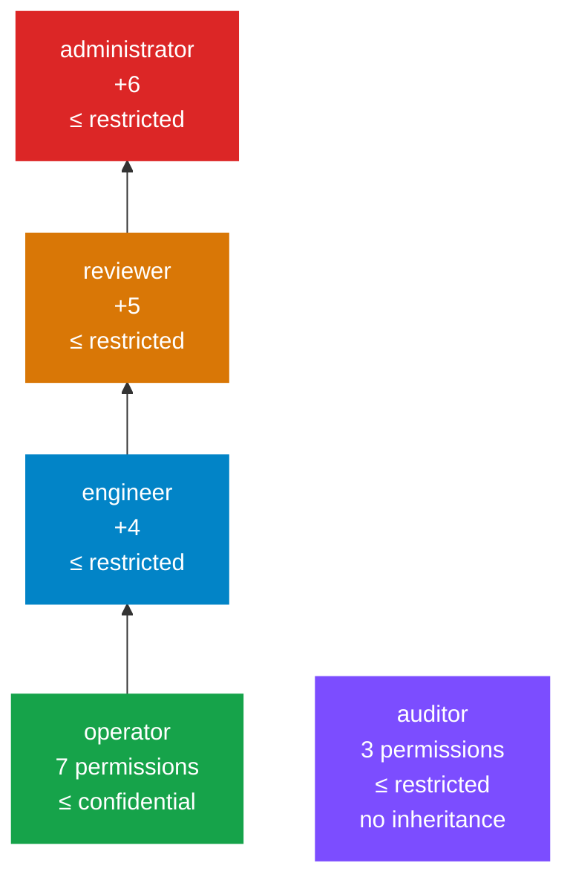

# 9.1 · Access control

Roles, permissions and departments are declared in `policies/access-control.yaml`. Anything not granted there is refused.

## Roles and inheritance

```mermaid
flowchart BT
    OP[operator<br/>7 permissions<br/>≤ confidential] --> EN[engineer<br/>+4<br/>≤ restricted]
    EN --> RV[reviewer<br/>+5<br/>≤ restricted]
    RV --> AD[administrator<br/>+6<br/>≤ restricted]
    AU[auditor<br/>3 permissions<br/>≤ restricted<br/>no inheritance]
    style OP fill:#16a34a,color:#fff,stroke:#16a34a
    style EN fill:#0284c7,color:#fff,stroke:#0284c7
    style RV fill:#d97706,color:#fff,stroke:#d97706
    style AD fill:#dc2626,color:#fff,stroke:#dc2626
    style AU fill:#7c4dff,color:#fff,stroke:#7c4dff
```

The auditor stands apart on purpose. It inherits nothing, so it cannot create tasks or search knowledge. It is **oversight without the power to act**.

## The 23 permissions

| Permission | op | eng | rev | aud | adm | Checked by |
|---|:--:|:--:|:--:|:--:|:--:|---|
| `task.create` | ✅ | ✅ | ✅ | | ✅ | Creating tasks, harness runs; listing skills |
| `task.read.own` | ✅ | ✅ | ✅ | | ✅ | Implicit: an owner may always read their task |
| `task.read.department` | | ✅ | ✅ | | ✅ | ⚠️ **Not enforced**: no code checks it |
| `task.read.all` | | | ✅ | ✅ | ✅ | Task list, task detail, the event stream, harness runs |
| `file.upload` | ✅ | ✅ | ✅ | | ✅ | `POST /api/files` |
| `file.read.own` | ✅ | ✅ | ✅ | | ✅ | Implicit, via `owner_always_allowed` |
| `knowledge.search` | ✅ | ✅ | ✅ | | ✅ | `POST /api/knowledge/search` |
| `knowledge.ingest` | | ✅ | ✅ | | ✅ | `POST /api/knowledge/documents` |
| `knowledge.manage` | | | | | ✅ | `DELETE /api/knowledge/documents/{id}` |
| `deliverable.download.own` | ✅ | ✅ | ✅ | | ✅ | Implicit: the requester may download their own released deliverable |
| `deliverable.download.department` | | ✅ | ✅ | | ✅ | ⚠️ **Not enforced** |
| `deliverable.download.all` | | | ✅ | | ✅ | Deliverable and harness report downloads |
| `audit.read.own` | ✅ | ✅ | ✅ | | ✅ | `GET /api/audit`, filtered to records where you are the actor |
| `audit.read.all` | | | ✅ | ✅ | ✅ | The whole log, export, browser verification |
| `approval.read` | | | ✅ | | ✅ | `GET /api/approvals` |
| `approval.decide` | | | ✅ | | ✅ | Approving tasks and harness reports; downloading held deliverables |
| `skill.create` | | ✅ | ✅ | | ✅ | Adding skills; deleting your own |
| `skill.manage` | | | | | ✅ | Deleting anyone's skill |
| `model.manage` | | | | | ✅ | ⚠️ Declared; no endpoint manages models yet |
| `policy.read` | | | | | ✅ | ⚠️ Declared; `GET /api/policies` is open to every signed-in user |
| `system.manage` | | | | | ✅ | ⚠️ Declared; no endpoint uses it |
| `users.manage` | | | | | ✅ | Every `/api/admin/*` provisioning route: invitations, access-request decisions, activation, password resets, the directory status |
| `sovereignty.read` | | | | ✅ | | ⚠️ Declared; `GET /api/sovereignty` is open to every signed-in user |

Every permission check goes through `require_permission(...)` or the gateway's `check_permission`, and is audited as `policy / permission.<name>:<allow|deny>`.

## Clearance

| Role | `max_data_classification` |
|---|---|
| operator | confidential |
| engineer, reviewer, auditor, administrator | restricted |

Clearance limits retrieval, the Documents list, and which runs' content a role may see. See [2.3](../02-concepts/03-classification.md).

## Departments

`operations`, `engineering`, `inspection`, `quality`, `finance`, `general`.

| Rule (`file_access`) | Effect |
|---|---|
| `department_isolation: true` | A file or passage from another department is refused… |
| `override_roles: [reviewer, auditor, administrator]` | …unless the reader's role is one of these… |
| `owner_always_allowed: true` | …and an uploader can always read their own upload |
| (retrieval and the Documents list) | Documents in the `general` department are visible to every department |

## Sessions

| Property | Value |
|---|---|
| Lifetime | 12 hours (`security.session_ttl_minutes: 720`) |
| Transport | Bearer token header, and cookie `workbench_session` (HttpOnly, SameSite=Strict, `Secure` off for local HTTP) |
| Storage | The `sessions` table, **token stored as issued** |
| Expiry | An expired session is deleted when next presented |
| Sign-out | `POST /api/auth/logout` deletes it |

## Sign-in throttling and sessions

- **Throttling** (`backend/security/throttle.py`). An account that fails five sign-ins within five minutes is refused for five minutes (HTTP 429 with `Retry-After`), whoever asks. A client address is locked only when it fails against ten different accounts, the pattern of one password sprayed across all of them; it is not locked for failing on one account, because behind the console's proxy every browser arrives from `127.0.0.1`. Each lockout is audited (`auth / login_throttled`). Settings: `security.login_max_failures`, `login_spray_accounts`, `login_window_seconds`, `login_lockout_seconds`.
- **Sessions** are stored and looked up by `sha256(token)`; the raw token exists only in the client.
- **The demo list** (`GET /api/auth/directory`, unauthenticated for the sign-in screen) lists only the accounts seeded from policy, and only while `demo.enabled` is true.

## How accounts come to exist

There is no public sign-up on a production host. Every account traces to an administrator's act, and every decision about who gets in -- granted or refused -- is written to the hash-chained audit log. There are four doors (`backend/core/accounts.py`; the endpoints are in [11.1](../11-api/01-auth-system.md#accounts-and-provisioning)):

| Door | Who opens it | What the account gets | Audited as |
|---|---|---|---|
| **Owner setup** | Whoever can read the machine: a one-time token written to `<storage.root>/setup-token` (`0600` where the OS honours it) and the service console, at each start while no administrator exists and demo mode is off. Lapses after 24 h; a restart issues a new one | `identity.owner_role` (default `administrator`), department `general`. Once only | `identity / setup_token_issued`, `owner_created`; `security / setup_token_refused`, `owner_setup_refused` |
| **Invitation** | An administrator, who fixes role and department and hands over an `AEGIS-XXXX-XXXX-XXXX` code (60 bits from `secrets`, 1 h – 30 days, single use, revocable) | Exactly the invitation's role and department | `identity / invite_created`, `invite_revoked`, `invite_accepted` (who invited whom, as what); `security / invite_refused` |
| **Access request** | Anyone who can reach the host asks; an administrator decides | Nothing until approved: the account is created inactive, least-privileged, holding only the password's hash. Approval sets the role and department the administrator chooses; the requested role is a note, never a grant. Rejection removes the account | `identity / access_requested`, `access_request_approved`, `access_request_rejected` |
| **Demo seed** | `demo.enabled: true` only | The seven accounts in `seed_users`, sharing `security.seed_user_password` | `identity / seed_users_created` |

`security.self_registration_enabled` (default `false`) still gates the older `POST /api/auth/register` for development. Keep it off anywhere else: it is the one path that does not pass through an administrator.

Administrators also deactivate and reactivate accounts (deactivation deletes the account's sessions at once) and issue one-time `RESET-…` password codes, since an air-gapped host has no mail to send a reset link by. Redeeming one ends every other session of that account. An administrator cannot deactivate themselves or the last active administrator, and cannot activate an account around a pending access request.

**Codes and tokens are stored as SHA-256**, for the reason sessions are: a copy of the database is not a way in. A fast hash is enough because each carries at least 60 bits, expires within days, and the routes that redeem them are throttled: a client that tries ten wrong codes in five minutes is locked out of redeeming codes for five minutes, on a counter separate from sign-in's, so guessing codes cannot lock anyone out of signing in. Each such lockout is audited (`security / codes_throttled`). Access requests are throttled the same way on a third counter (`security / requests_throttled`). A wrong, used, expired or revoked code gets the same sentence; the audit record says which.

### The plant directory: the preferred path

A plant that runs Active Directory or LDAP should not keep a second list of who works there: joiners, movers and leavers are already recorded in AD, and a workbench account that outlives its owner's AD account is the kind of gap an audit finds. The intended production path is to sign in against the directory and take the role from group membership through `identity.directory.group_role_map` -- with the role decided on this host, from the map, never taken from a directory attribute.

This build **declares** that path and does not implement it. `identity.directory` in `config/app.yaml` (`enabled`, `url`, `base_dn`, `user_filter`, `group_role_map`) is read and shown to administrators, and `backend/core/directory.py` defines the interface a client will implement. No LDAP library ships -- it is a dependency to vendor, review and patch on an air-gapped host -- so the directory reports *not configured* even when `enabled: true`, and every account is local.

## Not implemented yet

- **Directory sign-in** (LDAP / Active Directory): declared and reported as not configured, above. **OIDC and MFA** are not declared at all.
- **Department-wide task and deliverable visibility** for engineers, as noted in the table.

See what is still open in [9.6](06-threat-model.md#what-does-not-hold-yet).

<!-- nav:start -->

---

| | | |
|:--|:--:|--:|
| [← 09 · Security and governance](README.md) | [↑ 09 · Security and governance](README.md) | [9.2 · The policy gateway →](02-policy-gateway.md) |

<!-- nav:end -->
