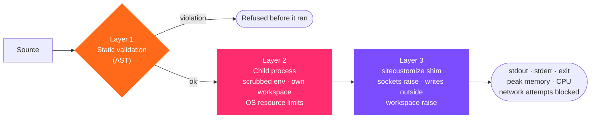

# 9.3 · The sandbox

Code runs. Network doesn't.

`backend/tools/sandbox.py` executes generated Python, and code you type on the Sandbox screen, under three independent layers. Each is meant to hold even if another is bypassed.

## Layer 1 · Static validation

The source is parsed into an AST and rejected, before anything runs, if it:

| Does | Configured by | Examples refused |
|---|---|---|
| Imports a **denied** module | `sandbox.denied_imports` | `socket`, `requests`, `urllib`, `urllib3`, `httpx`, `aiohttp`, `ftplib`, `smtplib`, `telnetlib`, `subprocess`, `multiprocessing`, `ctypes`, `importlib`, `pickle`, `shutil`, `pty`, `webbrowser`, `xmlrpc`, `http` |
| Imports anything **not allowed** | `sandbox.allowed_imports` | Allowed: `math`, `statistics`, `json`, `csv`, `re`, `datetime`, `decimal`, `fractions`, `itertools`, `functools`, `collections`, `dataclasses`, `typing`, `random`, `string`, `textwrap`, `pathlib`, `os`, `sys`, `time`, `uuid`, `hashlib`, `base64`, `numpy`, `pandas`, `openpyxl`, `matplotlib` |
| Calls a **denied** builtin | `sandbox.denied_calls` | `eval`, `exec`, `compile`, `__import__`, `breakpoint`, `open_host`, `getattr`, `setattr`, `delattr`, `vars`, `globals`, `locals` |
| Reaches **interpreter internals** | `sandbox.denied_attributes` | `__subclasses__`, `__globals__`, `__builtins__`, `__bases__`, `__mro__` |
| Makes a **process escape** | built in | `os.system`, `os.popen`, `os.spawn*`, `os.fork`, `os.kill`, `os.exec*` |

Why `getattr` is denied: without it, `getattr(os, "sys" + "tem")("…")` is a call on the name `getattr`, not an attribute of `os`, and it slipped past the process-escape rule, which only fires on a literal `os.<attr>`. A name built from strings also defeats the attribute deny-list.

## Layer 2 · The child process

| Property | Value |
|---|---|
| Working directory | A fresh `storage/workspaces/run-<id>/` per execution |
| Environment | **Scrubbed**: only `PATH`-like essentials, `PYTHONPATH` = workspace, `PYTHONNOUSERSITE=1`, `HOME`, `TMPDIR`, `TEMP`, `TMP` and `MPLCONFIGDIR` = workspace, BLAS thread counts = 1. No host credentials, proxies or tokens |
| Wall timeout | `sandbox.timeout_seconds` (45 s); the process group is killed |
| Output | Capped at `sandbox.max_output_bytes` (256 KB) |

### Resource limits, by operating system

The mechanism is chosen by **what the host can do**, probed at run time, never by configuration.

| | Linux | macOS | Windows |
|---|---|---|---|
| Mechanism | `setrlimit` in `preexec_fn`, after fork and before exec | `setrlimit` + a resident-memory **watchdog** in the parent | A kernel **Job Object** via `kernel32` |
| CPU | `RLIMIT_CPU` = 30 s | `RLIMIT_CPU` | Per-process user time |
| Memory | `RLIMIT_AS` = 1024 MB | Watchdog kills above 1024 MB resident (`RLIMIT_AS` cannot be set usefully on macOS) | Per-process committed memory |
| File size | `RLIMIT_FSIZE` = 25 MB | Same | Not a job limit; output is capped at 256 KB |
| Processes | `RLIMIT_NPROC` = current + 64 | Same | Active process limit |
| Core dumps | `RLIMIT_CORE` = 0 | Same | n/a |
| On close | Process group killed | Same | Kill-on-job-close |

Two details matter:

- **`RLIMIT_NPROC` is per user**, not per process. An absolute cap would break every fork on a busy workstation, so the cap is the user's current process count plus `sandbox.process_headroom` (64). Runaway forking is still contained.
- **On Windows, the job is assigned before the child runs a line of user code.** The child blocks on a one-byte stdin sentinel, which the parent writes only after `AssignProcessToJobObject` succeeds. If assignment fails, the child is killed rather than released. And before any code may run at all, the host is **probed**: a real child is placed in a job and a real over-cap allocation is confirmed to be refused. A wrong structure layout would otherwise silently apply no limit. If the probe fails, execution is **refused** with the measured reason.

If no limit mechanism works on a host, `execution_allowed` is false and code is refused. Code never runs unbounded while the interface describes a sandbox.

## Layer 3 · The runtime shim

A `sitecustomize.py` is written into each workspace, so the interpreter loads it before user code:

- `socket.socket`, **and** the C primitive `_socket.socket` it is built on, plus `socketpair`, are replaced with functions that raise `SovereignNetworkBlocked`, and each attempt is logged. Patching only `socket.socket` would leave `import _socket; _socket.socket().connect(…)` live.
- `builtins.open` and `os.open` are replaced with guards that raise `SovereignFilesystemBlocked` for any **write** (modes `w`, `a`, `x`, `+`, or write flags) outside the workspace. Reads pass through unchanged, which is the gap described below.

The result reports **network attempts blocked**, read back from the attempt log.

## What the self-test proves

The Assurance screen's self-test submits real payloads (a static socket import, a runtime socket call with the static check bypassed, `os.system`, a write outside the workspace, permitted work, a CPU spin, a memory bomb) and reports each outcome. On the demonstration host: **7 of 7 held**.

## What the sandbox does not stop

> [!WARNING]
> This is application-level isolation inside a subprocess: static rules, OS resource limits and an interpreter shim. It is **not** a container, a virtual machine, a namespace or a seccomp filter, and the child runs as the **same operating-system user** as the API.

Concretely, verified on the demonstration host:

| Attempt | Result |
|---|---|
| Write outside the workspace with `open()` or `os.open()` | ✅ Refused |
| Open a socket, even with `_socket` | ✅ Refused |
| `os.system`, `subprocess`, `getattr` tricks | ✅ Refused before running |
| **Read** a host file, e.g. `Path('/etc/hostname').read_text()` | ❌ **Allowed** |
| **List** host directories, e.g. `Path('/home').iterdir()` | ❌ **Allowed** |
| **Read the workbench's own database**, `storage/workbench.db` | ❌ **Allowed**, even as `operator` |

The last one matters most. The database holds every run's content, including runs from other departments and above the reader's clearance, and live session tokens. Code submitted by the lowest-privilege role can read it and print it back. **Until reads are confined, do not expose the sandbox to users you do not trust with everything on the host.**

## Closing the gap

In order of effort:

1. **Confine reads in the shim** the same way writes are: refuse `open` for reading, `Path.read_*`, `os.listdir`, `os.scandir` and `os.open` outside the workspace and the Python installation. Cheap, and it closes the demonstrated path, though an interpreter shim can in principle be bypassed.
2. **Hash session tokens at rest**, so a leaked database does not leak live sessions.
3. **Run each execution in a container** (rootless Podman or Docker) with `--network none`, a read-only root filesystem, a non-root user, `--cap-drop ALL`, `no-new-privileges`, CPU, memory, PID and time limits, and only the workspace mounted. That turns application-level containment into OS-enforced isolation. `config/app.yaml` already reserves `sandbox.runtime: docker` and its options, and the code reports *config requests 'docker', not implemented* rather than pretending. See `docs/RUNTIME-ENVIRONMENT.md`.

<!-- nav:start -->

---

| | | |
|:--|:--:|--:|
| [← 9.2 · The policy gateway](02-policy-gateway.md) | [↑ 09 · Security and governance](README.md) | [9.4 · The sovereignty monitor →](04-sovereignty-monitor.md) |

<!-- nav:end -->
