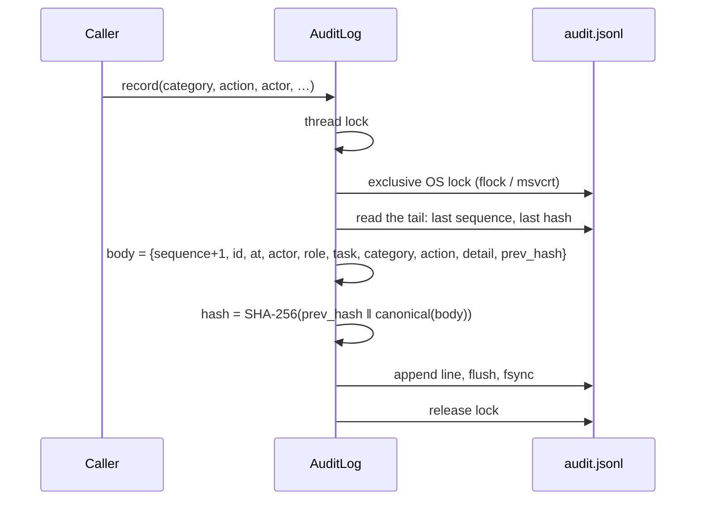

# 9.5 · The audit log

The concept is in [2.6 The audit chain](../02-concepts/06-audit.md). This page covers the implementation, `backend/core/audit.py`.

## Writing a record



- **Canonical JSON**: sorted keys, no whitespace (`separators=(",", ":")`), non-JSON values as strings. The same record always hashes the same.
- **Two locks**: a thread lock for the API's own threads, and an exclusive **operating-system** lock for other processes (the seed script, a second API process, the audit tool). The Windows branch uses `msvcrt.locking` on the first byte; neither branch is a no-op, and a platform with no kernel lock would raise rather than pretend.
- **Durability**: every record is flushed and `fsync`ed before `record()` returns.
- **Algorithm**: `audit.hash_algorithm` (SHA-256).
- **Switch**: `audit.enabled`. Turning it off stops recording and returns nothing. Do not.

## Verifying

`verify_chain()` reads the file from the start, recomputes each record's hash from the previous hash and its canonical body, and reports:

```json
{ "valid": true, "events": 234, "head_hash": "3838d5d3…6c68", "broken_at": null, "checked_at": "…" }
```

or the **sequence number** of the first record that does not recompute. It runs at startup (`audit.verify_on_startup`), on `GET /api/audit/chain`, and from the command line.

The browser check on the Audit screen re-implements the same computation in TypeScript with Web Crypto (`frontend/components/audit/chain-verify.ts`), so a compromised server cannot simply *claim* the chain is valid to a reviewer's browser.

## From the command line

```bash
python scripts/audit_tool.py verify      # recompute the chain; print the head
python scripts/audit_tool.py archive     # retire a broken chain and start a fresh one
```

`archive` never rewrites or deletes history: it moves the broken file aside with a timestamp, so it can still be examined. See [12.3 The audit tool](../12-operations/03-audit-tool.md).

## Querying

`GET /api/audit?category=&task_id=&search=&limit=` returns the newest matching records (default 300). Holders of `audit.read.own` get only records where they are the actor. `GET /api/audit/export` (`audit.read.all`) returns the full file as JSON lines, and is itself audited.

## Limits

| Limit | Mitigation now | Roadmap |
|---|---|---|
| A writer with file access can rewrite the **whole** chain with fresh hashes | Record the head hash somewhere the host cannot write | Periodic Merkle roots signed with a separately held Ed25519 key |
| The log is a single growing file | Archive periodically; verification stays linear and fast (234 records in 15 ms in the browser) | Segmented windows with signed roots |
| Records are not redacted for sensitive work (`redact_in_logs` is declared, not implemented) | Restrict `audit.read.all` | Redaction by classification |

<!-- nav:start -->

---

| | | |
|:--|:--:|--:|
| [← 9.4 · The sovereignty monitor](04-sovereignty-monitor.md) | [↑ 09 · Security and governance](README.md) | [9.6 · Threat model →](06-threat-model.md) |

<!-- nav:end -->
