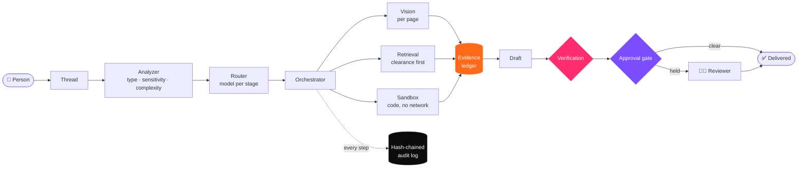

# The AEGIS Handbook

**Everything about the on-premise agentic AI workbench, in one place.**
How to install it, how to use every screen, how every stage of a run works, and how to configure, secure, operate and extend it.

---

## How to read this handbook

The handbook has fifteen sections. Each section is a folder with an overview page and a set of sub-sections, and every page links to the one before and after it, so it can be read cover to cover or dipped into.

Everything here was written from the source code, configuration and policy files in this repository. Where a page describes a limit, a default or a behaviour, it names the file it comes from so you can check it. Where the system does **not** do something, the page says so plainly.

> [!TIP]
> New to AEGIS? Read **[What AEGIS is](01-getting-started/01-overview.md)**, then **[Your first hour](01-getting-started/07-first-hour.md)**, then the **[Core concepts](02-concepts/README.md)**. That is about forty minutes, and everything else will make sense after it.

### Reading paths

| You are… | Start here | Then |
|---|---|---|
| 🧑‍🏭 **A user** asking questions and drafting documents | [Getting started](01-getting-started/README.md) | [Core concepts](02-concepts/README.md) → [Using the workbench](03-user-guide/README.md) |
| ✅ **A reviewer or auditor** | [Approval](02-concepts/05-approval.md) and [Audit](02-concepts/06-audit.md) | [Approvals screen](03-user-guide/05-approvals.md) → [Audit screen](03-user-guide/09-audit.md) |
| 🛠️ **An engineer** extending the system | [Architecture](04-architecture/README.md) | [Agents](07-agents/README.md) → [Verification](08-verification/README.md) → [Development](13-development/README.md) |
| 🖥️ **An operator** running it on a host | [Installation](01-getting-started/03-install-linux-macos.md) | [Configuration](10-configuration/README.md) → [Operations](12-operations/README.md) |
| 🔐 **A security reviewer** | [Security and governance](09-security/README.md) | [Threat model](09-security/06-threat-model.md) → [Red team](09-security/08-red-team.md) → [Signed proof](09-security/09-proof.md) |
| 🏆 **A judge or evaluator** | [Demo guide](14-demo-guide/README.md) | [Engineering verification](08-verification/06-engineering.md) → [Conflicts](02-concepts/09-conflicts.md) → [Red team](09-security/08-red-team.md) |

---

## Contents

### Part I · Use it

| # | Section | What it covers |
|---|---|---|
| 01 | **[Getting started](01-getting-started/README.md)** | What AEGIS is, requirements, installation on Linux, macOS and Windows, models, seeding the corpus, running, your first hour, installation troubleshooting |
| 02 | **[Core concepts](02-concepts/README.md)** | Runs, evidence and citations, classification and clearance, verification, approval, the audit chain, sovereignty, skills and harnesses, conflicts and human resolution |
| 03 | **[Using the workbench](03-user-guide/README.md)** | Every screen: sign-in, Thread, Skills, Harnesses, Approvals, Knowledge, Assurance, Sandbox, Audit, keyboard shortcuts, P&ID drawings |

### Part II · Understand it

| # | Section | What it covers |
|---|---|---|
| 04 | **[Architecture](04-architecture/README.md)** | System overview, the life of a request, backend modules, the frontend, the data model, the live event stream |
| 05 | **[Models and routing](05-models-and-routing/README.md)** | The model registry, how a model is chosen for each stage, memory residency, the Ollama client, adding a model |
| 06 | **[Knowledge and retrieval](06-knowledge-and-retrieval/README.md)** | Ingestion, per-page PDF reading and vision, chunking and embedding, retrieval and clearance, writing a corpus, revision control |
| 07 | **[Agents and orchestration](07-agents/README.md)** | The task analyzer, the orchestrator's stages, planning, the tool registry, deliverables |
| 08 | **[Verification](08-verification/README.md)** | Every check, how claims are found and traced, how figures are recomputed, thresholds, what verification could not catch, and the deterministic formula registry that closed it |

### Part III · Run it safely

| # | Section | What it covers |
|---|---|---|
| 09 | **[Security and governance](09-security/README.md)** | Roles and permissions, the policy gateway, the sandbox on each OS, the sovereignty monitor, the audit log, the threat model, the ingestion guard, the red team, signed proof |
| 10 | **[Configuration reference](10-configuration/README.md)** | Every setting in `config/` and `policies/`, and how to override them with environment variables |
| 11 | **[API reference](11-api/README.md)** | Every HTTP endpoint, its permission, its request and response, and the Server-Sent Events stream |
| 12 | **[Operations](12-operations/README.md)** | The run script, logs and storage, the audit tool, backup and restore, performance tuning, runtime troubleshooting |

### Part IV · Build on it

| # | Section | What it covers |
|---|---|---|
| 13 | **[Development](13-development/README.md)** | Repository layout, the test suite, conventions, contributing |
| 14 | **[Demo guide](14-demo-guide/README.md)** | The golden path for a live demonstration, rehearsal checklist, recovering on stage |
| 15 | **[Reference](15-reference/README.md)** | FAQ and glossary |

---

## AEGIS in one picture

Everything in that picture runs on one machine. The model is reached over loopback, and the platform makes no outbound calls while it runs.

---

## Conventions used in this handbook

| Convention | Meaning |
|---|---|
| `config/app.yaml` | A path, always relative to the repository root |
| `sandbox.timeout_seconds` | A setting, written as its YAML path |
| `SOVEREIGN_SANDBOX__TIMEOUT_SECONDS` | The environment variable that overrides that setting |
| `task.create` | A permission from `policies/access-control.yaml` |
| `task.verified` | A live event on the Server-Sent Events stream |
| **Held**, **Delivered** | What the interface shows for a run's status |

> [!NOTE]
> Coloured boxes like this one are notes. **Tips** are shortcuts, **Important** marks something you must do, and **Warning** marks something that can lose data or weaken a control.

---

**[Start reading →](01-getting-started/README.md)**

AEGIS · On-Premise Agentic AI Workbench · Built for Smart India Hackathon 2025

